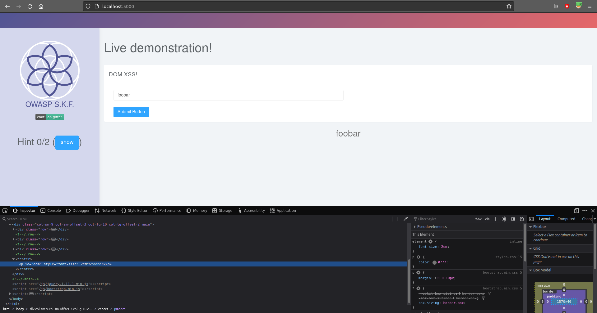
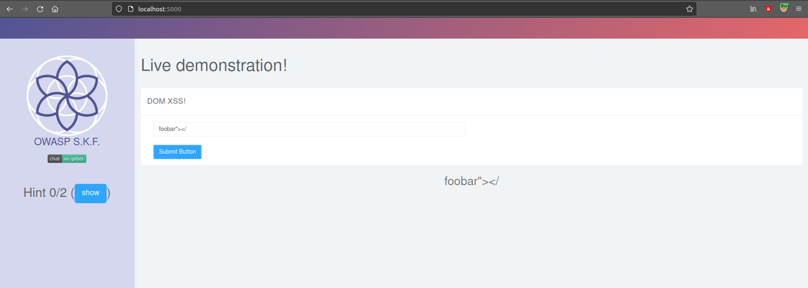
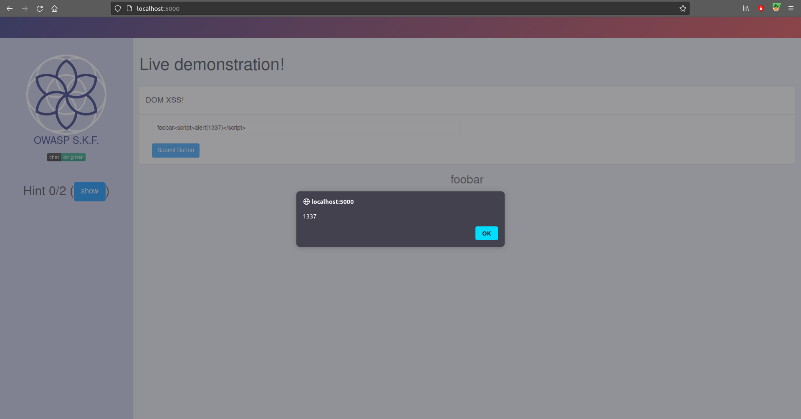

# Cross Site Scripting \(DOM\)

## Running the app on Docker

```
$ sudo docker pull blabla1337/owasp-skf-lab:js-xss-dom
```

```
$ sudo docker run -ti -p 127.0.0.1:5000:5000 blabla1337/owasp-skf-lab:js-xss-dom
```


Now that the app is running let's go hacking!


## Reconnaissance

#### Step 1

The application shows an input field box were we can try our injections. Lets first inject a normal test string and see how our input is used in the application.



As you can see below the input is reflected in the DOM.

Inspecting the source code of the application we can see that this application will take the user input and use it in the application where id="dom".


```javascript
function submit() {
  value = $("#input").val();
  console.log(value);
  $("#dom").html(value);
}
```

_note: this is done in the front-end side of the application._

## Exploitation

#### Step 1

Now we have seen where the user input is being reflected in the application we will have to look what dangerous HTML characters are not properly escaped so we can build our XSS payload. So for our first check we use the following string as an input:

```text
foobar"></
```



As you can see the application did not encode or blacklisted any of the dangerous HTML characters. Now lets try the XSS payload to see if this also is reflected back withouth any escaping or blacklist filtering.

```text
foobar<script>alert(1337)</script>
```



In Firefox we can see the XSS alert pop-up and we have successfully performed the XSS attack.

## Additional sources

Please refer to the OWASP testing guide for a full complete description about cross site scripting!


