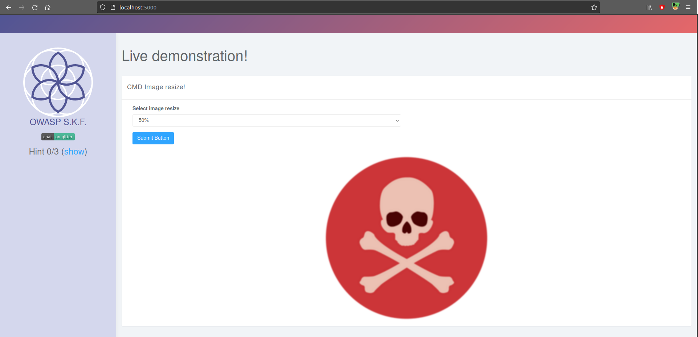
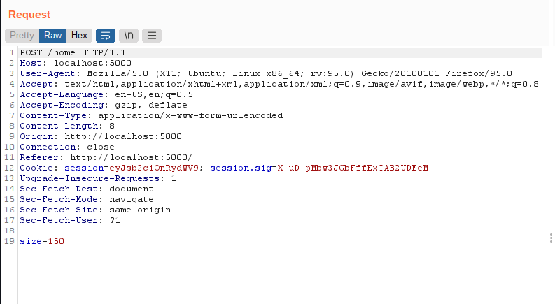
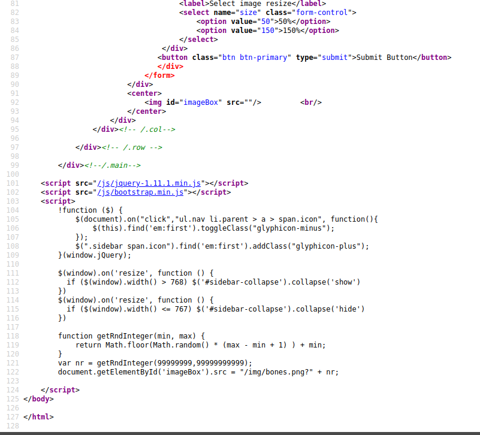
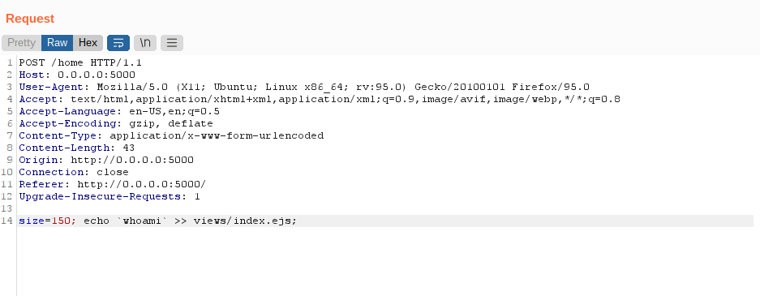
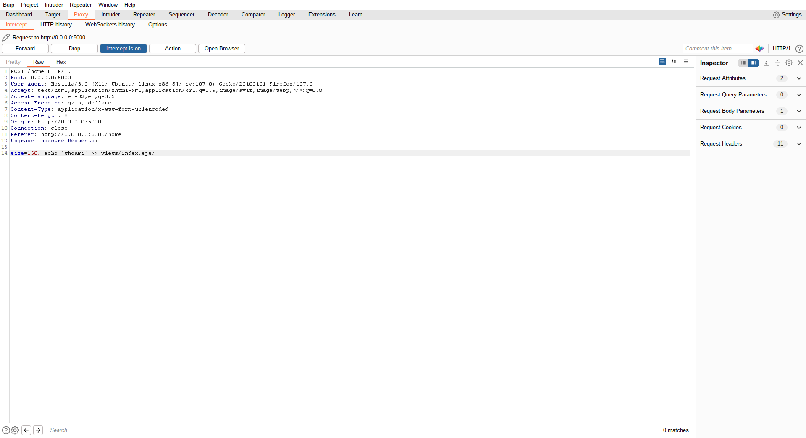

# KBID XXX - Command Injection 1 (CMD)

## Running the app nodeJs

First make sure nodejs and npm are installed on your host machine.
After installation, we go to the folder of the lab we want to practice.
"i.e /skf-labs/XSS, /skf-labs/RFI/" and run the following commands:

```
$ npm install
```

```
$ npm start
```


Now that the app is running let's go hacking!


## Reconnaissance

The command injecion is an attack in which the goal is execution of
arbitrary commands on the host operating system via a vulnerable
application. Command injection attacks are possible when an application
passes unsafe user supplied data (forms, cookies, HTTP headers etc.) to
a system shell. In the first step, the attacker needs to inspect the
functioning of the web app in order to find possible injection points.
When we start the application we can see that there is an image and the option to resize the image.



Now, we are going to select a value and press the button.



If we inspect the request with an intercepting proxy \(we are using
Burp\) we can see that the application is performing a POST request to
/home. In the request we send the number (in pixels) to resize the image.
In the response, we can check that the image has been resized.

## Exploitation

For this lab we are going to try to write in the source code the output of a command executed in the system.

First, we check the source code:



Now, we send a new HTTP request trying to write the output of the command
whoami (supposing that it will be executed in the target system) at the end of the index.html (main website view) code.



Now we access the source code of the website



to check that the output of the whoami command ("root") was appended at the end of the source code.
As we can see, the output of the command whoami, is showing us the priviledge
of the target user in the target system and that the web app is actually
vulnerable to OS command injection.

## Additional sources




