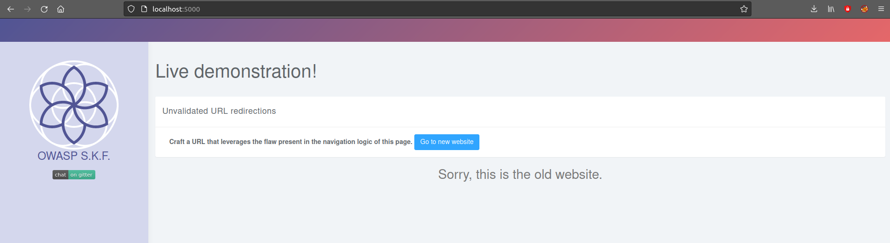

# NodeJS - URL Redirection

## Running the app nodeJs

First make sure nodejs and npm are installed on your host machine. After installation, we go to the folder of the lab we want to practice. "i.e /skf-labs/XSS, /skf-labs/RFI/" and run the following commands:

```
$ npm install
```

```
$ npm start
```


Now that the app is running let's go hacking!


## Reconnaissance

#### Step 1

The application shows that there is a new version of the website available somewhere, and a click on the button "Go to new website" will redirect you to it.



If we click on the button we will be redirected on the new page [http://localhost:5000/newsite](http://localhost:5000/newsite)

#### Step 2

Intercepting the traffic generated by the application, we note that the redirection is performed using the following call

```
GET /redirect?newurl=newsite
```

that will generate a 302 Redirect response from the server.

Inspecting the source code, it's possible to see no input validation of _newurl_ query string parameter is in place.

```javascript
app.all("/redirect", (req, res) => {
  let newurl = req.query.newurl;
  res.redirect(302, newurl);
});
```

## Exploitation

The exploitation is pretty straightforward. Replay the redirection request, but at this time change the value of _newurl_ into another URL.

_Original request_

```
http://localhost:5000/redirect?newurl=newsite
```

_Modified request_

```
http://localhost:5000/redirect?newurl=https://google.com
```

Using the payload above we will be able to successfully redirect a user to a malicious website

## Additional sources


