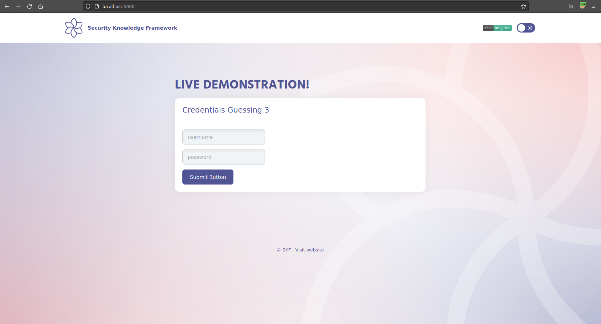
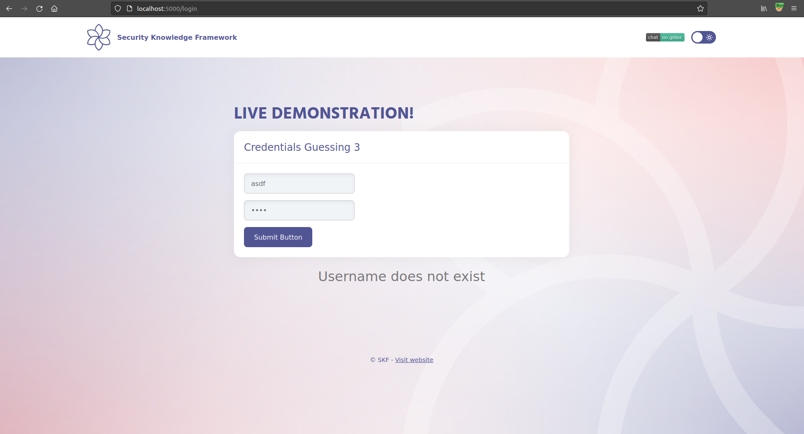
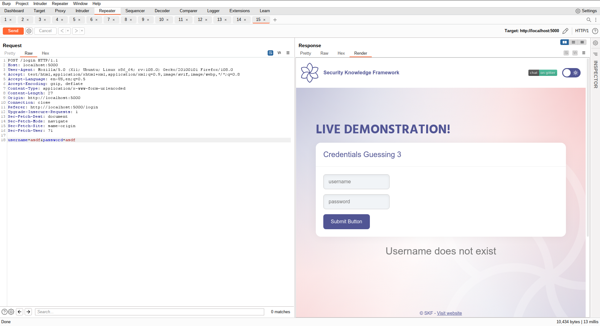
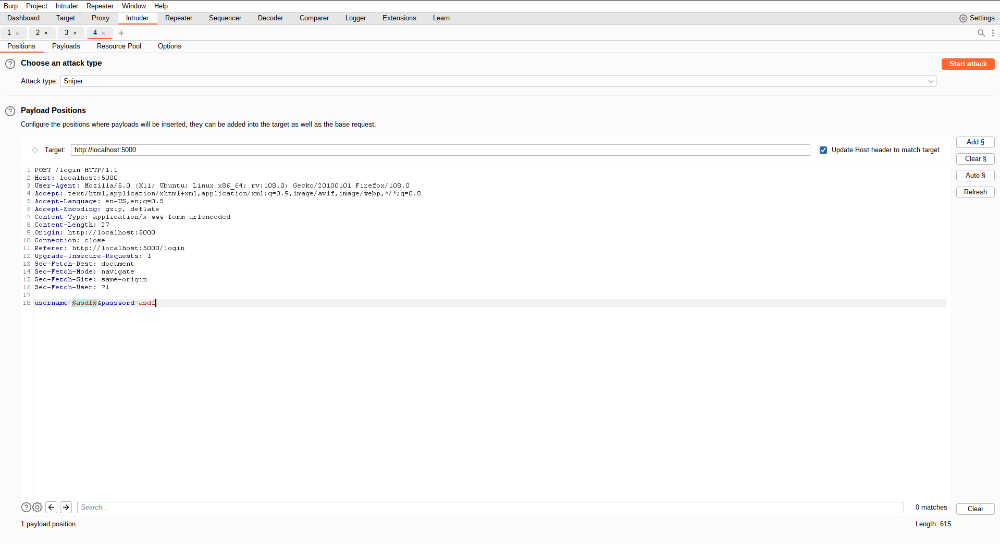
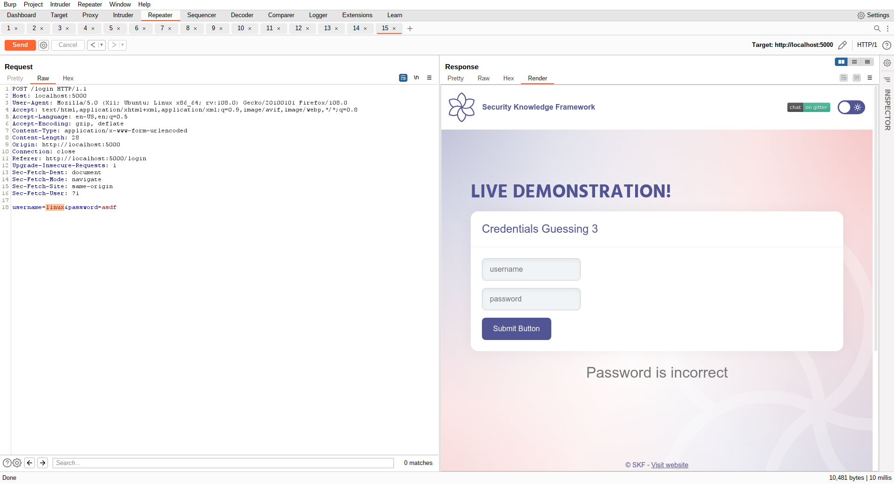

# KBID XXX - Credentials Guessing 3 (credentials-guessing-3)

## Running the app nodeJs

First make sure nodejs and npm are installed on your host machine.
After installation, we go to the folder of the lab we want to practice.
"i.e /skf-labs/XSS, /skf-labs/RFI/" and run the following commands:

```
$ npm install
```

```
$ npm start
```


Now that the app is running let's go hacking!


## Reconnaissance

It is very common to use very guessable and weak usernames and passwords because they are easier to use and remember.
However, this ease for the users becomes a great advantage for potential attackers who are trying to crack the user's credentials.
It is pretty easy for them to guess or brute force many different credentials until they get to the right ones.

When we start the application we can see that there is a login form.



If we try with some wrong and random credentials such as: [ asdasd:asdasd ], we don`t get access to the inside of the website and an error message is displayed:



It says that the username is incorrect.

## Exploitation

Provided that once the username is incorrect it will appear an error message and supossing that once it is correct, this message will not appear (or at least it will have a different length),
we will use Burp in order to brute force different usernames and discover the right one by analysing the length of the HTTP responses for each trial.
We use the "Intruder" functionality and we will load a prefixed dictionary with multiple usernames that will be tried against the website one by one.



If we check the lenght of the different HTTP responses for each of the password that Burp tried, we find that there's one with a different length than
the rest of the possibilities:



We have found something promising! This must be the desired username.

We can check now sending the HTTP request using this word as the username:


No error messages related to a wront username is displayed now (which means that this username must be correct), but it now says that the password is incorrect:



Now, if we follow the same methodology for the password, we will find the right password and get access to the inside of the website

And goal achieved!

## Additional sources


