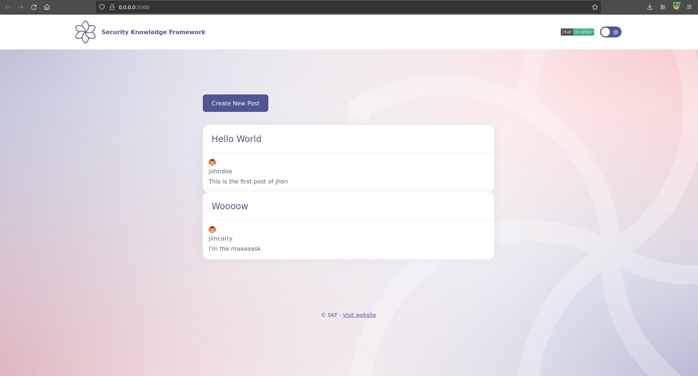
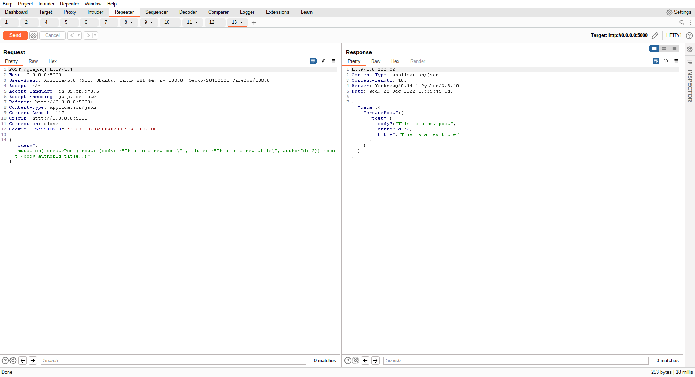

# GraphQL Mutations

## Running the app on Docker

```
$ sudo docker pull blabla1337/owasp-skf-lab:graphql-mutation
```

```text
$ sudo docker run -ti -p 127.0.0.1:5000:5000 blabla1337/owasp-skf-lab:graphql-mutation
```


Now that the app is running let's go hacking!


## Reconnaissance

The application implements a very basic mutation to create a new post on the blog. The mutation used is the following



```
mutation {
  createPost(input: {body: "' -- ", title: "test_title", authorId: 2}) {
    post {
      body
      authorId
      title
    }
  }
}
```



If we look at the code we have a class `CreatePost` that will implement our logic to create a post.

```python
class CreatePost(graphene.Mutation):
    """Mutation to create a post."""
    post = graphene.Field(lambda: PostObject, description="Post created by this mutation.")

    class Arguments:

        input = CreatePostInput(required=True)

    def mutate(self, info, input):

        post = Post(**input)
        db.session.add(post)
        db.session.commit()

        return CreatePost(post=post)
```

The method mutate will just get the new Post object and insert an instance in the database.

## Exploit

> What can you exploit? ;)
