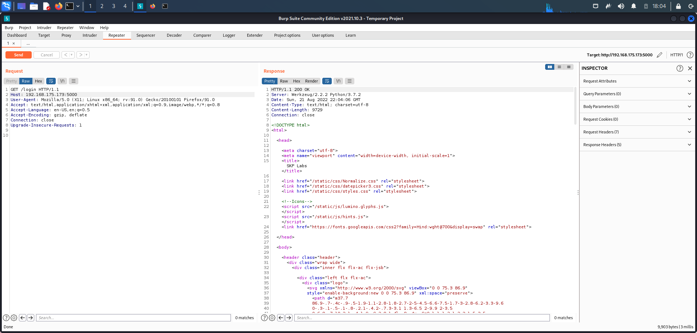
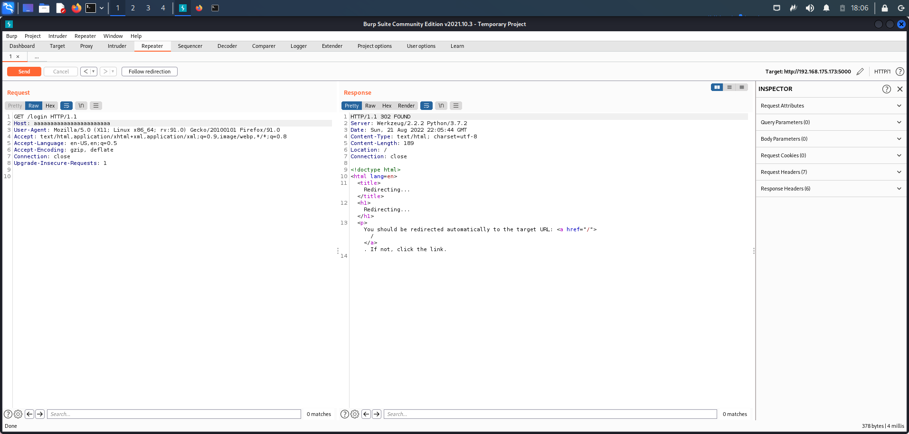
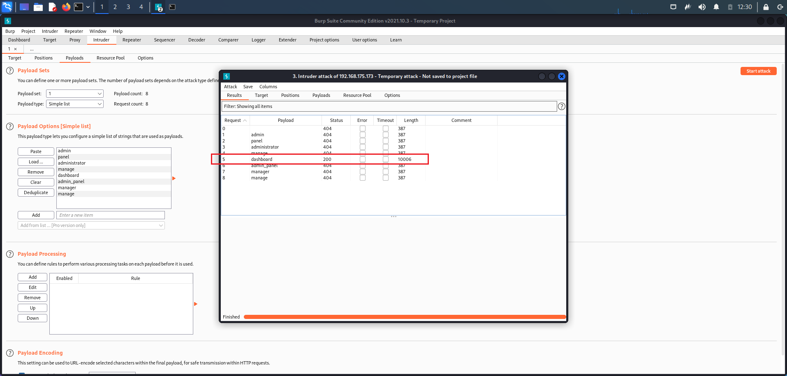
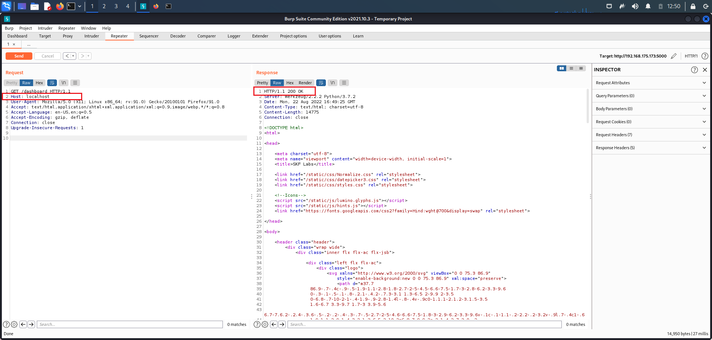
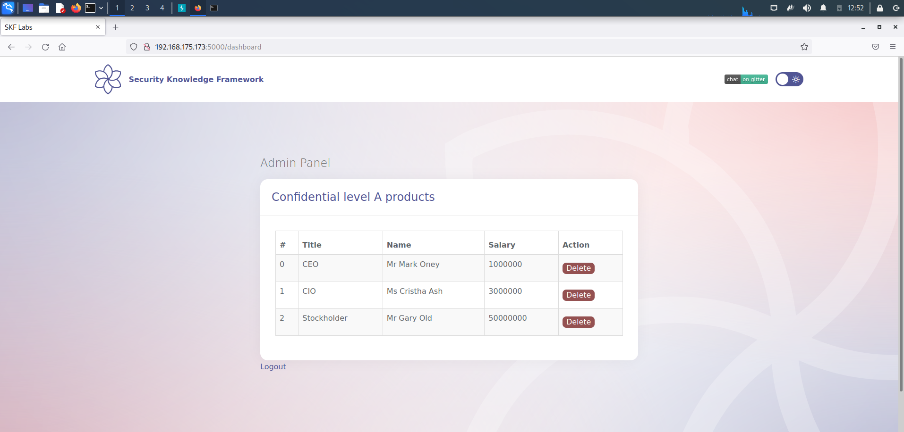
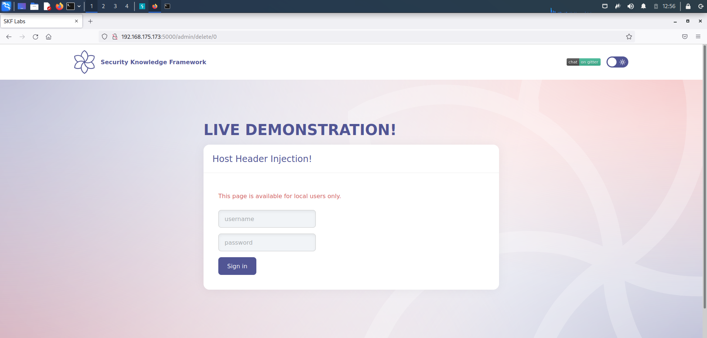
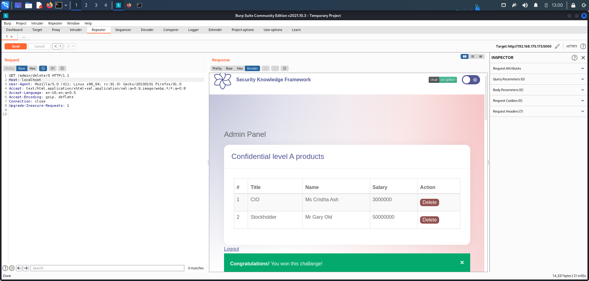

# Host Header Authentication Bypass

## Running the app on Docker

```
$ sudo docker pull blabla1337/owasp-skf-lab:host-header-authentication-bypass
```

```
$ sudo docker run -ti -p 127.0.0.1:5000:5000 blabla1337/owasp-skf-lab:host-header-authentication-bypass
```


Now that the app is running let's go hacking!


## Reconnaissance

A web server commonly hosts several web applications on the same IP address, referring to each application via the virtual host. In an incoming HTTP request, web servers often dispatch the request to the target virtual host based on the value supplied in the Host header. Without proper validation of the header value, the attacker can supply invalid input to cause the web server to:

- Dispatch requests to the first virtual host on the list.
- Perform a redirect to an attacker-controlled domain.
- **Allow access to virtual hosts that were not intended to be externally accessible.**
- Perform web cache poisoning.
- Manipulate password reset functionality.

In this laboratory, we are going to check the third scenario. Admin panel is not supposed to be accessable from external network. Server achieves this using `Host` header in client requests (vulnerable point), without checking it properly.
Our goal is "accessing admin panel from external network, even without knowing the actual credentials". We would achive this by tempering Host header in our http request.

Let's start with looking at a normal request to the vulnerable web application:



It give us 200 code which means: OK!
Out requesting page loaded successfully and there is no problem. Now what if we change the Host value in header? from 192.168.175.173:5000 to something random:



Interesting response from server: 302 Redirect! The server reacted to our random Host header, by redirecting us to location `/`, and it means the web application maybe vulnerable to host header injection attacks.

## Exploitation

In order to access to admin panel, we need to find its path at first. I used intruder with simple words to achieve this:



An interesting path fonud. Let's check it in browser:


Bingo! It seems there is something behinds. So we go straight to try to accesss it, by changing the `Host` header value to `localhost` (exploiting point). But why localhost?
Take a look at response:

```
This page is available for local users only.
```

We had reaction from server to changing the Host header value, before. It means the application checks the Host header and behaves in order to its value. By chaining all these to gether, by changing the Host header value to localhost, we maight be able to make the server to beleive that our request is from local computer itself and there is no need to restrictions. Let's try:



It is 200 which means OK! Rendering page:



Bingo! We bypassed the restrictions successfully! Let's check if we are able to make changes or not:



By clicking on Delete button directly, we would redirect to login page. So we repeat the bypassed we used for accessing `/dashboard` (do the same for `/admin/delete/0`):



Yes! It worked like a charm! We made changes in website by modifying a simple header.

## Additional sources


