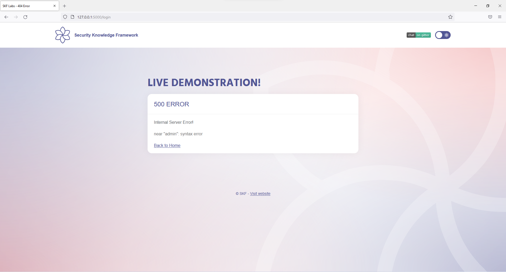
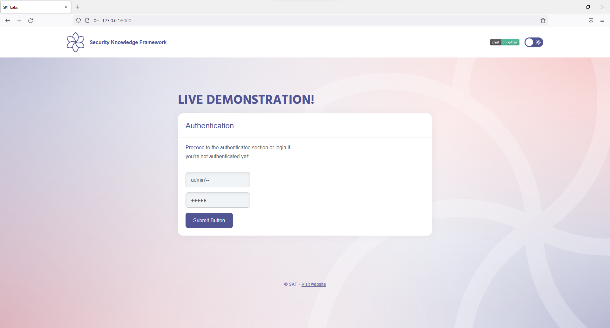
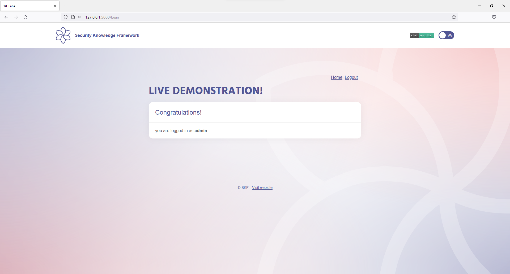

# SQLI Login Bypass

## Running the app on Docker

```
$ sudo docker pull blabla1337/owasp-skf-lab:sqli-login-bypass
```

```
$ sudo docker run -ti -p 127.0.0.1:5000:5000 blabla1337/owasp-skf-lab:sqli-login-bypass
```


Now that the app is running let's go hacking!


## Reconnaissance

While most applications require authentication to gain access to private information or to execute tasks, not every authentication method is able to provide adequate security. Negligence, ignorance, or simple understatement of security threats often result in authentication schemes that can be bypassed by simply skipping the log in page and directly calling an internal page that is supposed to be accessed only after authentication has been performed.

In addition, it is often possible to bypass authentication measures by tampering with requests and tricking the application into thinking that the user is already authenticated. This can be accomplished either by modifying the given URL parameter, by manipulating the form, or by counterfeiting sessions.

Obviously, an attacker can tamper with the URL, the form or the session cookie in order to get logged in as a user without knowing the actual credentials.

The goal of this lab is to get logged in as an admin without knowing his/her credentials

Let's start with an elementary test. Fill username and password fields with something random, to figure out the answer for "Can we enumerate users or not?":


Sometimes the server gives us useful information in the error message, like "User XXX not found". It explicitly mentions the username in the error message, and we can figure out user exists or not. The other case is that the server returns a general error message, like "username/password is wrong". No details here, but we know the problem. Finally, we have no errors here totally after clicking on "Submit Botton". It means no enumerations and no points of where the problem is. To find out more, we give it a SQL injection test, with a single quotation:




We have a syntax error! more errors and details that shows us it seems to be vulnerable to SQL injection attacks somehow.

## Exploitation

Let's check it a little bit deeper. We know the quotations, in the SQL query, on the website's backend, are **unbalanced** somehow. Actually, the query is something like this:

```
SELECT user FROM users WHERE username='admin' AND password='admin'
```

To bypass our assumption, the first question is "How we can bypass it?". The answer is simple: Use a **single-line comment statement**! After appending a **single quotation** and **comment statement** to end of username, the query would be something like below and the password part will be ignored:

```
SELECT user FROM users WHERE username='admin'--' AND password='admin'
```

In other word, the SQL will ignore the rest of things after comment statement and the final query would be a balanced query like this:

```
SELECT user FROM users WHERE username='admin'--
```

So, what does it means? it asks the server for "select everyone whose names is admin" and if there is someone with that name, our query becomes True and passes the next possible `if` statement in code:

```
if (query(user_inputs) == True)
{
    // display user account panel
}
```

Let's try:




## Additional sources


