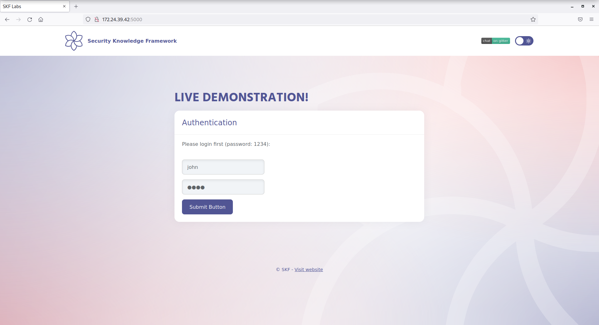
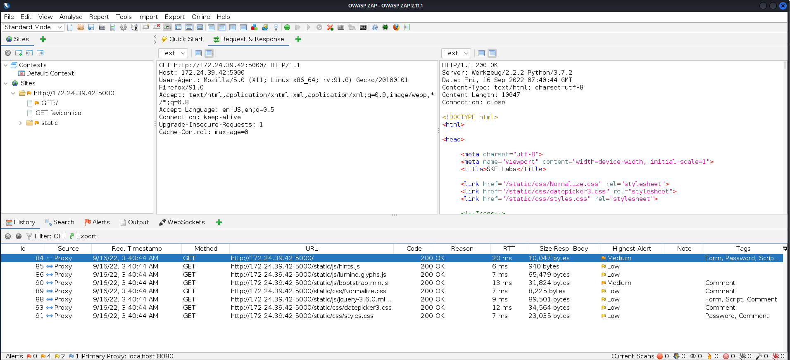
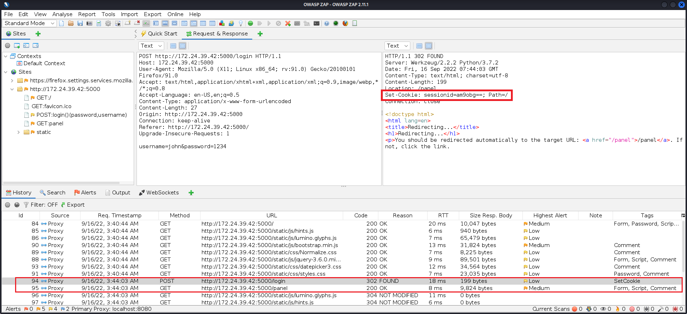
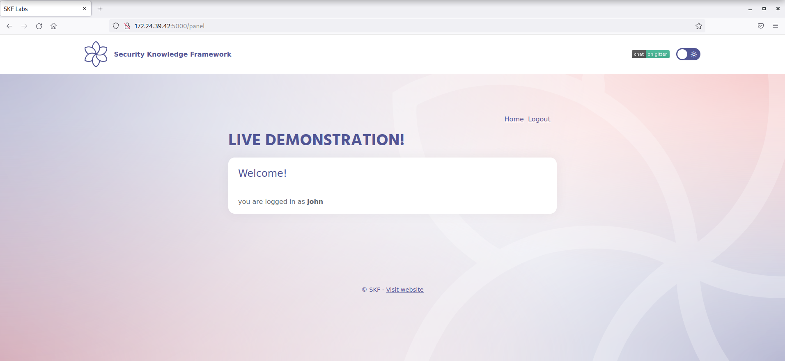
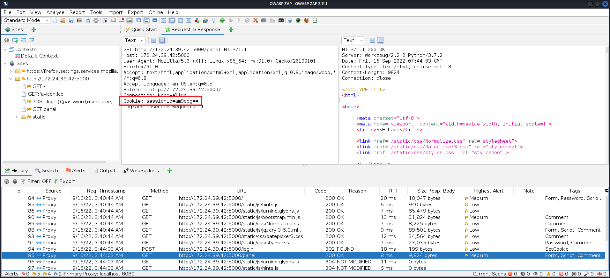
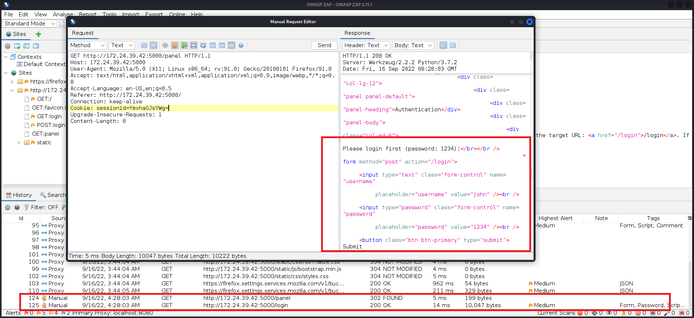
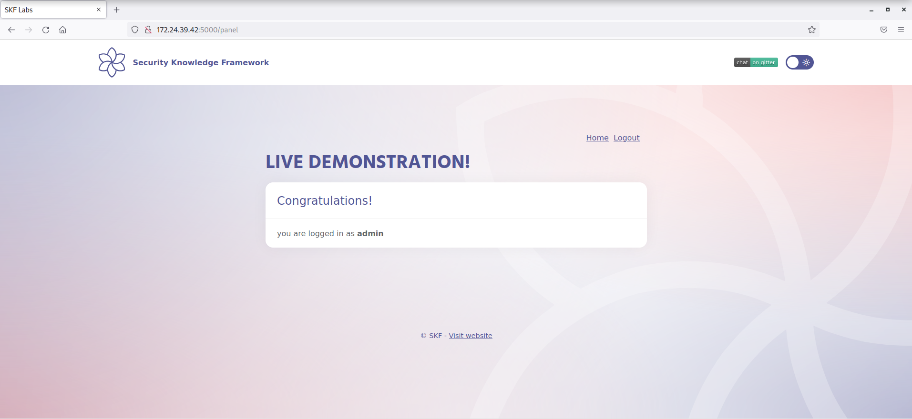

# Session Management - Part 1

## Running the app on Docker

```
$ sudo docker pull blabla1337/owasp-skf-lab:session-management-1
```

```
$ sudo docker run -ti -p 127.0.0.1:5000:5000 blabla1337/owasp-skf-lab:session-management-1
```


Now that the app is running let's go hacking!


## Reconnaissance

One of the core components of any web-based application is the mechanism by which it controls and maintains the state for a user interacting with it. To avoid continuous authentication for each page of a website or service, web applications implement various mechanisms to store and validate credentials for a pre-determined timespan. These mechanisms are known as Session Management.

An attacker who is able to predict and forge a weak cookie can easily hijack the sessions of legitimate users.

Cookies are used to implement session management and are described in detail in RFC 2965. See [WSTG-SESS-01](https://owasp.org/www-project-web-security-testing-guide/v42/4-Web_Application_Security_Testing/06-Session_Management_Testing/01-Testing_for_Session_Management_Schema) for more information.

The goal of this lab is to get access to admin panel, without knowing his/her credentials. So let's start.

At the first look, there is default credentials and site leads us to perform new login:



Before performing new login, let's check if there is any cookie(s):



No cookies for now. so we just continue to login as user `john`:



An interesting cookie found! after submiting login request, server respond us with 302 redirect and new cookie named `sessionid` and a base64-looking value for it. To make sure, decoding value `am9obg==` as base64, gives us very interesting string: `john`! It keeps track of submitting username. Let's check next response, which server redirects us to:




We logged in to user panel with a cookie named `sessionid` that keeps username as base64 encoded string.

In order to WSTG-SESS-01:

```
A common mistake is to include specific data in the Token instead of issuing a generic value and referencing real data server-side.
```

## Exploitation

Let's see server reaction to manipulating cookie. To do so, we can totally remove cookie or change it's value to something random. For example I base64 `blahblah` and put the result(`YmxhaGJsYWg=`) in `sessionid` cookie:



It redirects us to login page. Now we try with possible valid value like `admin`, to check how it reacts.




We successfully logged in as user `admin` without knowing his password. Mission complete!

## Additional sources


