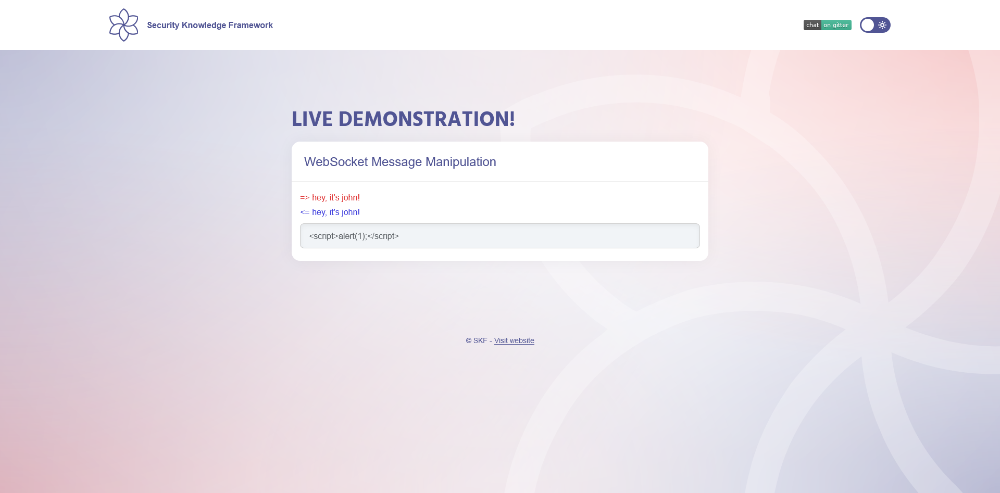
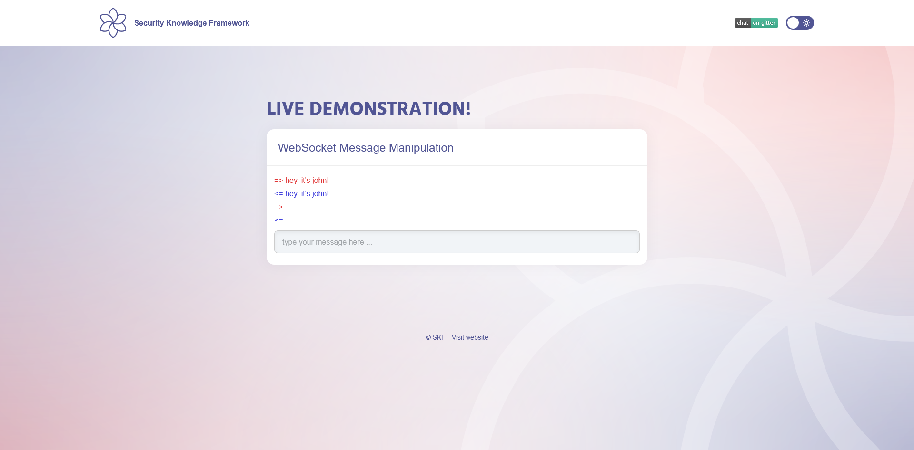
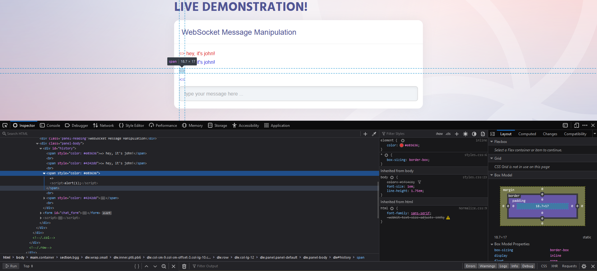
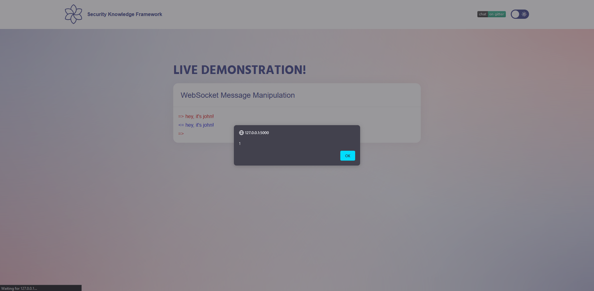
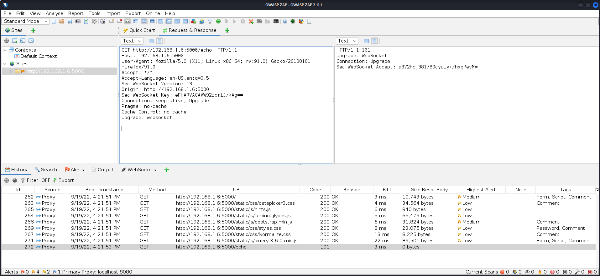
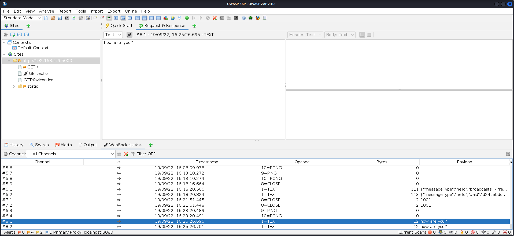
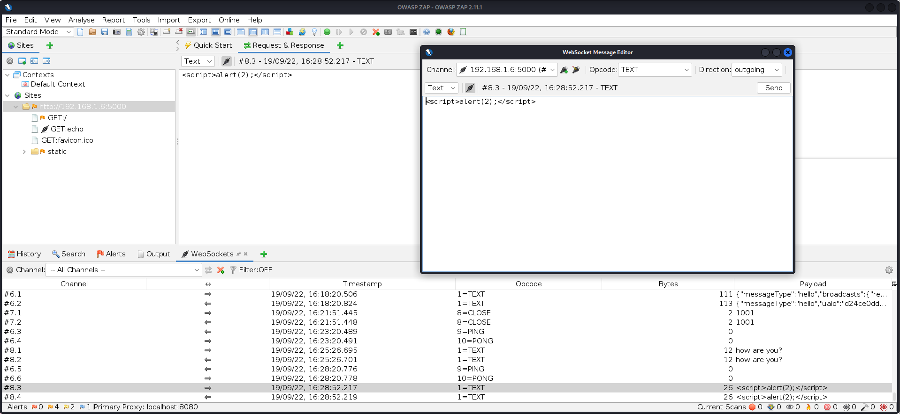
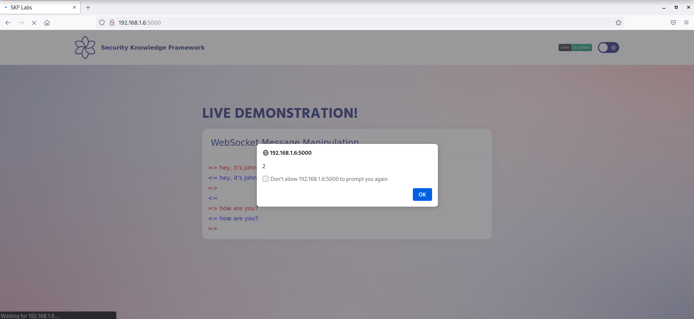

# WebSocket Message Manipulation

## Running the app on Docker

```
$ sudo docker pull blabla1337/owasp-skf-lab:websocket-message-manipulation
```

```
$ sudo docker run -ti -p 127.0.0.1:5000:5000 blabla1337/owasp-skf-lab:websocket-message-manipulation
```


Now that the app is running let's go hacking!


## Reconnaissance

Traditionally, the HTTP protocol only allows one request/response per TCP connection. Asynchronous JavaScript and XML (AJAX) allows clients to send and receive data asynchronously (in the background without a page refresh) to the server, however, AJAX requires the client to initiate the requests and wait for the server responses (half-duplex).

WebSockets allow the client or server to create a ‘full-duplex’ (two-way) communication channel, allowing the client and server to truly communicate asynchronously. WebSockets conduct their initial upgrade handshake over HTTP and from then on all communication is carried out over TCP channels by use of frames.

The goal of this lab is to find some client side vulnerability abusing websockets.

The home paage looks pretty simple:


So lets try it by entering some text in input:


The application is an echo server. It reflects our input directly on page. The first thing we comes to mind is to check for XSS. Let's try:



At the first look, nothing happens and the application shows us two empty rows:



Since our input is not empty, it means something happened. Maybe parsed somehow or it's trunicated. To ensure this, let's take a look at the page source code by pressing F12 and use "inspect elemnt" feature of our browser (mine is mozilla firefox):



Bingo! our input is right here. So we refresh the page to re-render the entire page and check if inputs are persistent or not:



## Exploitation

In this scenario, we capture the request using proxy and manipulate websocket messages as we want. OWASP-ZAP makes it easy to us:



As you can see, websocket handshake performed on page load. Let's write some message:



Click on "Open/Resend with Message Editor..." option and write your payload:



Server respoend us with correctly. Refresh the page to check result:



Bingo! we successfully executed code on page. Also we could set breakpoint before sending request ^\_^

NOTE: After refreshing page, you see two alerts per input. The reason is server returns us everything in history and since it's echo server, it duplicates our input. Therefore, popup shown us because of ourselve input in first time, and at the second time it is echo server response that reflacted our message.

## Additional sources



