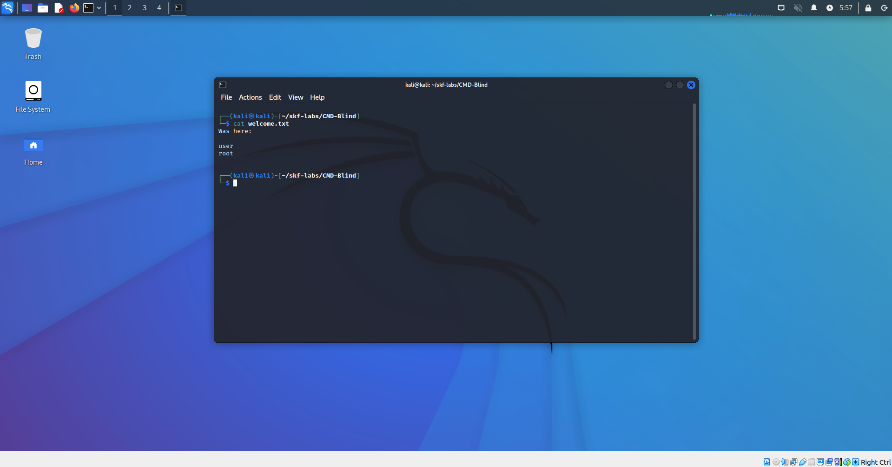

# Blind command injection

## Running the app on Docker

```
$ sudo docker pull blabla1337/owasp-skf-lab:cmd-blind
```

```
$ sudo docker run -ti -p 127.0.0.1:5000:5000 blabla1337/owasp-skf-lab:cmd-blind
```


Now that the app is running let's go hacking!


## Reconnaissance

The command injection is an attack in which the goal is execution of arbitrary commands on the host operating system via a vulnerable application. Command injection attacks are possible when an application passes unsafe user supplied data (forms, cookies, HTTP headers etc.) to a system shell.

In the first step, the attacker needs to inspect the functioning of the web app in order to find possible injection points.

When we start the application we can see that there is text box to write who we are. We are going to write our name and press the button:


If we inspect the request with an intercepting proxy (we are using Burp) we can see that the application is performing a POST request to /. In the request we send the text we have just written as our name. However in the response, we just get a "WELCOME!" string independently to what we have written.


If that was black box, as an input field we should try here different ways of attacking the web app until we realize that we can perform a command injection (blind). As it is a blind command injection (also called blind OS command injection) we need to find out a way to inject commands to the system and see the output of these results.

In this case we are going to use a local "hall-of-fame" file in the lab were the name is written after we type and press the button in the website.

## Exploitation

We send a new HTTP request trying to send the output of the command whoami (supposing that it will be executed in the target system).


Now we access the file welcome to check that the first name we wrote (shayu) was recorded, but in this case, also the output of the command whoami, showing us the priviledge of the target user in the target system and that the web app is actually vulnerable to OS command injection.



As a blind command injection, we could try other methods to detect that it is vulnerable and how to show the result of the command executed (because many times we will not have access to the inner files, like we did here with the file welcome, supposing a white box pentest).

## Additional sources

[https://www.owasp.org/index.php/Command_Injection](https://www.owasp.org/index.php/Command_Injection)
