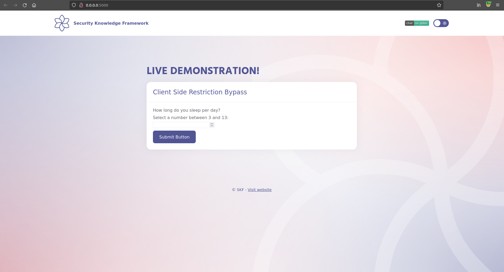
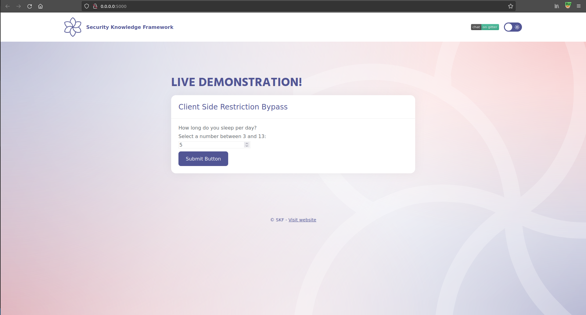
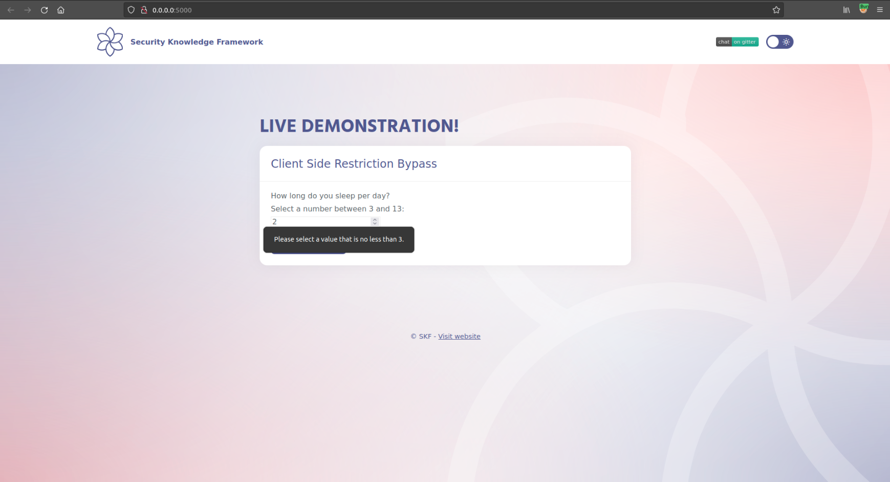
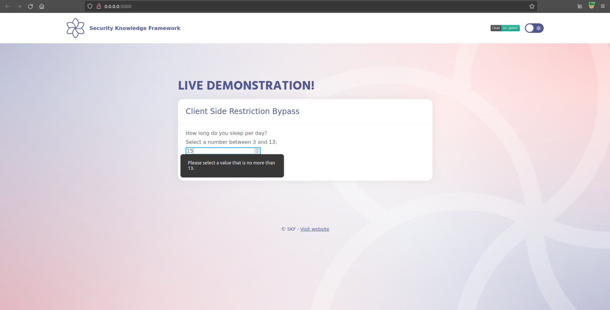
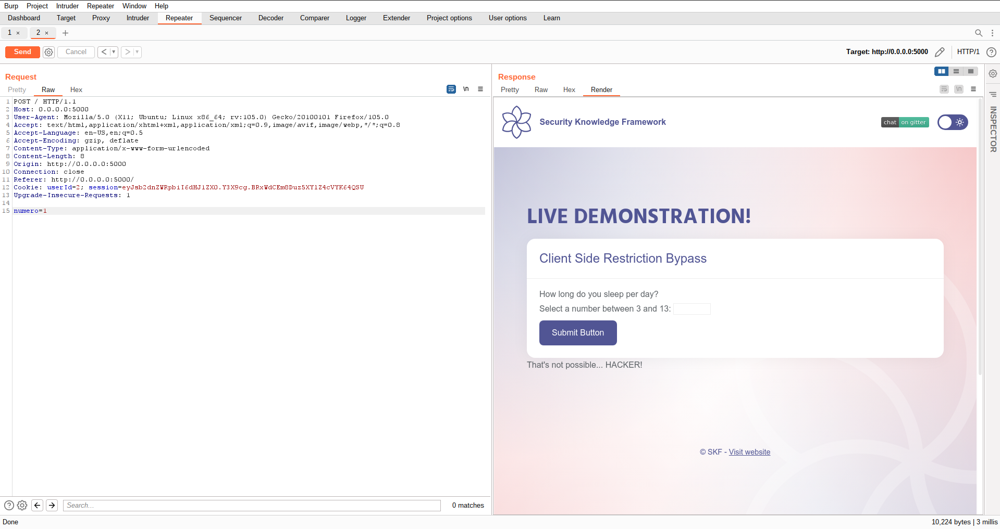
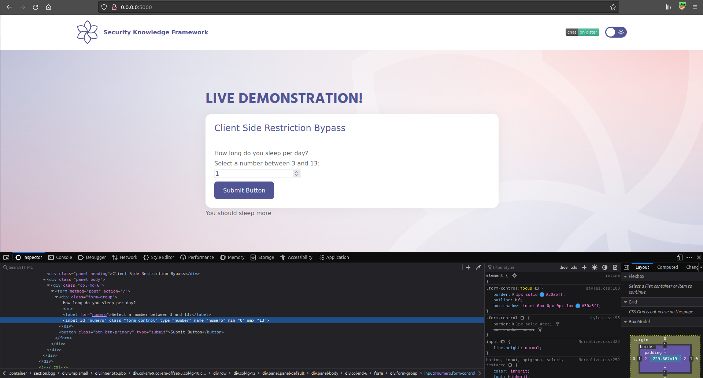

# Client Side Restriction Bypass

## Running the app on Docker

```text
$ sudo docker pull blabla1337/owasp-skf-lab:client-side-restriction-bypass
```

```text
$ sudo docker run -ti -p 127.0.0.1:5000:5000 blabla1337/owasp-skf-lab:client-side-restriction-bypass
```


Now that the app is running let's go hacking!


## Reconnaissance

The app allows us to select a number between 3 and 13 from the number input form. Let's also try typing numbers outside that interval directly into the field.









## Exploitation

We could intercept and modify the request on Burp:



Or alternatively, use devtools to modify the client-side restrictions directly:



And goal achieved! We could bypass the client-side restrictions.

## Additional sources


