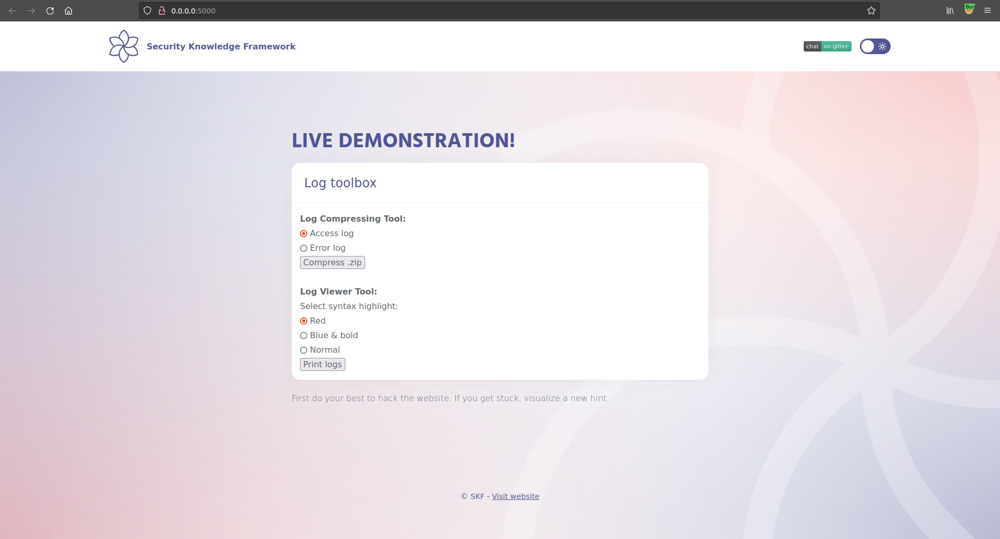
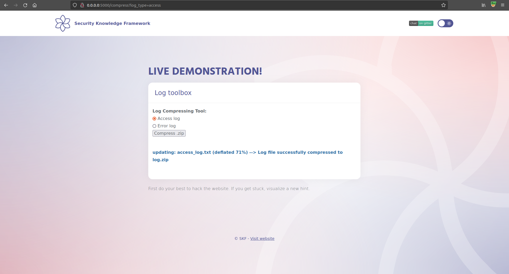
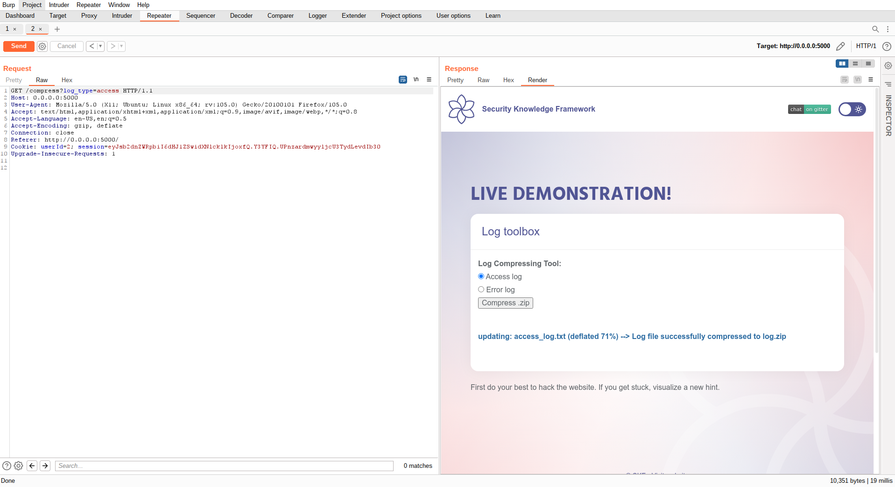
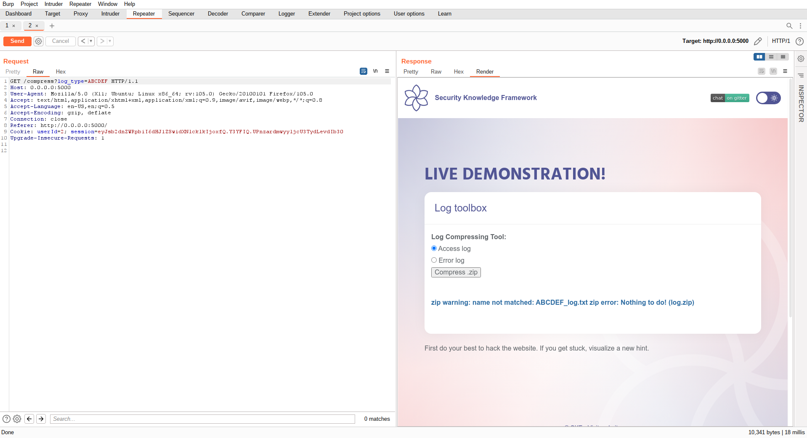
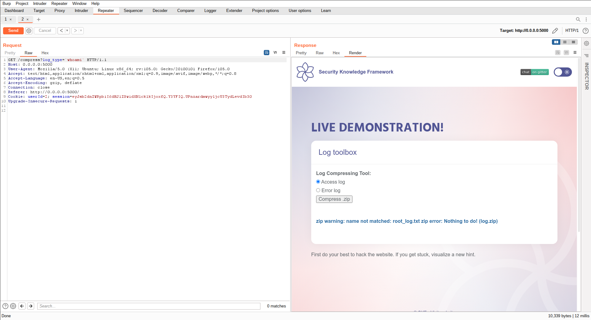

# Command Injection 2

## Running the app

```
$ sudo docker pull blabla1337/owasp-skf-lab:cmd2
```

```
$ sudo docker run -ti -p 127.0.0.1:5000:5000 blabla1337/owasp-skf-lab:cmd2
```


Now that the app is running let's go hacking!


## Reconnaissance

The command injecion is an attack in which the goal is the execution of arbitrary commands on the host operating system via a vulnerable application. Command injection attacks are possible when an application passes unsafe user supplied data (forms, cookies, HTTP headers etc.) to a system shell. In the first step, the attacker needs to inspect the functioning of the web app in order to find possible injection points. When we start the application we can see that there are two forms: the first one to select the logs and second one to select the color in the logs.



We are going to perform a basic exploration of the website trying the different options available.

We start by trying the Log Viewer Tool:


If we select the red color, the word log for the logs, will be red. We can inspect the request with an intercepting proxy (we are using Burp):


Then, if we try the other functionality we get something like that:



This request would seem like that:



It compresses the file and outputs the information message.

## Exploitation

We guess that the output is related to what we write in log_type (access), so we change the input to ABCDEF:



Now, we discover that it outputs what we write in log_type as parte of the name of the file. So let's see if that is also being executed in the system by entering a os command:



Finally, we have sent a new HTTP request trying to send the output of the command whoami to the message in the website and we got it. The output of the command whoami, showing us the priviledge of the target user in the target system and that the web app is actually vulnerable to OS command injection.

## Mitigation

OS Command Injection can be prevented by following the methods described below:

Primary Defenses:

Option 1: Avoid calling OS Commands directly. Option 2: Escaping values added to OS commands. Option 3: Parameterization in conjunction with Input Validation

Additional Defenses:

Applications should run using the lowest privileges that are required to accomplish the necessary tasks. If possible, create isolated accounts with limited privileges that are only used for a single task.

### Escaping values added to OS commands.

In this scenario we are Escaping values added to OS Command. For Escaping in python there is SHLEX(Simple lexical analysis) Library. The SHLEX is used for parsing simple shell like syntaxes. shlex.quote(): Function return a shell escaped version of the string.

The following code is vulnerable to OS Command injection because the user input is concatenated into query: PATH:/CMD2/CMD2.py

```
os_result = os.popen("zip log.zip " + log_type + "_log.txt && echo ' --> \
  Log file successfully compressed to log.zip'").read()
```

This is prevented by shlex.quote()

```
log_type1=shlex.quote(log_type)
os_result = os.popen("zip log.zip " + log_type1 + "_log.txt && echo ' --> \
  Log file successfully compressed to log.zip'").read()
```

This will ensure that the input is neutralized and the OS will not consider anything within the input as commands that needs to be executed.

## Additional sources

[https://www.owasp.org/index.php/Command_Injection](https://www.owasp.org/index.php/Command_Injection)
