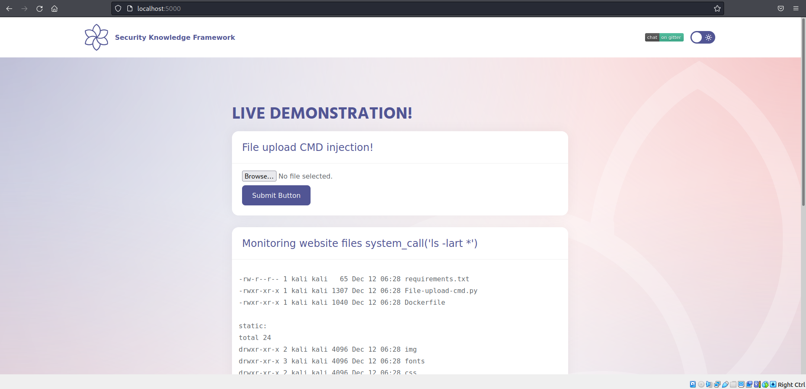
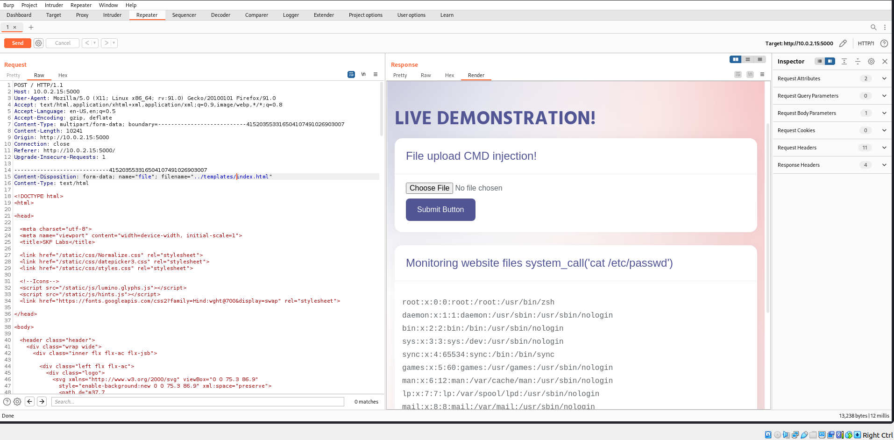
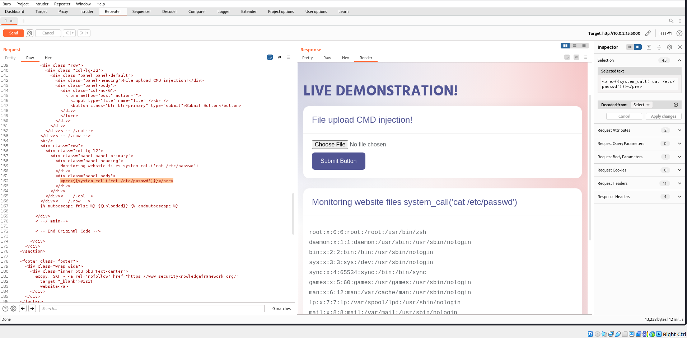
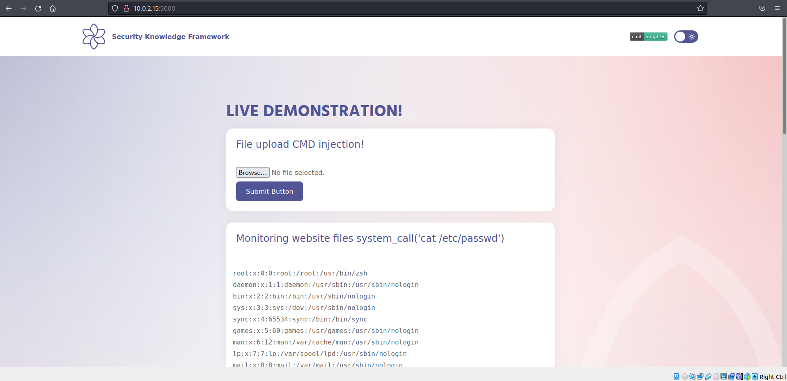

# Command Injection 3

## Running the app on Docker

```
$ sudo docker pull blabla1337/owasp-skf-lab:cmd3
```

```
$ sudo docker run -ti -p 127.0.0.1:5000:5000 blabla1337/owasp-skf-lab:cmd3
```


Now that the app is running let's go hacking!


## Reconnaissance

The command injecion is an attack in which the goal is the execution of arbitrary commands on the host operating system via a vulnerable application. Command injection attacks are possible when an application passes unsafe user supplied data (forms, cookies, HTTP headers etc.) to a system shell. In the first step, the attacker needs to inspect the functioning of the web app in order to find possible injection points.

We will start by exploring the application, we see there are file upload possibilities and also the home page displays the command prompt output of `'ls -lart *'`.



On attempting to upload file through the file upload functionality, we can notice the uploaded file can be found in the /uploads directory in a normal flow. And what about the command prompt output?, if you closely analyse the index.html file under /templates folder it includes a system call function. That's interesting right? Is it possible that the application consumes system_call function?

```
    <div class="col-lg-12">
                <div class="panel panel-primary">
                    <div class="panel-heading">
                        Monitoring website files system_call('ls -lart *')
                    </div>
                    <div class="panel-body">
                        <pre>{{system_call('ls -lart *')}}</pre>
                    </div>
                    <div class="panel-footer">
                        Hacking challenges
                    </div>
                </div>
```

## Exploitation

Let's think more about this, so we have a file upload possibility as well the application renders the system call from index.html to run and display OS command output. what if you as an attacker can exploit this situation and overwrite the index.html using the upload function combined with the path traversal. Let's give it go, we can either copy the index.html file separately and modify the system call to some other command you would like to run, assume "cat /etc/passwd" or modify the system_call while intercepting using burpsuite. Remember while we upload we also need to modify the upload path to "../templates/index.html" to overwrite the current rendered index.html:

_Modified index.html:_

```
<div class="panel panel-primary">
    <div class="panel-heading">
     Monitoring website files system_call('cat /etc/passwd')
     </div>
        <div class="panel-body">
        <pre>{{system_call('cat /etc/passwd')}}</pre>
         </div>
         <div class="panel-footer">
         Hacking challenges
         </div>
         </div>
```

Upload the modified file and changed the upload path as follows: 

Incase, you havent already modified the system_call locally you may also do it within the intercepted request in burpsuite as follows:



Forward the modified request and what do you see :-)? We successfully managed to overwrite the index.html and ran OS command of our choice.



Can you explore other possibilities using the same attack vector? Why not try to replace some icons or deface the application :-P?

## Additional sources

[https://www.owasp.org/index.php/Command_Injection](https://www.owasp.org/index.php/Command_Injection)
