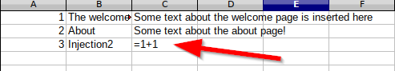
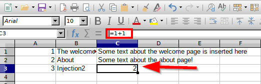
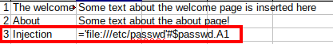
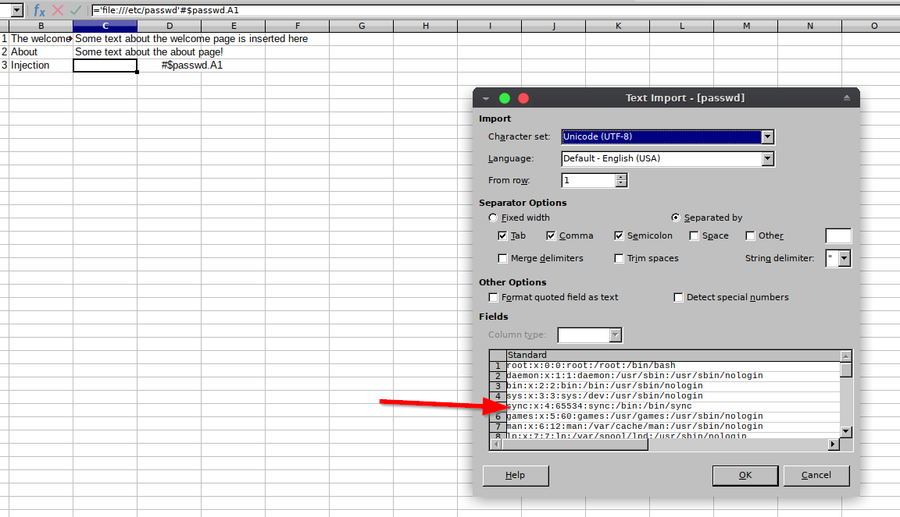

# Python - Formula Injection

## Running the app

```
$ sudo docker pull blabla1337/owasp-skf-lab:formula-injection
```

```
$ sudo docker run -ti -p 127.0.0.1:5000:5000 blabla1337/owasp-skf-lab:formula-injection
```

Now that the app is running let's go hacking!

## Running the app Python3

First, make sure python3 and pip are installed on your host machine. After installation, we go to the folder of the lab we want to practise "i.e /skf-labs/XSS/, /skf-labs/jwt-secret/ " and run the following commands:

```
$ pip3 install -r requirements.txt
```

```
$ python3 <labname>
```


Now that the app is running let's go hacking!


.png>)

## Reconnaissance

### Step1

The first step is to identify input forms and parameters that can be exported as CSV, XLS, XLSX or ODS. In this example we find that it's possible to add new pages and, after clicking on the button "Export pages", generate a XLS report of all pages created.


```
http://localhost:5000/
```

### Step2

Now let's see if we can inject a simple spreadsheet formula.


```
=1+1
```

The page "Injection2" was created and the formula was fully accepted.


Of course the formula has no effect on browser. This test is important for us to know the application is not validating the operator "=", so it can be used to inject formulas in our spreadsheet.

### Step3

Now, let's export the pages and see in our spreedsheet application (Excel, Calc) how does the formula injection look like.


Once the report is loaded into the spreadsheet application, we can notice the formula is not immediatelly executed and it's shown as text. This behavior can vary depending on the version and which application is being used.



However, any interaction with the cell containing the injected formula will cause the application to execute it.



By doing it so we are sure the application has a Formula Injection vulnerability.

This is due to the fact that the user supplied input is not properly verified, accepting any character, and, thereafter, exports the inputs to a XLS file.

## Exploitation

We are going to use this vulnerability to have a simple Command Execution on the victm's machine.

### Step1

We need to choose the correct formula to inject, based on the spreadsheet reader to load the file.

#### MS Excel

```
=cmd|' /C notepad'!'A1'
```

#### LibreOffice Calc

```
='file:///etc/passwd'#$passwd.A1
```

#### Step 2

Create a new page, injecting the correct formula, and export the pages as XLS.


#### Step 3

Open the exported file in the spreadsheet app. After the interaction with the cell containing the injected formula, we can verify the command is executed.





What else can be done?

Check the Additional sources section below with more possibilities for Formula Injection!

## Additional sources

Please refer to the OWASP testing guide for a full complete description about Formula Injection (CSV Injection)!

[https://www.owasp.org/index.php/CSV\_Injection](https://www.owasp.org/index.php/CSV\_Injection)

More references

[https://payatu.com/csv-injection-basic-to-exploit/](https://payatu.com/csv-injection-basic-to-exploit/)

[https://www.notsosecure.com/data-exfiltration-formula-injection/](https://www.notsosecure.com/data-exfiltration-formula-injection/)

[https://www.contextis.com/en/blog/comma-separated-vulnerabilities](https://www.contextis.com/en/blog/comma-separated-vulnerabilities)

[https://pentestmag.com/formula-injection/](https://pentestmag.com/formula-injection/)
