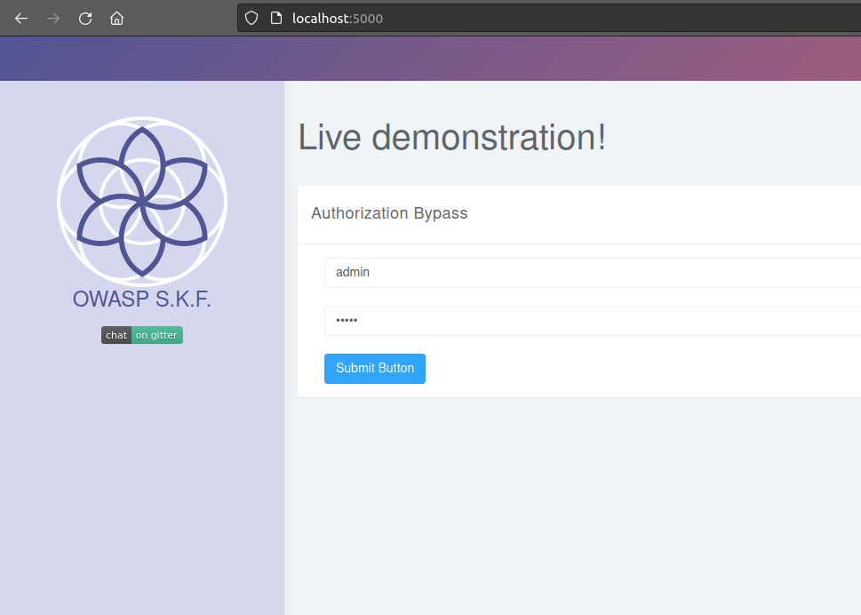
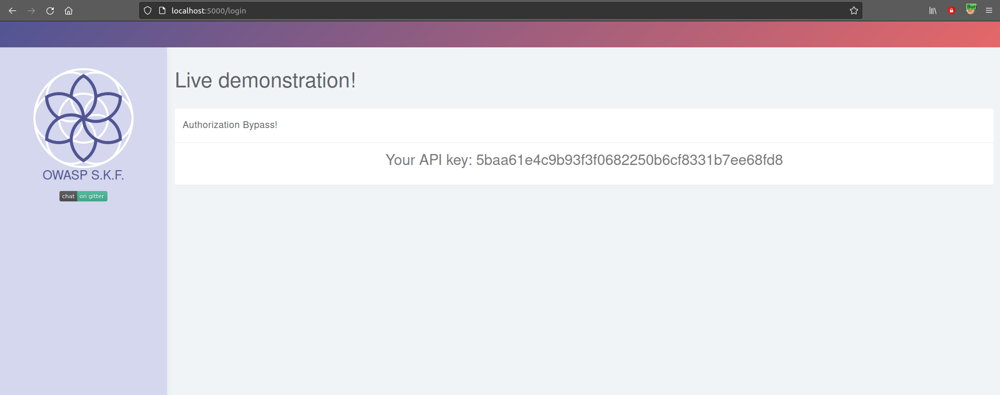
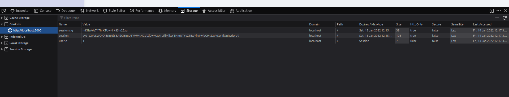
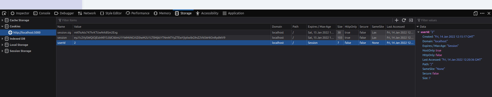

# KBID xxx - Auth-bypass-simple

## Running the app Python3

First, make sure python3 and pip are installed on your host machine. After installation, we go to the folder of the lab we want to practise "i.e /skf-labs/XSS/, /skf-labs/jwt-secret/ " and run the following commands:

```
$ pip3 install -r requirements.txt
```

```
$ python3 <labname>
```


Now that the app is running let's go hacking!


## Reconnaissance

While most applications require authentication to gain access to private information or to execute tasks, not every authentication method is able to provide adequate security. Negligence, ignorance, or simple understatement of security threats often result in authentication schemes that can be bypassed by simply tampering with cookie values.

Let's log in with admin/admin.





We see an API key, let's check the cookies:



## Exploitation

We have a cookie called userId, maybe this application is relying on this cookie for authentication, let's try changing it to 2.



The application did indeed use this cookie for authentication and now we have access to another user's API key.

## Additional sources




