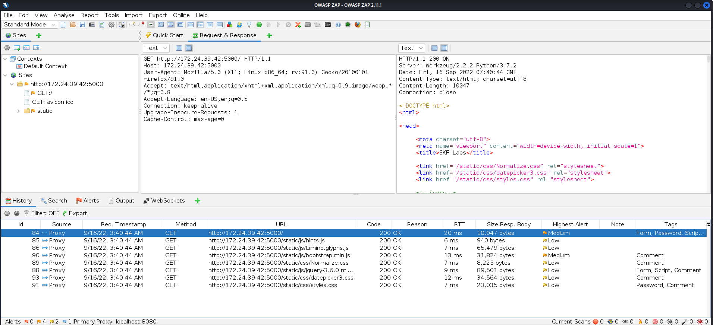
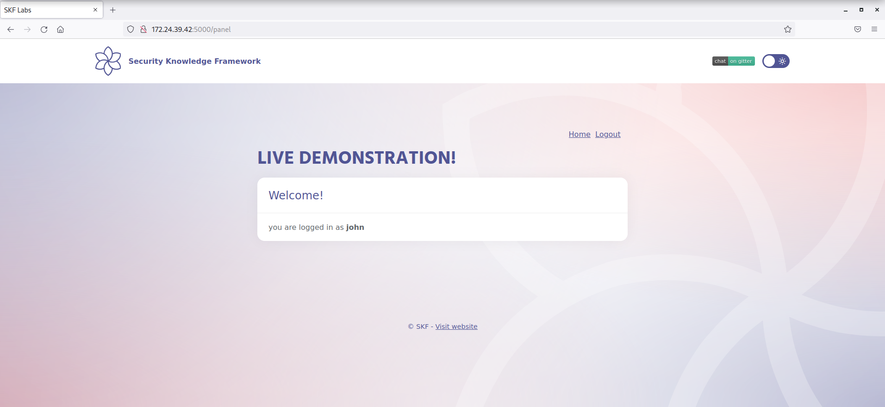
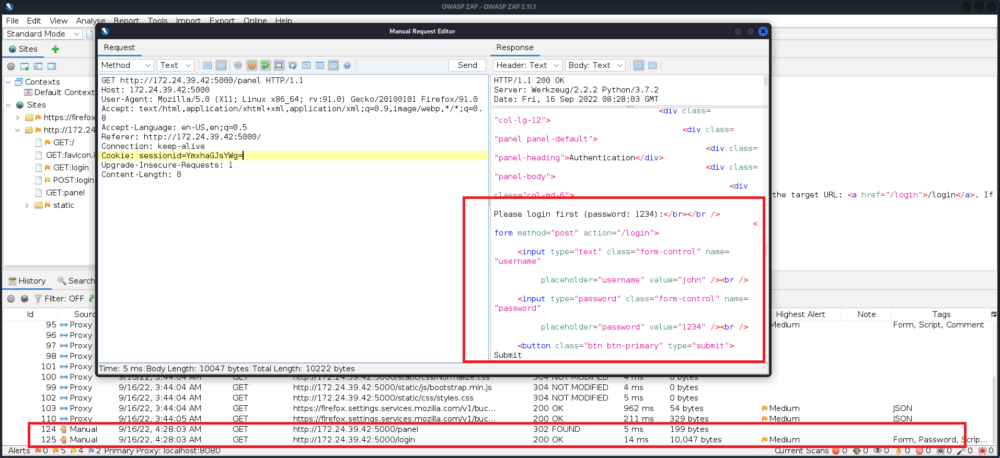
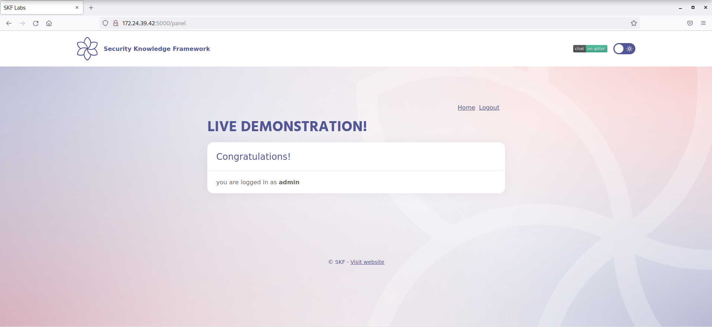

# KBID XXX - Session Management - Part 1

## Running the app

```
$ sudo docker pull blabla1337/owasp-skf-lab:session-management-1
```

```
$ sudo docker run -ti -p 127.0.0.1:5000:5000 blabla1337/owasp-skf-lab:session-management-1
```


Now that the app is running let's go hacking!


## Running the app Python3

First, make sure python3 and pip are installed on your host machine. After installation, we go to the folder of the lab we want to practise "i.e /skf-labs/python/Session-Management-1/ " and run the following commands:

```
$ pip3 install -r requirements.txt
```

```
$ python3 <labname>
```


Now that the app is running let's go hacking!



## Reconnaissance

One of the core components of any web-based application is the mechanism by which it controls and maintains the state for a user interacting with it. To avoid continuous authentication for each page of a website or service, web applications implement various mechanisms to store and validate credentials for a pre-determined timespan. These mechanisms are known as Session Management.

An attacker who is able to predict and forge a weak cookie can easily hijack the sessions of legitimate users.

Cookies are used to implement session management and are described in detail in RFC 2965. See [WSTG-SESS-01](https://owasp.org/www-project-web-security-testing-guide/v42/4-Web_Application_Security_Testing/06-Session_Management_Testing/01-Testing_for_Session_Management_Schema) for more information.

The goal of this lab is to get access to admin panel, without knowing his/her credentials. So let's start.

At the first look, there is default credentials and site leads us to perform new login:


Before performing new login, let's check if there is any cookie(s):



No cookies for now. so we just continue to login as user `john`:


An interesting cookie found! after submiting login request, server respond us with 302 redirect and new cookie named `sessionid` and a base64-looking value for it. To make sure, decoding value `am9obg==` as base64, gives us very interesting string: `john`! It keeps track of submitting username. Let's check next response, which server redirects us to:




We logged in to user panel with a cookie named `sessionid` that keeps username as base64 encoded string.

In order to WSTG-SESS-01:
```
A common mistake is to include specific data in the Token instead of issuing a generic value and referencing real data server-side.
```

## Exploitation

Let's see server reaction to manipulating cookie. To do so, we can totally remove cookie or change it's value to something random. For example I base64 `blahblah` and put the result(`YmxhaGJsYWg=`) in `sessionid` cookie:



It redirects us to login page. Now we try with possible valid value like `admin`, to check how it reacts. 




We successfully logged in as user `admin` without knowing his password. Mission complete!

## Additional sources


