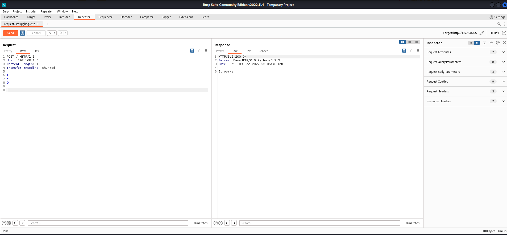

# KBID XXX - HTTP Desync Attack (Request Smuggling) CL.TE - 1

## Running the app

```
$ git clone git@github.com:blabla1337/skf-labs.git
```
```
$ cd skf-labs/python/HTTP-desync-CLTE-frontend-server
```
```
$ docker-compose -p http-desync-attack-clte-1 up --build
```


Now that the app is running let's go hacking!



## Introduction

Request smuggling attacks involve placing both the Content-Length header and the Transfer-Encoding header into a single HTTP request and manipulating these so that the front-end and back-end servers process the request differently. The exact way in which this is done depends on the behavior of the two servers:

 - CL.TE: the front-end server uses the Content-Length header and the back-end server uses the Transfer-Encoding header.
 - TE.CL: the front-end server uses the Transfer-Encoding header and the back-end server uses the Content-Length header.
 - TE.TE: the front-end and back-end servers both support the Transfer-Encoding header, but one of the servers can be induced not to process it by obfuscating the header in some way.

see [here](https://portswigger.net/web-security/request-smuggling) for more info.

## Reconnaissance

Here, the front-end server uses the Content-Length header and the back-end server uses the Transfer-Encoding header. We can perform a simple HTTP request smuggling attack as follows:

First of all, lets see what happens with a normal POST request:



As you can see it responed us with string: `It works!`. As frontend server uses Content-Length and backend server uses Transfer-Encoding in this scenario, we should align our request in order to this information. We set Content-Length to 11 to pass the all request body from frontend server to backend. The request body goes to the backend server as a sequence of bytes like `1\r\na\r\n0\r\n\r\n` (11 bytes).
But to get a valid response from backend server, we should consider Transfer-Encoding header. As RFC-2616 specifications:
```
Chunked-Body   = *chunk
                 last-chunk
                 trailer
                 CRLF

chunk          = chunk-size [ chunk-extension ] CRLF
                 chunk-data CRLF
chunk-size     = 1*HEX
last-chunk     = 1*("0") [ chunk-extension ] CRLF
```
the first line will be considered as **chunk size** in hexadecimal format. and **chunk body** (data) comes after, follwed by a CRLF at the end.
The rest line ablove, makes a single chunk. In our test it is `1\r\na\r\n`. The last chunk would be `0\r\n` and server waits for more chunks until last-chunks.
The last chunk indeed is a normal chunk which tells *there is no more content* (begins with `0` in hexadecimal as length and nothing followed by terminating CRLF).

Now what if we don't send last chunk? you right! the servers waits until it comes and client will goes to timeout. Let's craft a tricky one:
```
POST / HTTP/1.1
Host: 192.168.1.5
Content-Length: 4
Transfer-Encoding: chunked

1
a
X

```
Whats happening:
- The request comes to frontend server first of all.
- frontend server parses request and gets to `Content-Length` header which is 4
- frontend server reads the request body in specified amount of bytes in step 2 (4 bytes) (`1\r\na`).
- frontend server forwards the **processed request** to backend server, and the rest (`\r\nX`) remains unprocessed in frontend server.
- backend server gets the request and reads the first chunk in length `1` and data `a`
- backend server waits for the last chunk (which length is `0` followed by a CRLF)
- the connection remains open until client sends last chunk!
Let's see result in action:


No response from application, as you can see! we crafted a request which passes the frontend server and has effects on backend server.
This is a simple demonstration. For real cases and more information, follow additional sources linked end of this file.

## Additional sources



