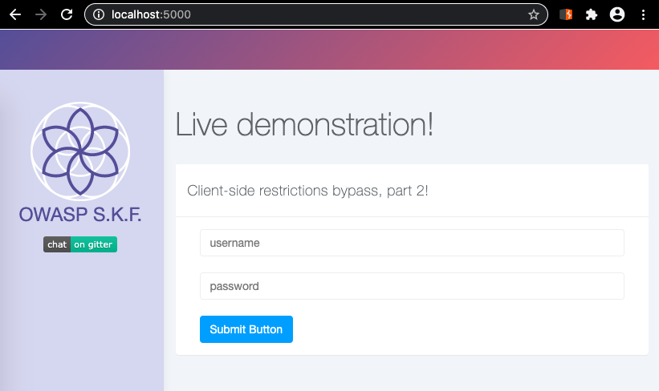
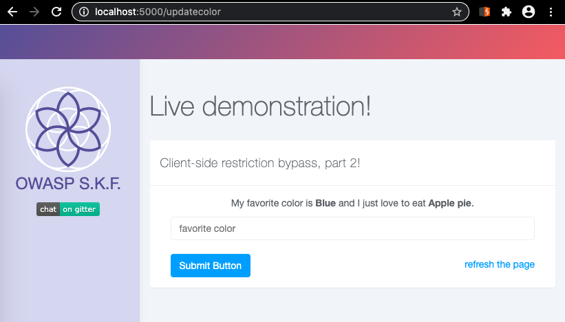
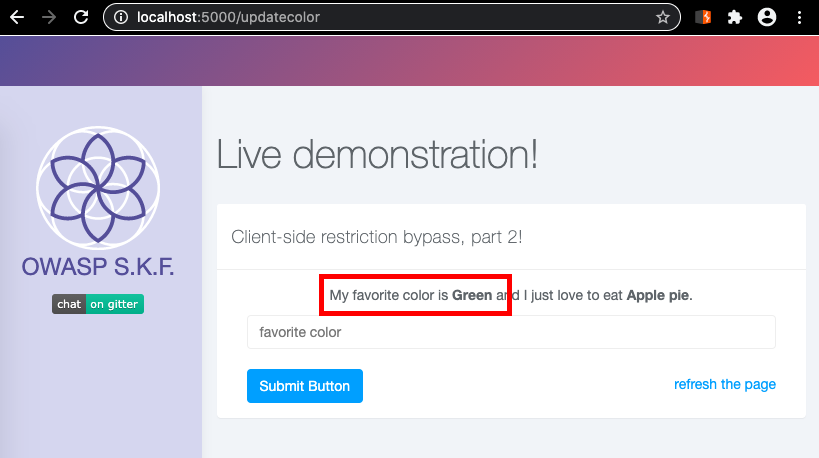
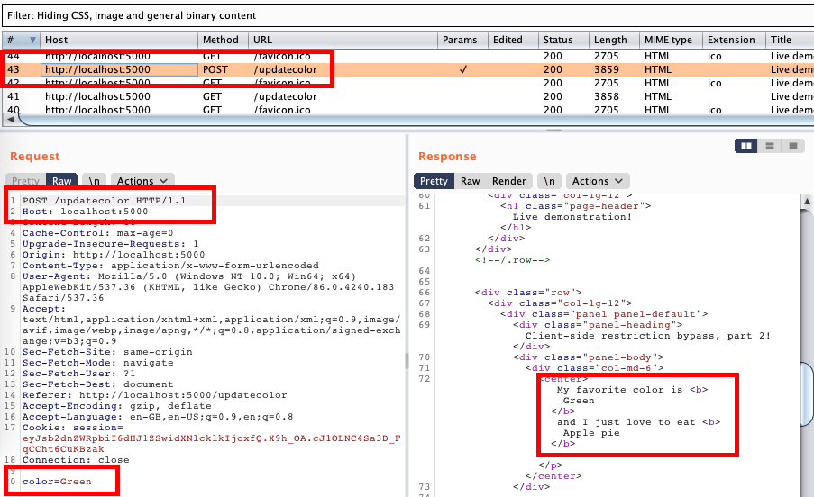
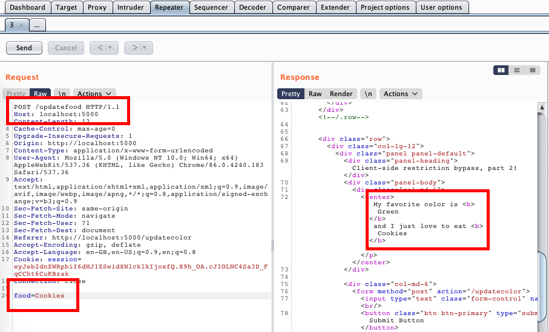
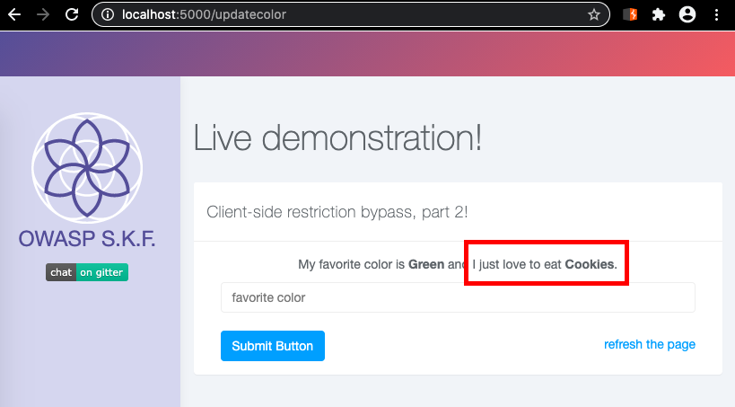
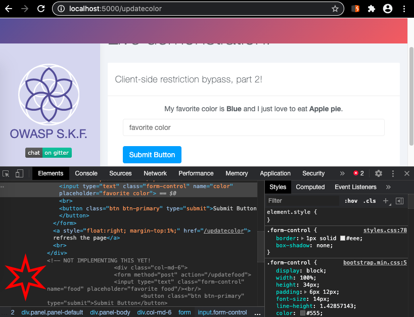
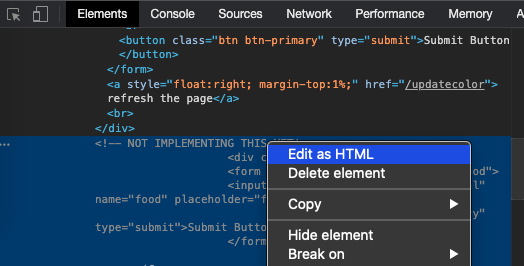
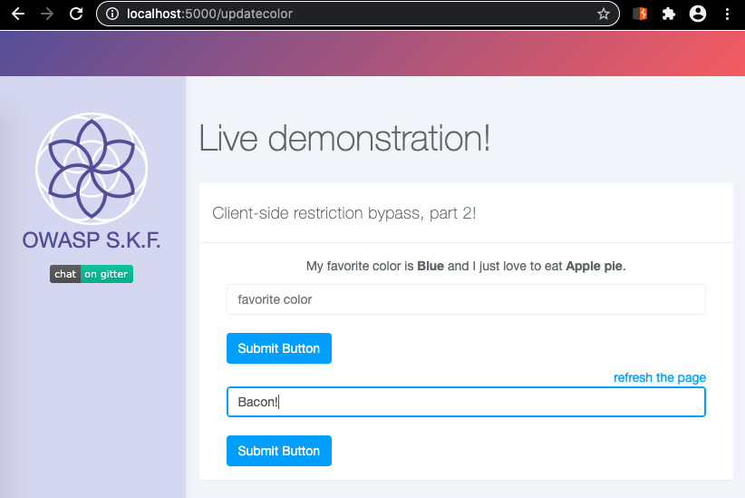

# KBID XXX - Client side restriction bypass harder

## Running the app

```
$ sudo docker pull blabla1337/owasp-skf-lab:client-side-restriction-bypass-2
```

```
$ sudo docker run -ti -p 127.0.0.1:5000:5000 blabla1337/owasp-skf-lab:client-side-restriction-bypass-2
```


Now that the app is running let's go hacking!


## Running the app Python3

First, make sure python3 and pip are installed on your host machine. After installation, we go to the folder of the lab we want to practise "i.e /skf-labs/XSS/, /skf-labs/jwt-secret/ " and run the following commands:

```
$ pip3 install -r requirements.txt
```

```
$ python3 <labname>
```


Now that the app is running let's go hacking!



## Reconnaissance


As we have done with previous labs, be sure to start Burp Suite so you can play along! Testing becomes so much easier if you use Burp's built-in Chrome web browser (tab **Proxy** > tab **Intercept** > button _Open Browser_).


Let us visit [http://localhost:5000](http://localhost:5000). It presents us with a familiar login screen.



For now, let's try user "admin" and password "admin". Which does let us inside!



We're told that the "admin" user really likes the color blue and that they enjoy feasting on apple pie. That's great news! And since we're logged in as the user "admin", we can even update our favorite color!

After submitting the form with a different color, the output has changed.



Let's take a look at Burp Suite's proxy history, to see what's happening in the background.



Burp shows us that a POST request was made to [http://localhost:5000/updatecolor](http://localhost:5000/updatecolor). The form was submitted with one key:value pair, being "color=Green".

## Exploitation

Looking into the HTTP requests in Burp, there appear to be no hidden form values that would allow us to change admin's favorite food. But let's try something! Maybe the web app is trying to hide some things in plain sight by simply not including them in the user interface. We can make a few guesses about what to try, no?

We _could_ just edit HTTP requests in Burp, making educated guesses.

If you right-click the POST request in Burp's proxy history, you can select "_Send to Repeater_". This will light up the **Repeater** tab in orange, showing that something new appeared. Over there, we can edit the request before submitting it.

Let's change the called URL to [http://localhost:5000/updatefood](http://localhost:5000/updatefood) and let's change the form key to "food". Then if we click the "_Send_" button, maybe we'll get lucky!



We did! And if you use the "_Refresh the page_" link (or the _Refresh_ button of the browser) you'll see that the change is persistent.



Alternatively, let's take a closer look at that front-end code! By right-clicking the form in our Chrome browser and choosing "_Inspect_" we can investigate the HTML in question.



What's this?!

The developer left us the clues right there in the HTML? And we manually did the hard work? No fair! Well, might as well use the form then!

If you right-click the commented text and choose "_Edit as HTML_" we can just remove the `<!--` and `-->` comment markers. And presto, there's our other form which will let us change the favorite food as well.





## Further investigation

If we hop into the Docker container we can inspect the source code of the application. You will need to open a shell in the running Docker container. This requires that you figure out its ID, using `docker ps`. Just adding the first few characters of the ID with `docker exec` is enough.

```
$ docker ps
CONTAINER ID        IMAGE                    COMMAND                  CREATED             STATUS              PORTS                    NAMES
4d7355d622cb        skf-labs/client-side-restriction-bypass-2   "python ./client-sid…"   3 hours ago         Up 3 hours          0.0.0.0:5000->5000/tcp   naughty_cori


$ docker exec -ti 4d73 /bin/sh
#
```

The application's starting point is `client-side-restriction-bypass-2.py`, which defines three routes: `/`, `/updatecolor` and `/updatefood`. Upon first browsing to the webapp you are sent to the `/` endpoint which presents the login page, by rendering the template for `templates/index.html`.

After logging in you are sent to the rendering of `templates/loggedin.html` which has the form and which uses data pulled from the SQLite backend. The form will only call the defined `/updatecolor` endpoint. And yes, the template for `loggedin.html` does have the commented-out, unused code to update the food value as well.

Looking at both of the "update" endpoints, we see that both **do check** for a logged in session. So that's good! It means that you shouldn't be able to call either of the endpoints without first logging in.

If the developer wanted to prevent us from updating the food, they should have either A) disabled the endpoint temporarily, or B) added an additional security check.

In its current state, it's just "_security through obscurity_. "Hiding" functionality by not turning it on, by not using it and so on does nothing to secure your applications.

## Additional sources

Security research company Mitre maintains a list of common vulnerability types, with CWE registrations: Common Weakness Enumeration.

[CWE-602 Client-side enforcement of server-side security](https://cwe.mitre.org/data/definitions/602.html) applies in this case.
