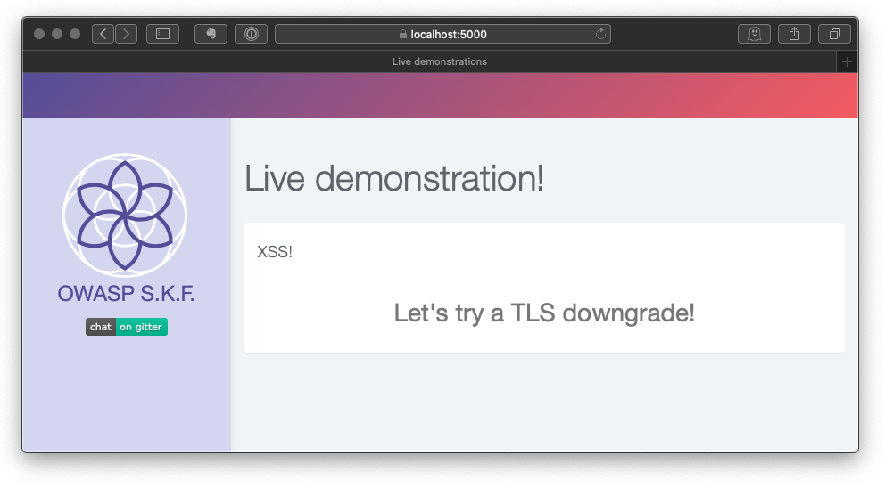
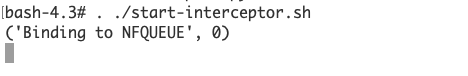
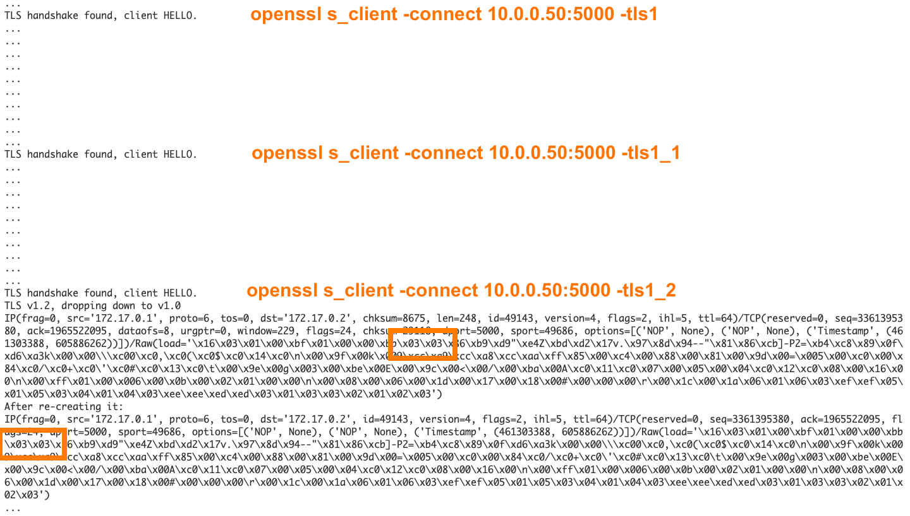
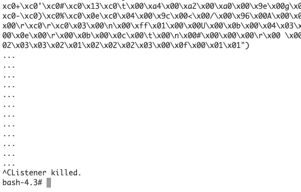
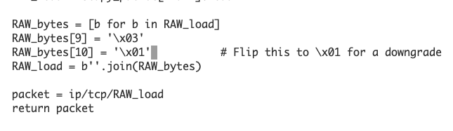
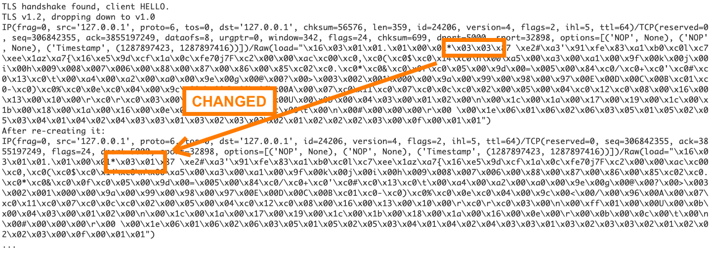
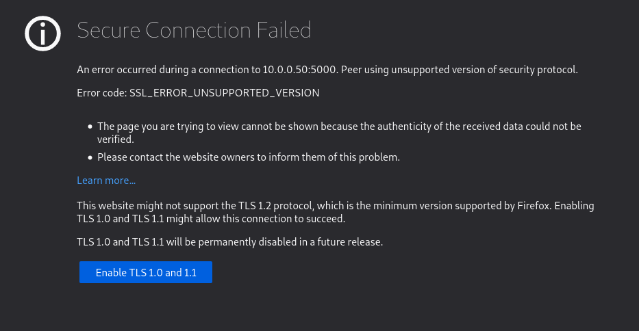

# KBID XXX - TLS downgrade

## Running the app

```
$ sudo docker pull blabla1337/owasp-skf-lab:tls-downgrade
```

```
$ sudo docker run -ti -p 127.0.0.1:5000:5000 --cap-add=NET_ADMIN blabla1337/owasp-skf-lab:tls-downgrade
```


Now that the app is running let's go hacking!


## Running the app with Python2

Because this lab hinges on the (ab)use of IPtables and NFqueues, you will need to run it from the Docker container. There's no option to run this with just Python.


Now that the app is running let's go hacking!



## Reconnaissance


The screenshots and commands in this write-up refer to host 10.0.0.50. That is where I ran the Docker container. In your case it is very likely 127.0.0.1.


When visiting [https://localhost:5000](https://localhost:5000) our browser warns us about a bad, self-signed certificate. In a real situation that would be a bad thing to encounter, but in our test lab it's to be expected. At least we have a safe HTTPS connection, right?

After confirming the exception, we will be greeted by the following web app. It has no functionality to play with, it's just a friendly page of text.



Let's take a look under the hood!

The OpenSSL suite has a command line component: _openssl_. This command allows you to perform many TLS/SSL activities such as inspecting and converting certificates. It also lets you test a TLS/SSL connection!

At first glance, things look okay! TLSv1.2 with ECDSA-RSA is a reasonable standard by any means!

```
$ openssl s_client -connect 10.0.0.50:5000 </dev/null
[...]

subject=C = NL, ST = SKF, L = Amsterdam, O = OWASP, CN = localhost
issuer=C = NL, ST = SKF, L = Amsterdam, O = OWASP, CN = localhost

[...]

New, TLSv1.2, Cipher is ECDHE-RSA-AES256-GCM-SHA384
Server public key is 1024 bit
Secure Renegotiation IS supported
Compression: NONE
Expansion: NONE
No ALPN negotiated
SSL-Session:
    Protocol  : TLSv1.2
    Cipher    : ECDHE-RSA-AES256-GCM-SHA384

[...]
```

A few things stand out:

- As we already knew, this server uses a self-signed certificate.
- The server uses the current TLS standard v1.2 with a strong set of algorightms.
- The server tells us that "_Secure Renegotiation IS supported_".

That final bit, tells us that the server is willing to discuss with us any alternate standards and algorithms. Let's see if we can use older standards for TLS.

```
$ openssl s_client -connect 10.0.0.50:5000 -tls1_1 </dev/null
[...]

    Protocol  : TLSv1.1
    Cipher    : ECDHE-RSA-AES256-SHA
```

Alright, so we can drop down to TLSv1.1. Any further?

```
$ openssl s_client -connect 10.0.0.50:5000 -tls1 </dev/null
[...]

    Protocol  : TLSv1
    Cipher    : ECDHE-RSA-AES256-SHA
```

Okay! We've gotten the server down to TLSv1.0, which by all means is deprecated. [Many browser vendors will flat out refuse to deal with TLSv1.0 and v1.1.](https://hacks.mozilla.org/2019/05/tls-1-0-and-1-1-removal-update/)

Is there anything below TLSv1.0? Why sure there is! Back in the day we had SSLv2 and SSLv3 which are now famous for being [susceptible to vulnerabilities such as the POODLE attack](https://www.acunetix.com/blog/articles/tls-vulnerabilities-attacks-final-part/). Using specialized tools and a little patience, POODLE will allow a malicious party to intercept and decrypt your traffic! This is why [browser vendors axed these standards](https://blog.mozilla.org/security/2014/10/14/the-poodle-attack-and-the-end-of-ssl-3-0/).

Current versions of the openssl command no longer have SSLv2 and v3 compatibility built in, unless you compile it from source. Luckily there are other testing tools at our disposal! Anyone with a Linux system can use on of the following:

- [SSLyze (github)](https://github.com/nabla-c0d3/sslyze)
- [TestSSL.sh (github)](http://github.com/drwetter/testssl.sh)

First, let's take a look with SSLyze.

```
$ sslyze 10.0.0.50:5000

 SCAN RESULTS FOR 10.0.0.50:5000 - 10.0.0.50
 -------------------------------------------

 * OpenSSL Heartbleed:
                                          OK - Not vulnerable to Heartbleed

 * SSL 3.0 Cipher suites:
     Attempted to connect using 80 cipher suites.

     The server accepted the following 7 cipher suites:
        TLS_RSA_WITH_CAMELLIA_256_CBC_SHA                 256
        TLS_RSA_WITH_AES_256_CBC_SHA                      256
        TLS_RSA_WITH_AES_128_CBC_SHA                      128
        TLS_RSA_WITH_3DES_EDE_CBC_SHA                     168
        TLS_ECDHE_RSA_WITH_AES_256_CBC_SHA                256       ECDH: prime256v1 (256 bits)
        TLS_ECDHE_RSA_WITH_AES_128_CBC_SHA                128       ECDH: prime256v1 (256 bits)
        TLS_ECDHE_RSA_WITH_3DES_EDE_CBC_SHA               168       ECDH: prime256v1 (256 bits)

     The group of cipher suites supported by the server has the following properties:
       Forward Secrecy                    OK - Supported
       Legacy RC4 Algorithm               INSECURE - Supported

     The server has no preferred cipher suite.

 * SSL 2.0 Cipher suites:
     Attempted to connect using 7 cipher suites; the server rejected all cipher suites.

[...]

 * Session Renegotiation:
       Client-initiated Renegotiation:    VULNERABLE - Server honors client-initiated renegotiations
       Secure Renegotiation:              OK - Supported

[...]

 * OpenSSL CCS Injection:
                                          OK - Not vulnerable to OpenSSL CCS injection

 * Downgrade Attacks:
       TLS_FALLBACK_SCSV:                 OK - Supported

 * Deflate Compression:
                                          OK - Compression disabled
```

SSLyze tells us that, while SSLv2 is not offered, SSLv3 is in fact available. Legacy RC4 algorithms also appear to be supported, meaning we could get lucky in cracking the encyrption.

Let's see if TestSSL.sh tells us anything else.

```
tess@kalivm:~/Tools/testssl.sh$ ./testssl.sh 10.0.0.50:5000

[...]

 LOW: 64 Bit + DES, RC[2,4], MD5 (w/o export)      offered (NOT ok)
 Triple DES Ciphers / IDEA                         offered
 Obsoleted CBC ciphers (AES, ARIA etc.)            offered

[...]

 Testing vulnerabilities

 Heartbleed (CVE-2014-0160)                not vulnerable (OK), timed out
 CCS (CVE-2014-0224)                       not vulnerable (OK)
 Ticketbleed (CVE-2016-9244), experiment.  not vulnerable (OK)
 ROBOT                                     not vulnerable (OK)
 Secure Renegotiation (RFC 5746)           supported (OK)
 Secure Client-Initiated Renegotiation     VULNERABLE (NOT ok), DoS threat
 CRIME, TLS (CVE-2012-4929)                not vulnerable (OK)
 BREACH (CVE-2013-3587)                    no gzip/deflate/compress/br HTTP compression (OK)  - only supplied "/" tested
 POODLE, SSL (CVE-2014-3566)               VULNERABLE (NOT ok), uses SSLv3+CBC (check TLS_FALLBACK_SCSV mitigation below)
 TLS_FALLBACK_SCSV (RFC 7507)              Downgrade attack prevention supported (OK)
 SWEET32 (CVE-2016-2183, CVE-2016-6329)    VULNERABLE, uses 64 bit block ciphers
 FREAK (CVE-2015-0204)                     not vulnerable (OK)
 DROWN (CVE-2016-0800, CVE-2016-0703)      not vulnerable on this host and port (OK)
 LOGJAM (CVE-2015-4000), experimental      not vulnerable (OK): no DH EXPORT ciphers, no DH key detected with <= TLS 1.2
 BEAST (CVE-2011-3389)                     VULNERABLE -- but also supports higher protocols  TLSv1.1 TLSv1.2 (likely mitigated)
 LUCKY13 (CVE-2013-0169), experimental     potentially VULNERABLE, uses cipher block chaining (CBC) ciphers with TLS. Check patches
 Winshock (CVE-2014-6321), experimental    not vulnerable (OK) - CAMELLIA or ECDHE_RSA GCM ciphers found
 RC4 (CVE-2013-2566, CVE-2015-2808)        VULNERABLE (NOT ok): ECDHE-RSA-RC4-SHA RC4-SHA RC4-MD5

[...]
```

In the end, it looks like this web application was made a long time ago and was meant to serve end-users with old browsers. Think "_Internet Explorer 6 old_". Maybe it's from some corporate network; you never what you'll find in those! The site appears to be potentially vulnerable to the POODLE and [SWEET32 attacks](https://sweet32.info) and attempts on cracking RC4.

Performing an actual attack would require that we set up a man-in-the-middle (MitM), to intercept and adjust the traffic. Luckily we have prepared just the thing for you!

## Exploitation

You will need to open a shell in the running Docker container. This requires that you figure out its ID, using `docker ps`. Just adding the first few characters of the ID with `docker exec` is enough.

```
$ docker ps
CONTAINER ID        IMAGE                    COMMAND                  CREATED             STATUS              PORTS                    NAMES
4d7355d622cb        skf-labs/tls-downgrade   "python ./TLS-downgr…"   3 hours ago         Up 3 hours          0.0.0.0:5000->5000/tcp   naughty_cori


$ docker exec -ti 4d73 /bin/bash
bash-4.3#
```

In your working directory `/TLS-downgrade` you will find the web application's files as well as a few tools to peform the _Man In The Middle_ attack.

```
bash-4.3# ls
Docker                README.md             interceptor.py        start-interceptor.sh  templates
Dockerfile            TLS-downgrade.py      requirements.txt      static
```

The shell script `start-interceptor.sh` is used to add a local firewall rule and to start the Python script (`interceptor.py`) that interacts with this firewall rule.



The firewall rule that we create will make sure every incoming TCP/IP packet is parsed by the Python script `interceptor.py`. This script passes every packet onwards to the Docker container, **except** for TLSv1.2 "_Client Hello_" packets. This packet is the first step in setting up a working TLS connection, all of which is explained in grand details in [_The Illustrated TLS connection_](https://tls.ulfheim.net).

If you start the interceptor without any modifications, it will pass on the TLS _Client Hello_ unaltered. Doing so will show debugging output in your Bash session. TLSv1.0 and v1.1 connections don't trigger the MitM, while TLSv1.2 does.



The screenshot above shows the interceptor's debugging output for three consecutive OpenSSL tests.

```
openssl s_client -connect 10.0.0.50:5000 -tls1 </dev/null
openssl s_client -connect 10.0.0.50:5000 -tls1_1 </dev/null
openssl s_client -connect 10.0.0.50:5000 -tls1_2 </dev/null
```

The screenshot also shows two orange boxes around "\x03\x03". These are the bytes that indicate the TLS version. We will be chancing this to "\x03\x01" later on.

By default, your browser and the `openssl` will try the strongest, most modern settings through TLSv1.2. Doing this manually with `openssl` means you just leave off the forced version:

`openssl s_client -connect 10.0.0.50:5000 </dev/null`

You will remember that OpenSSL and modern-day browsers should protect you against TLS downgrade attacks. So it's good that our Docker container has an old version of OpenSSL. ;) To make sure that it works, while the interceptor is running, do the following from your host OS:

```
$ docker exec 75b3 /usr/bin/openssl s_client -connect localhost:5000

CONNECTED(00000003)
[...]

SSL-Session:
    Protocol  : TLSv1.2
    Cipher    : ECDHE-RSA-AES256-GCM-SHA384
[...]
```

Go back to your Bash session in the Docker container and interupt/kill the running `start-interceptor.sh`. You can do this by pressing .



Edit the interceptor.py script, with `vi`. You need to be on line 87, where you need to change one byte from "\x03" to "\x01". Make the change, save the file and exit the text editor.



Now start the interceptor again using `./start-interceptor.sh`.

Then, perform the `openssl s_client` command again through `docker exec`.

The interception logs should show that the "\x03\x03" was changed into "\x03\x01":



And the `openssl s_client` command should show that the TLS standard was downgraded by the MiTM, to TLSv1.0.

```
$ docker exec 75b3 /usr/bin/openssl s_client -connect localhost:5000
CONNECTED(00000003)
[...]

SSL-Session:
    Protocol  : TLSv1
    Cipher    : ECDHE-RSA-AES256-SHA
[...]
```

If you now visit the web application with your browser, it should warn you that it does not want to visit sites running TLSv1.0 or v1.1.



One important take-away is that modern browsers have been built in such a way as to protect you against attacks like these. But more importantly: don't take it at face-value that a site offering HTTPS will always offer you the best and strongest configuration. A man-in-the-middle can in some cases force both client and server to downgrade their algorithms to something more easily cracked. Your browser had no intentions of asking for TLSv1.0, but the _Man In The Middle_ changed the setting along the way.

## Remediation

Let's delve into the code to see what's happening here. Like before, you can enter your Docker container using `docker exec`.

The file `TLS-downgrade.py` forms the entry point for this web application. Like most of the SKF Labs applications, it runs Flask with Python. The TLS listener is configured as follows:

```python
# Adding all the ciphers, we may need them.
ciphers = 'ECDHE-RSA-AES256-GCM-SHA384:ECDHE-ECDSA-AES256-GCM-SHA384:ECDHE-RSA-AES256-SHA384:ECDHE-ECDSA-AES256-SHA384:ECDHE-RSA-AES256-SHA:ECDHE-ECDSA-AES256-SHA:SRP-DSS-AES-256-CBC-SHA:SRP-RSA-AES-256-CBC-SHA:SRP-AES-256-CBC-SHA:DH-DSS-AES256-GCM-SHA384:DHE-DSS-AES256-GCM-SHA384:DH-RSA-AES256-GCM-SHA384:DHE-RSA-AES256-GCM-SHA384:DHE-RSA-AES256-SHA256:DHE-DSS-AES256-SHA256:DH-RSA-AES256-SHA256:DH-DSS-AES256-SHA256:DHE-RSA-AES256-SHA:DHE-DSS-AES256-SHA:DH-RSA-AES256-SHA:DH-DSS-AES256-SHA:DHE-RSA-CAMELLIA256-SHA:DHE-DSS-CAMELLIA256-SHA:DH-RSA-CAMELLIA256-SHA:DH-DSS-CAMELLIA256-SHA:ECDH-RSA-AES256-GCM-SHA384:ECDH-ECDSA-AES256-GCM-SHA384:ECDH-RSA-AES256-SHA384:ECDH-ECDSA-AES256-SHA384:ECDH-RSA-AES256-SHA:ECDH-ECDSA-AES256-SHA:AES256-GCM-SHA384:AES256-SHA256:AES256-SHA:CAMELLIA256-SHA:PSK-AES256-CBC-SHA:ECDHE-RSA-AES128-GCM-SHA256:ECDHE-ECDSA-AES128-GCM-SHA256:ECDHE-RSA-AES128-SHA256:ECDHE-ECDSA-AES128-SHA256:ECDHE-RSA-AES128-SHA:ECDHE-ECDSA-AES128-SHA:SRP-DSS-AES-128-CBC-SHA:SRP-RSA-AES-128-CBC-SHA:SRP-AES-128-CBC-SHA:DH-DSS-AES128-GCM-SHA256:DHE-DSS-AES128-GCM-SHA256:DH-RSA-AES128-GCM-SHA256:DHE-RSA-AES128-GCM-SHA256:DHE-RSA-AES128-SHA256:DHE-DSS-AES128-SHA256:DH-RSA-AES128-SHA256:DH-DSS-AES128-SHA256:DHE-RSA-AES128-SHA:DHE-DSS-AES128-SHA:DH-RSA-AES128-SHA:DH-DSS-AES128-SHA:DHE-RSA-SEED-SHA:DHE-DSS-SEED-SHA:DH-RSA-SEED-SHA:DH-DSS-SEED-SHA:DHE-RSA-CAMELLIA128-SHA:DHE-DSS-CAMELLIA128-SHA:DH-RSA-CAMELLIA128-SHA:DH-DSS-CAMELLIA128-SHA:ECDH-RSA-AES128-GCM-SHA256:ECDH-ECDSA-AES128-GCM-SHA256:ECDH-RSA-AES128-SHA256:ECDH-ECDSA-AES128-SHA256:ECDH-RSA-AES128-SHA:ECDH-ECDSA-AES128-SHA:AES128-GCM-SHA256:AES128-SHA256:AES128-SHA:SEED-SHA:CAMELLIA128-SHA:IDEA-CBC-SHA:PSK-AES128-CBC-SHA:ECDHE-RSA-RC4-SHA:ECDHE-ECDSA-RC4-SHA:ECDH-RSA-RC4-SHA:ECDH-ECDSA-RC4-SHA:RC4-SHA:RC4-MD5:PSK-RC4-SHA:ECDHE-RSA-DES-CBC3-SHA:ECDHE-ECDSA-DES-CBC3-SHA:SRP-DSS-3DES-EDE-CBC-SHA:SRP-RSA-3DES-EDE-CBC-SHA:SRP-3DES-EDE-CBC-SHA:EDH-RSA-DES-CBC3-SHA:EDH-DSS-DES-CBC3-SHA:DH-RSA-DES-CBC3-SHA:DH-DSS-DES-CBC3-SHA:ECDH-RSA-DES-CBC3-SHA:ECDH-ECDSA-DES-CBC3-SHA:DES-CBC3-SHA:PSK-3DES-EDE-CBC-SHA'

# Standard and protocol setup
ctx = ssl.SSLContext(ssl.PROTOCOL_SSLv23)
ctx.options &= ~ssl.OP_NO_SSLv3
ctx.set_ciphers(ciphers)

# Loading the certificate
ctx.load_cert_chain('/ssl.cert', '/ssl.key')
```

It looks like someone has deliberately enable every cipher available to OpenSSL and has also re-enabled SSLv3. This doesn't have to be a malicious action, it could be down to inexperience or even a design decision based on the need to support legacy applications like IE6, IE8 or Java 6.

However, we can't go on like this! We have to fix things.

First of all, all the ciphers need to go! We will have to trust the OpenSSL defaults to be stronger than what's configured now. [Python's documentation also tells us](https://docs.python.org/2/library/ssl.html#ssl-contexts) that: _"Changed in version 2.7.16: The context is created with secure default values. \[...] The initial cipher suite list contains only HIGH ciphers, no NULL ciphers and no MD5 ciphers"_. That would suggest an upgrade might be needed.

Next up, we really should not allow SSLv3 anymore, so we'll take out the manual override. And finally, if we would like to also disable the deprecated TLSv1.0 and v1.1, we could tell Python's SSL Context to only accept v1.2.

The new, resulting code would be:

```python
# Standard and protocol setup
ctx = ssl.SSLContext(ssl.PROTOCOL_TLSv1_2)

# Loading the certificate
ctx.load_cert_chain('/ssl.cert', '/ssl.key')
```

Well now! That looks a lot simpler! And it even protects us against the MitM TLS-downgrade attack!

```
$ docker exec 75b3 /usr/bin/openssl s_client -connect localhost:5000
CONNECTED(00000003)
[...]
SSL-Session:
    Protocol  : TLSv1
    Cipher    : 0000
```

Oddly, the old OpenSSL in the Docker container still reports the protocol version as v1.0, but the Cipher set is set to NULL, meaning no session can be built. Running the same test from a modern Linux renders as follows:

```
$ openssl s_client -connect 10.0.0.50:5000 </dev/null
CONNECTED(00000003)
[...]

New, (NONE), Cipher is (NONE)
```

If you'd really like to bring this application into the 21st century, then upgrades are in order! Replacing Pything 2.7 with anything >= 3.7 would be great. Ditto for OpenSSL, which should really be replaced with anything over 1.1.0. Making changes like those, would require a rebuild of the Docker container though, since you'd be looking at upgrading to Alpine 3.15 for example. ;)

## Additional sources


OWASP TLS cheat sheet



Acunetix explains TLS vulnerabilities



The illustrated TLS connection

