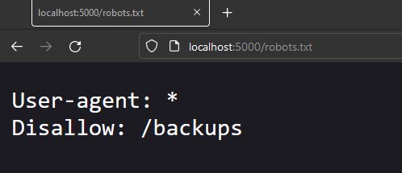
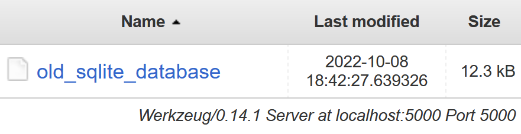
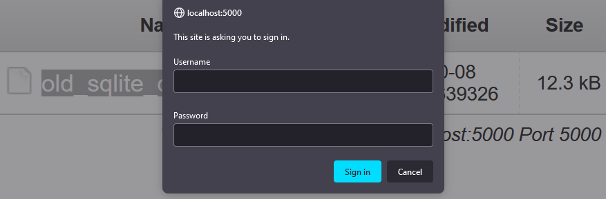
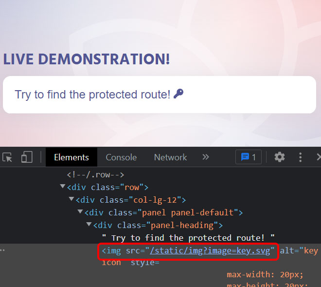
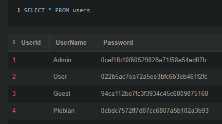

# KBID xxx - Unreferenced-Files

## Running the app

```
$ sudo docker pull blabla1337/Unreferenced-files
```

```
$ sudo docker run -ti -p 127.0.0.1:5000:5000 blabla1337/Unreferenced-files
```





Now that the app is running let's go hacking!

## Running the app Python3

First, make sure python3 and pip are installed on your host machine. After installation, we go to the folder of the lab we want to practise "i.e /skf-labs/XSS/, /skf-labs/jwt-secret/ " and run the following commands:

```
$ pip3 install -r requirements.txt
```

```
$ python3 <labname>
```


Now that the app is running let's go hacking!



## Reconnaissance

Sometimes unreferenced or forgotten files are left behind on the server. These files can contain sensitive information. Let's see if we can find any.

The application doesn't show anything interesting at first sight. Let's try to find some hidden files.

The file robots.txt it's used to tell search engine crawlers which URLs the crawler can access on your site. If we go to the robots.txt file we can see that there is a route called "backups" that is not allowed to be indexed by search engines.



## Exploitation

If we go to the backups route we can see that there is a file called "old_sqlite_database".



When can't download the file by clicking on it and if we try to download it by using the following URL `/backups/old_sqlite_database` we will be asked to log in.



If we go back to the home page and inspect the icon we will notice that the app may be vulnerable to dynamic file inclusion.



Now we can try to use the following url: `/static/img?image=../../backups/old_sqlite_database` and we will be able to download the file. Judging by the file name we can assume that the file is an SQLite database. Let's try to open it.



We successfully obtained an unreferenced backup file that contains sensitive information.

## Additional sources

[owasp.org | Review Old Backup and Unreferenced Files for Sensitive Information](https://owasp.org/www-project-web-security-testing-guide/latest/4-Web_Application_Security_Testing/02-Configuration_and_Deployment_Management_Testing/04-Review_Old_Backup_and_Unreferenced_Files_for_Sensitive_Information)
